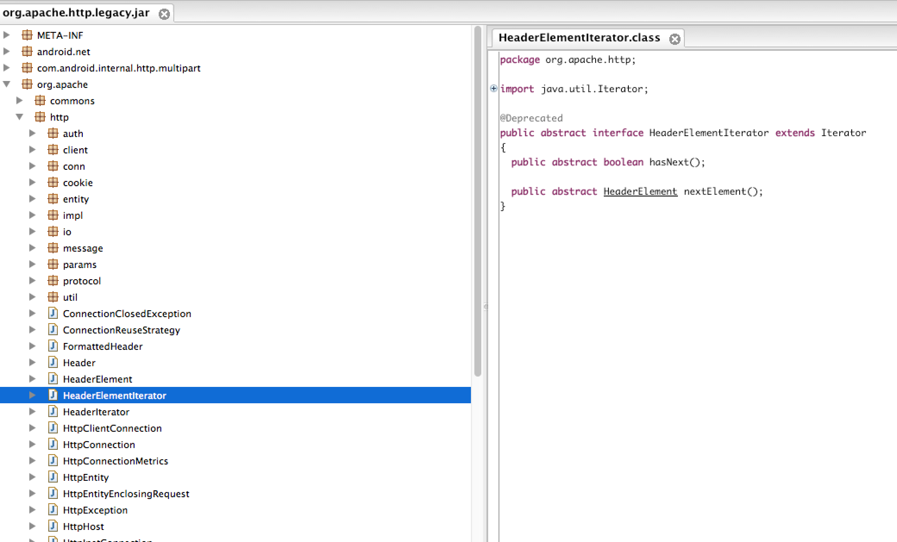

## Android一些开发的小技巧

> 隐藏标题、状态栏  
> [图片显示是否需要关闭硬件加速](#hardware_speed)      
> [Activity之间跳转动画](#activity_jump_animaiton)
> [全屏的DialogFragment](fullscreen_dialog_fragment)      
> [ViewPager获取当前显示的View](#viewpger_current_view)       
> [TextureView的优点不会启动时黑一下](#TextureView_pro)
> [AndroidHttpClient简单创建网络请求](#AndroidHttpClient)      
> [判断TouchEvent位于哪个View中](#touch_view)     
> [判断一个Activity的Application是否在运行](#anchor_activity_is_runing)   
> [获取当前运行的顶层Activity](#anchor_top_activity_runing)   
> [Android 6.0 Apache HTTP Client Removal](#COMPILE_SDK_VERSION_23)  
> [Android 使用android-support-multidex解决Dex超出方法数的限制问题,让你的应用不再爆棚](#android-support-multidex_65535)    
> [加速Android Studio的Gradle构建速度](#gradle_speeding)    
> [Window Leaked窗体泄漏了Activity has leaked window](#leaked_window)     
> [MAC下显示隐藏代码](#mac_file_show_orhide)     
> [Android Webview回调单引号跟双引号的问题](#webview_js_callback)     
> [Android使用UncaughtExceptionHandler捕获全局异常](#android_UncaughtExceptionHandler)     
> [TextView单行及多行处理断行的问题](#textview_mutil_lines)
> [Webview多级网页回退](#webview_muti_level)      
> [Android类似的沉浸式改变StatueBar颜色](#statue_bar_color)    
> [trying to use a recycled bitmap android.graphics.](#recycled_bitmap)     
> [Shape巧妙使用避免无谓切图](#shape_img)       
> [缓存路径与缓存清理](#cache_and_clean)       
> [Uri方法集合](#uri_method)      
> [定制View判断是否可以上滚](#view_can_scroll)
> [代码中如何用一些小红点 小方框 颜色做icon](#icon_shape)    
> [ 如何取消默认的material design效果以及输入框只显示下边界](#cancle_material)         
> [如何Autocommplete的控制，宽度，位置，边界线](#Autocommplete)           
> [List的滚动监听 mRvRecord.getRecyclerView().getViewTreeObserver().addOnScrollChangedListener(presenter);            
> [关于android:lineSpacingExtra属性 在android5.0与先期版本存在的区别](#lineSpacingExtra)     
> [@回复某人](#ClickableSpan_)       
> [查看View或者ViewGroup是否可以滚动-商品详情](#can_view_scroll)        
>  滚动的有效长度     
> [dialog获取返回按键的监听](#dialog_back_key) 
> [View 定制如果能基于系统控件就不要完全自定义](#view_extends_origin)

<a name="hardware_speed"/>

# 图片显示是否需要关闭硬件加速

原因 [http://www.cnblogs.com/jackxlee/p/4744447.html] 

Android  GPU  CPU 公用内存，不存在显存内存之分。

在Android 5.0之前，Android应用程序的主线程同时也是一个Open GL线程。但是从Android 5.0之后，Android应用程序的Open GL线程就独立出来了，称为Render Thread，所以下面的函数要注意使用的地方

    //added by Jack for handle exception "Bitmap too large to be uploaded into a texture".
    public boolean isNeedCloseHardwareAcceleration(int w, int h) {
        int[] maxSize = new int[1];
        GLES10.glGetIntegerv(GL10.GL_MAX_TEXTURE_SIZE, maxSize, 0);
        if(maxSize[0] < h || maxSize[0] < w) {
            return true;
        }
        return false;
    }
    
 如果想要加载超级大图那就分块加载
 
 最近做项目发现其他手机没有问题，但是出现了一个手机报异常，最难过的是不显示报错信息，弄了很久，才发现了一句话：Bitmap too large to be uploaded into a texture exception，百度一下才知道怎么回事。简单说就是硬件加速的时候，对图片的大小有限制。不同设备可能有不同的最大值。这个问题悲催的地方是，程序貌似没有捕获到这个exception, 结果是程序也不报错，图片也显示不出来。只有看debug log才能发现这个error message.

一个解决的方法是禁止硬件加速，简单粗暴：但是影响性能

	<application android:hardwareAccelerated="false" ...>

比较好的解决方法是类似google map的实现：将图片分成不同的块，每次加载需要的块。android提供了一个方法：
 
	public void drawBitmap (Bitmap bitmap, Rect src, RectF dst, Paint paint)
	public Bitmap decodeRegion (Rect rect, BitmapFactory.Options options)

采取上述操作后，就可以加载很多图片，同时也可以显示超级大图了。
还有用ImageLoad加载图片，如果出现这个问题我们可以这样处理：
可以对ImageView设置最大高度和最大宽度：

		android:maxHeight="1000dip"
		android:maxWidth="1000dip"
		
同时相应的scaleType为FIT_CENTER  FIT_XY   FIT_START FIT_END CENTER_INSIDE

    
<a name="activity_jump_animaiton"/>

# Activity之间跳转动画

Animation有四种，scale,rotate,translate,alpha,而Activity之间的跳转有两种。
一种是overPendingTransition，传入in和out的animation文件，Activity转换的时候就可以显示动画了，一个是Activity进来的动画，一个是Activity销毁的动画，而且这个动画必须在startActivity或者finish函数之后调用才有效果。
另外一种是通过Theme的方式来进行Animation的设置的。
其中要了解有四个属性，都是Window类里面的属性：

* activityOpenEnterAnimation:当打开一个新的Activity，这Animation就会作用于接下来进入屏幕的Activity
* activityOpenExitAnimation:当打开一个新的Activity，这Animation就会作用于接下来退出屏幕的Activity
* activityCloseEnterAnimation: 当关闭现在的Activity，这个Animation就会作用于接下来的进入屏幕的Activity
* activityCloseExitAnimation:当关闭现在的Activity，这个Animation就会作用于接下来的要退出屏幕的Activity
* 
即，当启动一个Activity的时候，activityOpenEnterAnimation这个Animation就是刚要进来的Activity的Animation，activityOpenEXiteAnimation就是给退出的Activity使用的Animation,而activityCloseEnterAnimation是给即将显示在屏幕上的Activity用的Animation,activityCloseExitAnimation就是给即将退出屏幕的Activity所显示的。
接着再把这个四个属性写进一个style文件中，而它是继承自@android:style/Animation.Activity的，所以parent需要写上@android:style/Animation.Activity，接着给android:windowAnimationStyle赋值为该style，接着在Theme中赋值。

	 

    
    
anim style文件，就是最终要给Theme赋值的文件。这样就能显示了，而如果要给所有的Activity都添加上Animation的显示效果，就在Application的标签中添加上这个Theme行了。

注意配合，一定要前面的也用
  

<a name="fullscreen_dialog_fragment"/>

# 全屏的DialogFragment及默认动效

    @Override
    public void onStart() {
        super.onStart();
        Dialog dialog = getDialog();
        if (dialog != null) {
            int width = ViewGroup.LayoutParams.MATCH_PARENT;
            int height = ViewGroup.LayoutParams.MATCH_PARENT;
            dialog.getWindow().setLayout(width, height);
            dialog.getWindow().setBackgroundDrawable(new ColorDrawable(0x00000000));
        }
    }
 
 或者
    
     @Override
    public void onStart() {
        super.onStart();
        Dialog dialog = getDialog();
         if (dialog != null) {
        WindowManager.LayoutParams params = dialog.getWindow().getAttributes();
        params.width = WindowManager.LayoutParams.MATCH_PARENT;
        params.height = WindowManager.LayoutParams.MATCH_PARENT;
        params.gravity = Gravity.BOTTOM;
        dialog.getWindow().setAttributes(params);
        }
    }

默认动效跟自己的动效其实是同时执行的，所以可能会导致View的动效看不到 ，当然可以  <item name="android:windowAnimationStyle">@style/animat</item>

    

    

    

        
            @Override
    public LayoutInflater getLayoutInflater(Bundle savedInstanceState) {
        if (!mShowsDialog) {

是FragmentManager在peformCreateView时候调用的，DialogFragment覆盖该函数，并在里面创建了Dialog，在OnactivityCreate的时候setContentView，注意将默认动效关闭

## dialog 在onstart设置属性有效的原理

    public void show() {
        if (mShowing) {
            if (mDecor != null) {
                if (mWindow.hasFeature(Window.FEATURE_ACTION_BAR)) {
                    mWindow.invalidatePanelMenu(Window.FEATURE_ACTION_BAR);
                }
                mDecor.setVisibility(View.VISIBLE);
            }
            return;
        }

        mCanceled = false;
        
        if (!mCreated) {
            dispatchOnCreate(null);
        }
	<!--这里是原理-->
        onStart();
        mDecor = mWindow.getDecorView();
        
##         Activity setTheme的时机

      如果没有手动设置mThemeResource，则选取系统中为我们提供的默认Theme。当然我们也可以手动设置Theme 
 Resource ，如开篇所述。
            
  方法一： Activity中调用setTheme()方法，该方法会实现在ContextThemeWrapper.java类中。
     @Override 
     
     public void setTheme(int resid) {
         mThemeResource = resid;    //设置mThemeResource
         initializeTheme();
     }
     
 方法二：在AndroidManifest文件中，为Activity节点配置android:theme属性. 当通过startActivity()启动一个
 Activity时，会调用setTheme()方法。文件路径:frameworks\base\core\java\android\app\ActivityThread.java
 
	    private final Activity performLaunchActivity(ActivityClientRecord r, Intent customIntent) {
	        ...
	        Activity activity = null;
	        try {
	        	//创建Activity实例
	            java.lang.ClassLoader cl = r.packageInfo.getClassLoader();
	            activity = mInstrumentation.newActivity(
	                    cl, component.getClassName(), r.intent);
	        } 
	        ...
	        try {
	        	...
	            if (activity != null) {
	            	//创建相应的信息.
	                ContextImpl appContext = new ContextImpl();
	                appContext.init(r.packageInfo, r.token, this);
	                appContext.setOuterContext(activity);
	                CharSequence title = r.activityInfo.loadLabel(appContext.getPackageManager());
	                ...   
	                activity.attach(appContext, this, getInstrumentation(), r.token,
	                        r.ident, app, r.intent, r.activityInfo, title, r.parent,
	                        r.embeddedID, r.lastNonConfigurationInstance,
	                        r.lastNonConfigurationChildInstances, config);
	                ...
	                //activityInfo相关信息是由ActivityManagerService通过IPC调用而来
	                //可以参考Android SDK的ActivityInfo类 API。
	                int theme = r.activityInfo.getThemeResource();
	                if (theme != 0) {
	                    activity.setTheme(theme); //调用setTheme()方法，参见方法1
	                }
	          ...
	            }
	        }
	        ...  
	        return activity;
	    }

  总结： 如果没有为设置Theme Resource ，则会选取默认的Theme Style，否则选用我们设置的Theme。因为mTheme对象是相对统一的，只不过每次都通过apply一个新的Style ID，感觉Android 框架会为每个用程序的资源形成一个统一的资源库，应用程序定义的所有Style都存在在该资源库中，可以通过通过Style ID值显示获取对应值集合。 但由于对系统获取资源的过程不了解，目前还不清楚Android中是如何根据资源ID获取对应的资源甚至一组资源的。但可喜的是，老罗目前正在研究这块，希望能在老罗的文章中找到答案。
  
 参考文档 [http://blog.csdn.net/qinjuning/article/details/8829877]
 
##  （注意：Dialog不能让Activity的生命周期发生变化

我们常见的Activity跳转当中，是第二个Activity将第一个Activity完全覆盖让其不再可见。所以这样的跳转第一个Activity的生命周期的变化是onResume()->onPause()->onStop()。

而当第二个Activity为Dialog样式时第一个Activity的生命周期变化是：onResume()->onPause()。

也就是上图中文字说明的：The activity is no longer visibale当activity不再可见时才会运行到onStop()。（注意：Dialog不能让Activity的生命周期发生变化）

参考文档：http://leochin.com/android-ui-activitydialogtheme/

 <a name="viewpger_current_view"/>
 
##  Activity跟Dialog的样式

       <item name="android:windowIsFloating">false</item>
       
之所以会悬浮，居中，就是因为这个    在PhoneWindow.java中

    protected ViewGroup generateLayout(DecorView decor) {
    。。。。
        if (mIsFloating) {
            setLayout(WRAP_CONTENT, WRAP_CONTENT); 
            setFlags(0, flagsToUpdate);
        } else {
            setFlags(FLAG_LAYOUT_IN_SCREEN|FLAG_LAYOUT_INSET_DECOR, flagsToUpdate);
        }
 
而setLayout最终调用Window的setLayout

    public void setLayout(int width, int height) {
        final WindowManager.LayoutParams attrs = getAttributes();
        attrs.width = width;
        attrs.height = height;
        if (mCallback != null) {
            mCallback.onWindowAttributesChanged(attrs);
        }
    }
    
这里是就直接改变WindowManager.LayoutParams 的值而回调会导致窗口重绘,对于Activity同样的原理

    public void onWindowAttributesChanged(WindowManager.LayoutParams params) {
        if (mDecor != null) {
            mWindowManager.updateViewLayout(mDecor, params);
        }
    }
    
                     
虽然在Window中 默认Match

    private final WindowManager.LayoutParams mWindowAttributes =
        new WindowManager.LayoutParams();
        
  
generateLayout代码分析

        
       protected ViewGroup generateLayout(DecorView decor) {
        // Apply data from current theme.
        TypedArray a = getWindowStyle();   //获得当前的Theme属性对应的TypedArray对象.

        //是否是Dialog样式的界面 , android:windowIsFloating属性
        mIsFloating = a.getBoolean(com.android.internal.R.styleable.Window_windowIsFloating, false);
        int flagsToUpdate = (FLAG_LAYOUT_IN_SCREEN | FLAG_LAYOUT_INSET_DECOR)
                & (~getForcedWindowFlags());
        //如果是Dialog样式，则设置当前的WindowManager.LayoutParams的width和height值，代表该界面的大小由布局文件大小指定。
        // 因为默认的WindowManager.LayoutParams的width和height是MATCH_PARENT，即与屏幕大小一致.
        if (mIsFloating) {
            setLayout(WRAP_CONTENT, WRAP_CONTENT);
            setFlags(0, flagsToUpdate); //取消FLAG_LAYOUT_IN_SCREEN | FLAG_LAYOUT_INSET_DECOR 位标记
        } else {
            setFlags(FLAG_LAYOUT_IN_SCREEN | FLAG_LAYOUT_INSET_DECOR, flagsToUpdate);
        }
        //是否是没有标题栏 , android:windowNoTitle属性
        if (a.getBoolean(com.android.internal.R.styleable.Window_windowNoTitle, false)) {
            requestFeature(FEATURE_NO_TITLE); //添加FEATURE_NO_TITLE
        }
        //是否是全屏, android:windowFullscreen属性
        if (a.getBoolean(com.android.internal.R.styleable.Window_windowFullscreen, false)) {
            setFlags(FLAG_FULLSCREEN, FLAG_FULLSCREEN & (~getForcedWindowFlags()));
        }
        //是否是显示墙纸, android:windowShowWallpaper属性
        if (a.getBoolean(com.android.internal.R.styleable.Window_windowShowWallpaper, false)) {
            setFlags(FLAG_SHOW_WALLPAPER, FLAG_SHOW_WALLPAPER & (~getForcedWindowFlags()));
        }
        WindowManager.LayoutParams params = getAttributes(); //当前的WindowManager.LayoutParams对象
        if (!hasSoftInputMode()) {  //是否已经设置了softInputMode模式，可显示通过#setSoftInputMode()方法设定
            params.softInputMode = a.getInt(
                    com.android.internal.R.styleable.Window_windowSoftInputMode,//android:windowSoftInputMode
                    params.softInputMode);  //可以由 WindowManager.LayoutParams指定
        }
        //是否是某个Activity的子Activity，一般不是，getContainer()返回 null.
        if (getContainer() == null) {
            if (mBackgroundDrawable == null) {   //获得了指定的背景图片.
                if (mBackgroundResource == 0) {  //获得了指定的背景图片资源
                    mBackgroundResource = a.getResourceId(  //背景图片id ,  android:windowBackground
                            com.android.internal.R.styleable.Window_windowBackground, 0);
                }
            }
            ...
        }
        // Inflate the window decor.
        int layoutResource;
        int features = getLocalFeatures(); // 等同于mFeatures,由requestFeature()设定.
        if ((features & ((1 << FEATURE_LEFT_ICON) | (1 << FEATURE_RIGHT_ICON))) != 0) {
            //1、判断是否为对话框样式
            if (mIsFloating) {
                layoutResource = com.android.internal.R.layout.dialog_title_icons;
            } else {
                layoutResource = com.android.internal.R.layout.screen_title_icons;
            }
        } else if { //2、进度条样式  ;  //3、自定义Title}
            else if ((features & (1 << FEATURE_NO_TITLE)) == 0) {
                //4、没有标题栏
                // If no other features and not embedded, only need a title.
                // If the window is floating, we need a dialog layout
                if (mIsFloating) {
                    layoutResource = com.android.internal.R.layout.dialog_title;
                } else {
                    layoutResource = com.android.internal.R.layout.screen_title;
                }
                // System.out.println("Title!");
            } else {
                layoutResource = com.android.internal.R.layout.screen_simple;
            }
            View in = mLayoutInflater.inflate(layoutResource, null);
            decor.addView(in, new ViewGroup.LayoutParams(MATCH_PARENT, MATCH_PARENT));
            ...
            if (getContainer() == null) {
                Drawable drawable = mBackgroundDrawable;
                if (mBackgroundResource != 0) {        //获取背景图片资源
                    drawable = getContext().getResources().getDrawable(mBackgroundResource);
                }
                mDecor.setWindowBackground(drawable); //为DecorView设置背景图片
                drawable = null;
                //判断是否需要设置WindowFrame图片,该资源代表一个前景foreground图片，相对于背景background图片，
                if (mFrameResource != 0) {        //默认为null ，<item name="windowFrame">@null</item>
                    drawable = getContext().getResources().getDrawable(mFrameResource);
                }
                mDecor.setWindowFrame(drawable);
            }
            return contentParent;
        }
   
   
   RootMeasureSpec的生成 windowSize是计算的，rootDimension可以使matchparent等，这个是可以设置的，或者是根据Theme生成的
   
   
       private static int getRootMeasureSpec(int windowSize, int rootDimension) {
        int measureSpec;
        switch (rootDimension) {

        case ViewGroup.LayoutParams.MATCH_PARENT:
            // Window can't resize. Force root view to be windowSize.
            measureSpec = MeasureSpec.makeMeasureSpec(windowSize, MeasureSpec.EXACTLY);
            break;
        case ViewGroup.LayoutParams.WRAP_CONTENT:
            // Window can resize. Set max size for root view.
            measureSpec = MeasureSpec.makeMeasureSpec(windowSize, MeasureSpec.AT_MOST);
            break;
        default:
            // Window wants to be an exact size. Force root view to be that size.
            measureSpec = MeasureSpec.makeMeasureSpec(rootDimension, MeasureSpec.EXACTLY);
            break;
        }
        return measureSpec;
    }
    
##   getContext().getResources().getDisplayMetrics()帮助考虑是否需要底部导航栏的高度，并生成顶层的一些参数
  
          @Override
        protected void onMeasure(int widthMeasureSpec, int heightMeasureSpec) {
            final DisplayMetrics metrics = getContext().getResources().getDisplayMetrics();
            final boolean isPortrait = metrics.widthPixels < metrics.heightPixels;

            final int widthMode = getMode(widthMeasureSpec);
            final int heightMode = getMode(heightMeasureSpec);

            boolean fixedWidth = false;
            if (widthMode == AT_MOST) {
                final TypedValue tvw = isPortrait ? mFixedWidthMinor : mFixedWidthMajor;
                if (tvw != null && tvw.type != TypedValue.TYPE_NULL) {
                    final int w;
                    
##         android:fitsSystemWindows="true"

这里帮助View添加了Padding的信息       
                
# ViewPager获取当前显示的View 一定要通过setPrimaryItem配合自定的接口实现

    private View mCurrentView;

    @Override
    public void setPrimaryItem(ViewGroup container, int position, Object object) {
        if (object instanceof View) {
            mCurrentView = (View) object;
        } else if (object instanceof Fragment) {
            Fragment fragment = (Fragment) object;
            mCurrentView = fragment.getView();
        }
    }

    public View getPrimaryItem() {
        return mCurrentView;
    }

<a name="TextureView_pro"/>

# TextureView的优点不会启动时黑一下

TextureView+一张站位图，解决视频预加载时黑一下的尴尬

<a name="AndroidHttpClient"/>

# AndroidHttpClient

AndroidHttpClient.newInstance(userAgent)

<a name="touch_view"/>

# 判断TouchEvent位于哪个View中

    /***
     * judge is event  is in current view
     */
    protected boolean isTransformedTouchPointInView(MotionEvent ev, View view) {
        float x = ev.getRawX();
        float y = ev.getRawY();
        int[] rect = new int[2];
        view.getLocationInWindow(rect);
        float localX = x - rect[0];
        float localY = y - rect[1];
        return localX >= 0 && localX < (view.getRight() - view.getLeft())
                && localY >= 0 && localY < (view.getBottom() - view.getTop());
    }
    

<a name="view_extends_origin"/>

# View 定制如果能基于系统控件就不要完全自定义

在定义仿淘宝京东商品详情的时候

    /***
     * 复用已经实现的View，省却了测量布局之类的麻烦
     */
    @Override
    protected void onMeasure(int widthMeasureSpec, int heightMeasureSpec) {
        super.onMeasure(widthMeasureSpec, heightMeasureSpec);
        measureChildren(widthMeasureSpec, heightMeasureSpec);
        setMeasuredDimension(getMeasuredWidth(), getMeasuredHeight());
    }

<a name="dialog_back_key"/>

#  dialog获取返回按键的监听 注意区分up与down否则执行两次

        dialog.setCancelable(false);
        dialog.setOnKeyListener(new DialogInterface.OnKeyListener() {
            @Override
            public boolean onKey(DialogInterface dialog, int keyCode, KeyEvent event) {
                if (keyCode == KeyEvent.KEYCODE_BACK && event.getAction() == KeyEvent.ACTION_UP) {
                    startOutAnimation();
                    return true;
                }
                return false;
            }
        });

 
            
####    如何取消默认的material design效果以及输入框只显示下边界

其实如果不做MVP，很简单，但是如果做了，就要考虑怎么配合，怎么获取整体刷新，如果不要获取当前Fragment，那无所谓，基本自足就可以了，甚至连位置都不用记录

 <a name="gradle_speeding"></>
 
####加速Android Studio的Gradle构建速度
 
	org.gradle.daemon=true
	org.gradle.jvmargs=-Xmx2048m -XX:MaxPermSize=2048m -XX:+HeapDumpOnOutOfMemoryError -Dfile.encoding=UTF-8
	org.gradle.parallel=true
	org.gradle.configureondemand=true
 
 
 

	# Project-wide Gradle settings.
	
	# IDE (e.g. Android Studio) users:
	# Settings specified in this file will override any Gradle settings
	# configured through the IDE.
	
	# For more details on how to configure your build environment visit
	# http://www.gradle.org/docs/current/userguide/build_environment.html
	
	# The Gradle daemon aims to improve the startup and execution time of Gradle.
	# When set to true the Gradle daemon is to run the build.
	# TODO: disable daemon on CI, since builds should be clean and reliable on servers
	org.gradle.daemon=true
	
	# Specifies the JVM arguments used for the daemon process.
	# The setting is particularly useful for tweaking memory settings.
	# Default value: -Xmx10248m -XX:MaxPermSize=256m
	org.gradle.jvmargs=-Xmx2048m -XX:MaxPermSize=512m -XX:+HeapDumpOnOutOfMemoryError -Dfile.encoding=UTF-8
	
	# When configured, Gradle will run in incubating parallel mode.
	# This option should only be used with decoupled projects. More details, visit
	# http://www.gradle.org/docs/current/userguide/multi_project_builds.html#sec:decoupled_projects
	org.gradle.parallel=true
	
	# Enables new incubating mode that makes Gradle selective when configuring projects. 
	# Only relevant projects are configured which results in faster builds for large multi-projects.
	# http://www.gradle.org/docs/current/userguide/multi_project_builds.html#sec:configuration_on_demand
	org.gradle.configureondemand=true

其次，不要将release、split之类的 在debug中放出来，最后要注意使用aar，而不是project

#### Looper.loop()会创建一个常驻线程除非自己主动结束

 Looper.loop(); 让Looper开始工作，从消息队列里取消息，处理消息。 注意：写在Looper.loop()之后的代码不会被执行，这个函数内部应该是一个循环，当调用mHandler.getLooper().quit()后，loop才会中止，其后的代码才能得以运行。

 
#### Android 使用android-support-multidex解决Dex超出方法数的限制问题,让你的应用不再爆棚

[参考文档](http://blog.csdn.net/t12x3456/article/details/40837287) 

[使用方法](http://www.infoq.com/cn/news/2014/11/android-multidex)

 1.修改Gradle配置文件，启用MultiDex并包含MultiDex支持：

android { compileSdkVersion 21 buildToolsVersion "21.1.0"

defaultConfig {
    ...
    minSdkVersion 14
    targetSdkVersion 21
    ...

    // Enabling multidex support.
    multiDexEnabled true
}
...
}

dependencies { compile 'com.android.support:multidex:1.0.0' } 
 让应用支持多DEX文件。在MultiDexApplication JavaDoc中描述了三种可选方法：

* 在AndroidManifest.xml的application中声明android.support.multidex.MultiDexApplication；

* 如果你已经有自己的Application类，让其继承MultiDexApplication；

* 如果你的Application类已经继承自其它类，你不想/能修改它，那么可以重写attachBaseContext()方法：

		@Override 
		protected void attachBaseContext(Context base) {
		    super.attachBaseContext(base); MultiDex.install(this);
		}

 
 
 
#### Android 6.0 Apache HTTP Client Removal

COMPILE_SDK_VERSION=23引入的问题

Android 6.0 release removes support for the Apache HTTP client. If your app is using this client and targets Android 2.3 (API level 9) or higher, use the HttpURLConnection class instead. This API is more efficient because it reduces network use through transparent compression and response caching, and minimizes power consumption. To continue using the Apache HTTP APIs, you must first declare the following compile-time dependency in your build.gradle file:

	android {
	    useLibrary 'org.apache.http.legacy'
	}

####  minSdkVersion targetSdkVersion maxSdkVersion 

build target并不存在于manifest文件中，而是存在于项目根目录中的project.properties文件中。如果使用Eclipse构建项目的话，那么每个项目的根目录下都会有一个project.properties文件，这个文件中的内容用于告诉构建系统，怎样构建这个项目。打开这个文件，除了注释之外，还有以下一行：
target=android-18 这句话就是指明build target，也就是根据哪个android平台构架这个项目。指明build target为android-18，就是使用sdk中platforms目录下android-18目录中的android.jar这个jar包编译项目。同样，这个android.jar会被加入到本项目的build path中。如下图：

每当修改了build target，就会将另一个android.jar加入到build path中替换原来的jar。将build target改成android-17后的效果如下图：

一般情况下，应该使用最新的API level作为build target,不过不太好吧

#### Android gradle: buildtoolsVersion vs compileSdkVersion ...

At IO 2014, we release API 20 and build-tools 20.0.0 to go with it.You can use a higher version of the build-tools than your compileSdkVersion, in order to pick up new/better compiler while not changing what you build your app against.

* CompileSdkVersion是你SDK的版本号，也就是API Level，例如API-19、API-20、API-21等等。
 
* buildeToolVersion是你构建工具的版本，其中包括了打包工具aapt、dx等等。这个工具的目录位于..your_sdk_path/build-tools/XX.XX.XX这个版本号一般是API-LEVEL.0.0。 例如I/O2014大会上发布了API20对应的build-tool的版本就是20.0.0在这之间可能有小版本，例如20.0.1等等。
 
*  build-tools 里面是不同版本(例如21.1.1)的build工具，这些工具包括了aapt打包工具、dx.bat、aidl.exe等等
 
*  platform 是存放不同API-level版本SDK目录的地方
 
* platform-tools 是一些android平台相关的工具，adb、fastboot等
 
* tools是指的安卓开发相关的工具，例如android.bat、ddms.bat(Dalvik debug Monitor Service)、draw9patch.bat等等

#### MAC下显示隐藏代码

	defaults write ~/Library/Preferences/com.apple.finder AppleShowAllFiles -bool true  显示代码

	defaults write ~/Library/Preferences/com.apple.finder AppleShowAllFiles -bool false 隐藏代码

#### 判断一个Activity的Application是否在运行

由于ActivityManager.getRunningTasks在5.0 lolip之后废弃了，如何判断一个Activity的App是否在运行。

**参考文档**[ActivityManager.getRunningTasks is deprecated android](http://stackoverflow.com/questions/31156313/activitymanager-getrunningtasks-is-deprecated-android)

	/***
	 * Checking Whether any Activity of Application is running or not
	 * @param context
	 * @return
	 */	 	 
	 
	public static boolean isForeground(Context context) {
	
	    // Get the Activity Manager
	    ActivityManager manager = (ActivityManager) context.getSystemService(Context.ACTIVITY_SERVICE);
	
	    // Get a list of running tasks, we are only interested in the last one,
	    // the top most so we give a 1 as parameter so we only get the topmost.
	    List<ActivityManager.RunningAppProcessInfo> task = manager.getRunningAppProcesses();
	
	    // Get the info we need for comparison.
	    ComponentName componentInfo = task.get(0).importanceReasonComponent;
	
	    // Check if it matches our package name.
	    if(componentInfo.getPackageName().equals(context.getPackageName()))
	        return true;
	
	    // If not then our app is not on the foreground.
	    return false;
	}

 
#### Android获取当前Activity对象

背景：（当你不能使用this获取Activity对象）如何方便地当前Activity对象

思路：

* 维护一个Activity的対象栈，在每个Activity的生命手气方法执行的时候，控制add和remove，栈顶元素就是当前的Activity对象。为了代码的复用，这个操作可以
写在BaseActivity中.

* 使用反射来获取当前Activity对象。（个人认为是相对优雅和解耦的方式）

查看源码发现 Activity Thread 这个类管理着所有的Activity对象，也就持有所有的Activity对象，使用反射获得当前ActivityThread对象

，然后就能拿到当前的Activity对象

示例：
		
    public static Activity getCurrentActivity() {

        Class activityThreadClass = null;
        try {
            activityThreadClass = Class.forName("android.app.ActivityThread");

            Object activityThread = activityThreadClass.getMethod("currentActivityThread").invoke(null);

            Field activitiesField = activityThreadClass.getDeclaredField("mActivities");

            activitiesField.setAccessible(true);

            Map activities = (Map) activitiesField.get(activityThread);

            for (Object activityRecord : activities.values()) {

                Class activityRecordClass = activityRecord.getClass();

                Field pausedField = activityRecordClass.getDeclaredField("paused");

                pausedField.setAccessible(true);

                if (!pausedField.getBoolean(activityRecord)) {

                    Field activityField = activityRecordClass.getDeclaredField("activity");

                    activityField.setAccessible(true);

                    Activity activity = (Activity) activityField.get(activityRecord);

                    return activity;

                }

            }
        } catch (Exception e) {
            e.printStackTrace();
        }
        return null;

    }

 
Having access to the current Activity is very handy. Wouldn’t it be nice to have a static getActivity method returning the current Activity with no unnecessary questions?

The Activity class is very useful. It gives access to the application’s UI thread, views, resources, and many more. Numerous methods require a Context, but how to get the pointer? Here are some ways:

Tracking the application’s state using overridden lifecycle methods. You have to store the current Activity in a static variable and you need access to the code of all Activities.
Tracking the application’s state using Instrumentation. Declare Instrumentation in the manifest, implement it and use its methods to track Activity changes. Passing an Activity pointer to methods and classes used in your Activities. Injecting the pointer using one of the code injection libraries. All of these approaches are rather inconvenient; fortunately, there is a much easier way to get the current Activity.
Seems like the system needs access to all Activities without the issues mentioned above. So, most likely there is a way to get Activities using only static calls. I spent a lot of time digging through the Android sources on grepcode.com, and I found what I was looking for. There is a class called ActivityThread. This class has access to all Activities and, what’s even better, has a static method for getting the current ActivityThread. There is only one little problem – the Activity list has package access.
Easy to solve using reflection:

	public static Activity getActivity() {
	    Class activityThreadClass = Class.forName("android.app.ActivityThread");
	    Object activityThread = activityThreadClass.getMethod("currentActivityThread").invoke(null);
	    Field activitiesField = activityThreadClass.getDeclaredField("mActivities");
	    activitiesField.setAccessible(true);
	    HashMap activities = (HashMap) activitiesField.get(activityThread);
	    for (Object activityRecord : activities.values()) {
	        Class activityRecordClass = activityRecord.getClass();
	        Field pausedField = activityRecordClass.getDeclaredField("paused");
	        pausedField.setAccessible(true);
	        if (!pausedField.getBoolean(activityRecord)) {
	            Field activityField = activityRecordClass.getDeclaredField("activity");
	            activityField.setAccessible(true);
	            Activity activity = (Activity) activityField.get(activityRecord);
	            return activity;
	        }
	    }
	}
Such a method can be used anywhere in the app and it’s much more convenient than all of the mentioned approaches. Moreover, it seems like it’s not as unsafe as it looks. It doesn’t introduce any new potential leaks or null pointers.

The above code snippet lacks exception handling and naively assumes that the first running Activity is the one we’re looking for. You might want to add some additional checks.

 
	

#### Window Leaked大概就是说一个窗体泄漏了 Activity com.photos.MainActivity has leaked window  
 		 
Android的每一个Activity都有个WindowManager窗体管理器，同样，构建在某个Activity之上的对话框、PopupWindow也有相应的WindowManager窗体管理器。因为对话框、PopupWindown不能脱离Activity而单独存在着，所以当某个Dialog或者某个PopupWindow正在显示的时候我们去finish()了承载该Dialog(或PopupWindow)的Activity时，就会抛Window Leaked异常了，因为这个Dialog(或PopupWindow)的WindowManager已经没有谁可以附属了，所以它的窗体管理器已经泄漏了。

**WMS会管理所有的Window，而Activity内部创建的Window属于Activity的子Window，如果不自己释放，就会导致窗口泄露。会一直被WMS保持着**

#### Android Webview回调单引号跟双引号的问题

**
对于字符串形式的参数，一定要记住使用单引号 ' 将其包裹，否则 JavaScript （可能）会无法解析这个字符串，提示未定义。 因为js会把未加单引号的字符串当做变量，而不是String常量'号，但是对于字符串要加，当然也比较灵活，只要字符串是'adfadfa',或者“adfa”的格式传递过去就可以！
**

#### ViewPager 设置自动循环的View的时候，初始postion不能太大，不然会滑动混乱

#### SparseArray代替HashMap<int object>

	private static final SparseArray<String> FROM_INFOS = new SparseArray<String>() 	{
	        {
	            put(R.id.xxx, "_stat_from=web_in_wxfriend");
	            put(R.id.xxx, "_stat_from=web_in_wxmoments");
	            put(R.id.xxx, "_stat_from=web_in_weibo");
	     
	        }
	    };
	    
#### onNewIntent的使用场景 

launchMode为singleTask的时候，通过Intent启到一个Activity,如果系统已经存在一个实例，系统就会将请求发送到这个实例上，但这个时候，系统就不会再调用通常情况下我们处理请求数据的onCreate方法，而是调用onNewIntent方法，这个只是作为一个增补，有的话没坏处，或者说只有好处如下所示:

	public void onCreate(Bundle savedInstanceState) {
	
	   super.onCreate(savedInstanceState);
	
	   setContentView(R.layout.main);
	
	   processExtraData();
	
	 }
	
	 protected void onNewIntent(Intent intent) {
	
	   super.onNewIntent(intent);
	
	   setIntent(intent);//must store the new intent unless getIntent() will return the old one
	
	   processExtraData()
	
	 }
	
	 private void processExtraData(){
	
	   Intent intent = getIntent();
	
	   //use the data received here
	
	 }	    
	 

	 
#### Android使用UncaughtExceptionHandler捕获全局异常

	Implemented by objects that want to handle cases where a thread is being terminated by an uncaught exception. Upon such termination, the handler is notified of the terminating thread and causal exception. If there is no explicit handler set then the thread's group is the default handler.

在JDK5.0中， 通过Thread的实例方法setUncaughtExceptionHandler，可以为任何一个Thread设置一个UncaughtExceptionHandler。当然你也可以为所有Thread设置一个默认的UncaughtExceptionHandler，通过调用Thread.setDefaultUncaughtExceptionHandler(Thread.UncaughtExceptionHandler eh)方法,这是Thread的一个static方法。

定义一个Handler类必须实现Thread.UncaughtExceptionHandler接口的void uncaughtException(Thread t, Throwable e)方法。如果不设置一个Handler，那么单个Thread的Handler是null。但是，如果这个单个线程是ThreadGroup中的一个Thread，那么这个线程将使用ThreadGroup的UncaughtExceptionHandler。ThreadGroup自身已经实现了Thread.UncaughtExceptionHandler接口。 

這樣就夠了 。uncaughtException(Thread a, Throwable e)可以拿到Thread，所以在uncaughtException释放相关资源是最好的办法。

   UncaughtExceptionHandler可以用来捕获程序异常，比如NullPointerException空指针异常抛出时，如果用户没有try catch捕获，那么，Android系统会弹出对话框的“XXX程序异常退出”，给应用的用户体验造成不良影响。为了捕获应用运行时异常并给出友好提示，便可继承UncaughtExceptionHandler类来处理。
   
   其实，UncaughtExceptionHandler是同线程绑定的，只负责本线程的异常，一般好像应用只会捕获主线程的异常。
	   
	   public class CrashHandler implements UncaughtExceptionHandler {  
	    private static final String TAG = CrashHandler.class.getSimpleName();  
	  
	    private static CrashHandler instance; // 单例模式  
	  
	    private OnBeforeHandleExceptionListener mListener;  
	  
	    private Context context; // 程序Context对象  
	    private Thread.UncaughtExceptionHandler defalutHandler; // 系统默认的UncaughtException处理类  
	    private DateFormat formatter = new SimpleDateFormat(  
	            "yyyy-MM-dd_HH-mm-ss.SSS", Locale.CHINA);  
	  
	    private CrashHandler() {  
	  
	    }  
	  
	    /** 
	     * 获取CrashHandler实例 
	     *  
	     * @return CrashHandler 
	     */  
	    public static CrashHandler getInstance() {  
	        if (instance == null) {  
	            synchronized (CrashHandler.class) {  
	                if (instance == null) {  
	                    instance = new CrashHandler();  
	                }  
	            }  
	        }  
	  
	        return instance;  
	    }  
	  
	    /** 
	     * 异常处理初始化 
	     *  
	     * @param context 
	     */  
	    public void init(Context context) {  
	        this.context = context;  
	        // 获取系统默认的UncaughtException处理器  
	        defalutHandler = Thread.getDefaultUncaughtExceptionHandler();  
	        // 设置该CrashHandler为程序的默认处理器  
	        Thread.setDefaultUncaughtExceptionHandler(this);  
	    }  
	  
	    /** 
	     * 当UncaughtException发生时会转入该函数来处理 
	     */  
	    @Override  
	    public void uncaughtException(Thread thread, Throwable ex) {  
	        //异常发生时，先给蓝牙服务端发送OK命令  
	        if (mListener != null) {  
	            mListener.onBeforeHandleException();  
	        }  
	  
	        // 自定义错误处理  
	        boolean res = handleException(ex);  
	        if (!res && defalutHandler != null) {  
	            // 如果用户没有处理则让系统默认的异常处理器来处理  
	            defalutHandler.uncaughtException(thread, ex);  
	  
	        } else {  
	            try {  
	                Thread.sleep(3000);  
	            } catch (InterruptedException e) {  
	                Log.e(TAG, "error : ", e);  
	            }  
	            // 退出程序  
	            android.os.Process.killProcess(android.os.Process.myPid());  
	            System.exit(1);  
	        }  
	    }  
	  
	    /** 
	     * 自定义错误处理,收集错误信息 发送错误报告等操作均在此完成. 
	     *  
	     * @param ex 
	     * @return true:如果处理了该异常信息;否则返回false. 
	     */  
	    private boolean handleException(final Throwable ex) {  
	        if (ex == null) {  
	            return false;  
	        }  
	  
	        new Thread() {  
	  
	            @Override  
	            public void run() {  
	                Looper.prepare();  
	  
	                ex.printStackTrace();  
	                String err = "[" + ex.getMessage() + "]";  
	                Toast.makeText(context, "程序出现异常." + err, Toast.LENGTH_LONG)  
	                        .show();  
	  
	                Looper.loop();  
	            }  
	  
	        }.start();  
	  
	        // 收集设备参数信息 \日志信息  
	        String errInfo = collectDeviceInfo(context, ex);  
	        // 保存日志文件  
	        saveCrashInfo2File(errInfo);  
	        return true;                                                                                                                }  
	}  	    

应用绑定异常处理方法：	

	CrashHandler crashHandler = CrashHandler.getInstance();  
	crashHandler.init(getApplicationContext());
	
<a name="textview_mutil_lines"/>
	
####  TextView单行 或者多行   尾部截断
	
                <TextView
                    android:layout_width="wrap_content"
                    android:layout_height="wrap_content"
                    android:ellipsize="end"
                    android:singleLine="true"
                    android:textColor="@color/selector_text_color_enable_or_disable"
                    android:textSize="@dimen/text_size_m" />	
                    多行
                    
                    android:ellipsize="end"
						android:singleLine="false"
						android:maxLines="3"

但是如果在代码里面不用	 android:singleLine="false"，如果用了反而无效

<a name="statue_bar_color"/>

#### 控制状态栏的颜色--采用第三方兼容库 
						
[参考文档  SystemBarTint ](https://github.com/jgilfelt/SystemBarTint)
						
    public void setStatueBarColor(@ColorRes int colorResId) {
        int color = ResourcesUtil.getColor(colorResId);
        if (Build.VERSION.SDK_INT >= Build.VERSION_CODES.LOLLIPOP) {
            getWindow().setStatusBarColor(color);
        } else {
            SystemBarTintManager manager = new SystemBarTintManager(this);
            manager.setStatusBarTintEnabled(true);
            manager.setTintColor(color);
        }
    }	
    
    
< a name="webview_muti_level"/>
    					
#### webview 多级网页
    
When your WebView overrides URL loading, it automatically accumulates a history of visited web pages. You can navigate backward and forward through the history with goBack() and goForward().

For example, here's how your Activity can use the device Back button to navigate backward:
    
	@Override
	public boolean onKeyDown(int keyCode, KeyEvent event) {
	    // Check if the key event was the Back button and if there's history
	    if ((keyCode == KeyEvent.KEYCODE_BACK) && myWebView.canGoBack()) {
	        myWebView.goBack();
	        return true;
	    }
	    // If it wasn't the Back key or there's no web page history, bubble up to the default
	    // system behavior (probably exit the activity)
	    return super.onKeyDown(keyCode, event);
	}
	
The canGoBack() method returns true if there is actually web page history for the user to visit. Likewise, you can use canGoForward() to check whether there is a forward history. If you don't perform this check, then once the user reaches the end of the history, goBack() or goForward() does nothing.

<a name="recycled_bitmap"/>

#### trying to use a recycled bitmap android.graphics.Bitmap@xxx 原理

* Manage Memory on Android 2.3.3 and Lower

*  [参考文档](http://developer.android.com/intl/zh-cn/training/displaying-bitmaps/manage-memory.html)

On Android 2.3.3 (API level 10) and lower, using recycle() is recommended. If you're displaying large amounts of bitmap data in your app, you're likely to run into OutOfMemoryError errors. The recycle() method allows an app to reclaim memory as soon as possible.

	Caution: You should use recycle() only when you are sure that the bitmap is no longer being used. If you call recycle() and later attempt to draw the bitmap, you will get the error: "Canvas: trying to use a recycled bitmap".

当你根据id从drawable（drawable资源文件夹）中获取一个drawable时，系统会将这个drawable加入缓存之中。这样，你第二次继续获取这个drawable时，如果缓存之中的drawable没有被回收，则会被返回。
如果你通过getDrawable(id)方法获取到一个bitmap1，继续通过getDrawable(id)方法获取到一个bitmap2。那么bitmap1=bitmap2。所以，当你对bitmap1进行recycle之后，又将bitmap2设置给Imageview显示，极大可能会出现java.lang.RuntimeException: Canvas: trying to use a recycled bitmap android.graphics.Bitmap@xxx的错误。

 
 
<a name="shape_img"/>

#### 巧妙的使用Shape减少切图

	<shape xmlns:android="http://schemas.android.com/apk/res/android">
	    <gradient
	        android:angle="270"
	        android:endColor="@color/transparent"
	        android:startColor="@color/black" />
	</shape>

<a name="cache_and_clean"/>

#### 缓存路径与缓存清理 

	getCacheDir()方法用于获取/data/data/<application package>/cache目录
	getFilesDir()方法用于获取/data/data/<application package>/files目录
 
 
应用程序在运行的过程中如果需要向手机上保存数据，一般是把数据保存在SDcard中的。
大部分应用是直接在SDCard的根目录下创建一个文件夹，然后把数据保存在该文件夹中。
这样当该应用被卸载后，这些数据还保留在SDCard中，留下了垃圾数据。
如果你想让你的应用被卸载后，与该应用相关的数据也清除掉，该怎么办呢？

	通过Context.getExternalFilesDir()方法可以获取到 SDCard/Android/data/你的应用的包名/files/ 目录，一般放一些长时间保存的数据
	
	通过Context.getExternalCacheDir()方法可以获取到 SDCard/Android/data/你的应用包名/cache/目录，一般存放临时缓存数据

如果使用上面的方法，当你的应用在被用户卸载后，SDCard/Android/data/你的应用的包名/ 这个目录下的所有文件都会被删除，不会留下垃圾信息。

而且上面二个目录分别对应 设置->应用->应用详情里面的”清除数据“与”清除缓存“选项

	public File getDiskCacheDir(Context context, String uniqueName) {  
	    String cachePath;  
	    if (Environment.MEDIA_MOUNTED.equals(Environment.getExternalStorageState())  
	            || !Environment.isExternalStorageRemovable()) {  
	        cachePath = context.getExternalCacheDir().getPath();  
	    } else {  
	        cachePath = context.getCacheDir().getPath();  
	    }  
	    return new File(cachePath + File.separator + uniqueName);  
	} 
	
参考文档http://blog.csdn.net/u011494050/article/details/39671159

	Environment.getDataDirectory() = /data
	Environment.getDownloadCacheDirectory() = /cache
	Environment.getExternalStorageDirectory() = /mnt/sdcard
	Environment.getExternalStoragePublicDirectory(“test”) = /mnt/sdcard/test
	Environment.getRootDirectory() = /system
	getPackageCodePath() = /data/app/com.my.app-1.apk
	getPackageResourcePath() = /data/app/com.my.app-1.apk
	getCacheDir() = /data/data/com.my.app/cache
	getDatabasePath(“test”) = /data/data/com.my.app/databases/test
	getDir(“test”, Context.MODE_PRIVATE) = /data/data/com.my.app/app_test
	getExternalCacheDir() = /mnt/sdcard/Android/data/com.my.app/cache
	getExternalFilesDir(“test”) = /mnt/sdcard/Android/data/com.my.app/files/test
	getExternalFilesDir(null) = /mnt/sdcard/Android/data/com.my.app/files
	getFilesDir() = /data/data/com.my.app/files
	
	尽量不要写死绝对路径，比如/sdcard/
	尽量获取

<a name="uri_method"/>

#### Uri方法集合   

	   Uri uri = Uri.parse(url);
       Uri.getScheme() 
       Uri.getHost();
                    //添加点击专题中商品的埋点
                    if (TextUtils.equals(host, ConstantsRT.GOOD_DETAIL_ROUTER_PATH)) {
                        int goodsId = Integer.parseInt(uri.getQueryParameter(ConstantsRT.GOOD_DETAIL_ROUTER_PARAM));
                        if (canTrackTopicId() && goodsId > 0) {
                          String string=  uri.getQueryParameter(ConstantsRT.SUBJECT_ROUTER_PATH);

<a name="view_can_scroll"/>

### 定制View判断是否可以上滚

    public boolean canChildScrollUp() {
        if (android.os.Build.VERSION.SDK_INT < 14) {
            if (mTarget instanceof AbsListView) {
                final AbsListView absListView = (AbsListView) mTarget;
                return absListView.getChildCount() > 0
                        && (absListView.getFirstVisiblePosition() > 0 || absListView.getChildAt(0)
                                .getTop() < absListView.getPaddingTop());
            } else {
                return ViewCompat.canScrollVertically(mTarget, -1) || mTarget.getScrollY() > 0;
            }
        } else {
            return ViewCompat.canScrollVertically(mTarget, -1);
        }
    }
    
<a name="icon_shape"/>

####  如何创建代码的小icon 比如红点
   
            colorDrawable = new ShapeDrawable(new OvalShape());
            colorDrawable.setIntrinsicWidth(mDotSize);
            colorDrawable.setIntrinsicHeight(mDotSize);
            colorDrawable.getPaint().setStyle(Paint.Style.FILL);
            textView.setCompoundDrawablesWithIntrinsicBounds(null, null, colorDrawable, null);
            
<a name="cancle_material"/>
            
####    如何取消默认的material design效果以及输入框只显示下边界

	<layer-list xmlns:android="http://schemas.android.com/apk/res/android">
	    <!--负数值随意-->
	    <item
	        android:bottom="@dimen/border_width_2px"
	        android:left="-5dp"
	        android:right="-5dp"
	        android:top="-5dp">
	        <shape xmlns:android="http://schemas.android.com/apk/res/android"
	            android:shape="rectangle">
	            <solid android:color="@color/white" />
	            <stroke
	                android:width="@dimen/border_width_1px"
	                android:color="@color/black_alpha15" />
	        </shape>
	    </item>
	</layer-list>         
  
  <a name="Autocommplete"/>
  
 layer-list 其实就是层叠图片的效果，
  
####   如何Autocommplete的控制，宽度，位置，边界线
  
      <activity
            android:name=".module.login.activity.LoginActivity"
            android:launchMode="singleTask"
            android:screenOrientation="portrait"
            android:windowSoftInputMode="adjustNothing"/>    否则这里会把位置给顶上去
            
            
            
           accountEdit.setDropDownVerticalOffset(-3);

        accountEdit.setDropDownBackgroundDrawable(ResourcesUtil.getDrawable(R.drawable.shape_account_dropdown_bg));
        accountEdit.setDropDownWidth(SystemUtil.getScreenWidth(getContext()));
        adapter = new EmailInputAdapter(context, "");
        dataSetObserver = new DataSetObserver() {
            @Override
            public void onChanged() {
                super.onChanged();
                if (adapter.getCount() > 4) {
                    accountEdit.setDropDownHeight(ResourcesUtil.getDimenPxSize(R.dimen.login_account_dropdown_height));
                } else {
                    accountEdit.setDropDownHeight(ResourcesUtil.getDimenPxSize(R.dimen.login_account_dropdown_single_height) * adapter.getCount());
                }
            }
        };             

####             管理系统UI之二：隐藏Status Bar （Hiding the Status Bar）

<http://www.jcodecraeer.com/a/anzhuokaifa/developer/2014/1117/1995.html>            
            
                
    
<a name="lineSpacingExtra"/>
    
####     关于android:lineSpacingExtra属性 在android5.0与先期版本存在的区别
	

	在此控件当中我们采用paddingBottom来这是下边距，这里我们不使用固定的数值而是写到dimens文件当中。
	android:paddingBottom="@dimen/linepaddingbutton"
	然后我们分版本谁知dimen变量的值：
	在values当中的dimens设置linepaddingbutton=0dp
	在values-v21 当中的dimens设置linepaddingbutton=7dp
	这样就可以解决兼容性的问题实现一致的展现的效果
	
#### 	如何处理一些handler的使用 ，自己实现Hanlder并且注意Destroy的时候移除

	   private Handler mHandler;
	    private Queue<Runnable> mRunnableQueue =new LinkedBlockingDeque<>();
	    
    public void onPostResume() {
        postRunnables();
    }

    void postRunnables() {

        Iterator<Runnable> iterator = mRunnableQueue.iterator();
        while (iterator.hasNext()) {
            mHandler.post(iterator.next());
        }
        mRunnableQueue.clear();
    }

    public void onDestroy() {
       
        mHandler.removeCallbacksAndMessages(null);
    }
    
 <a name="ClickableSpan_"/>
    
# @回复某人  ClickableSpan

		        htmlLinkNick = "<a style=\"color:#9878ff;\" href='sender'>" + spSenderNick
		                + "</a>" + "<a style=\"color:#9878ff;\" href='awarder'>" + AwarderForSender + "</a>";
		        if (mInfo.type == 0) {
	 	            htmlLinkText = "</a><a style=\"color:#252525;\" href='content'>" + mInfo.content + "</a>";
		        } else {
	 	            htmlLinkText = "</a>" + " " + mContext.getResources().getString(R.string.receiver)
		                    + "<a style=\"color:#9878ff;\" href='receiver'>" + mInfo.receiverNick
		                    + "</a>" + "<a style=\"color:#9878ff;\" href='awarder'>" + AwarderForReceiver + "</a>" +
		                    "</a> : <a style=\"color:#252525;\" href='content'>" + mInfo.content + "</a>";
		        }

<a name="can_view_scroll"/>

# 查看View或者ViewGroup是否可以滚动-商品详情

	private boolean innerCanChildScrollVertically(View view, int direction) {
	        if (view instanceof ViewGroup) {
	            final ViewGroup vGroup = (ViewGroup) view;
	            View child;
	            boolean result;
	            for (int i = 0; i < vGroup.getChildCount(); i++) {
	                child = vGroup.getChildAt(i);
	                if (child instanceof View) {
	                    result = ViewCompat.canScrollVertically(child, direction);
	                } else {
	                    result = innerCanChildScrollVertically(child, direction);
	                }
	
	                if (result) {
	                    return true;
	                }
	            }
	        }
	
	        return ViewCompat.canScrollVertically(view, direction);
	    }

不过要注意配合requestdisallowintercept 使用

# 获取滚动有效距离标尺

	mTouchSlop = ViewConfiguration.get(getContext()).getScaledTouchSlop(); 	    