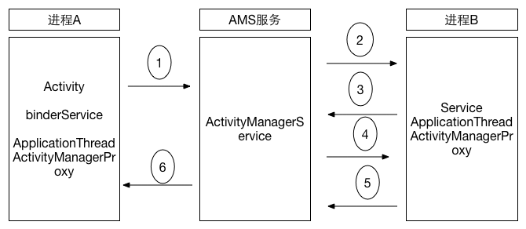

> [目录]    
> [Binder概述](#sumery_binder)  
> [问题引入原理](#binder_qusetions_index)  
> [ServiceManager化身大管家](#ServiceManager)  
> [Service实现逻辑](#service_part_arch)  
> [    - Service自身服务的实现](#service_self_implement)  
> [    - Service注册逻辑](#service_self_register)   
> [Android应用层对Binder的支持](#java_binder_ref)     

> 分析原理的步骤     
> 
> * 实现初衷    
> * 实现方式    
> * 使用方式    

### 概述: 

###	App：框架

### Binder面试问题--来说说Binde

#### 来说说Binder、点击事件如何传递到View，rootView+WindowsManager

如何理解这个Binder：从用法理解原理，而不是从原理理解用法。这大概也是比较合理的学习方式，难道我们要先学会语法再说话吗？

### Service自身抽象、注册、Loop成为服务 Loop与注册分开

#### Client有采用什么逻辑吗？直接在主线程中处理

传统的分析方式：注册 ServiceManager成为管家、数据结构、请求、返回、详细，但是等你看完可能更混乱，这里我只是直接用白话说一遍，然后个地方，找关键代码分析，看懂了，再看代码，才懂，这里有个逻辑问题，很多东西，你懂了，才看得懂别人写的。

### 1、Binder概述

   Binder是Android最重要的进程间通信方式之一，它基于OpenBinder，在被引入Android时候就自带Android特性，并为其做了很多修改，比如，Binder驱动中自带对ServiceManger-Clien-Server框架的支持。Android基于Linux内核，其进程管理完全沿用了Linux的进程/线程模型，进程划分为用户空间与内核空间，在用户空间，进程间是无法通信的，只有通过内核空间才能传递数据。 
Binder自身的意义倾向于通信，只是进程间通信的一种方式，但是在Android系统中，Binder被提到了核心高度，Android基本可以看做基于Binder模型实现的是一种Android RPC模型（远程过程调用协议 Remote Procedure Call Protocal ），即：C/S架构。Binder只是定义了通信，不要把数据传输跟业务处理弄混淆，用户空间包括Java层与Native层都是封装而已，为了Android用户空间的通信协议。

图1：Android系统中的Binder框架
由图1可知，       Android的Binder框架其实是有三部分构成： 

* 	ServiceManager（大管家）： 负责管理所有服务，帮助Client传递服务代理代理 
* 	Servers：真正的服务提供端
* 	Clients（客户端）：服务请求端

   Android系统基于Linux内核，因此，进程间通信必定会通过内核，Linux进程通信工具有很多种，Android选用了Binder，其优点是简单，并且只需要一次数据传递（先不讨论其原理）。其实Binder就是一个字符设备，驱动会为每个打开Binder的进程分配一块地址空间，在内核里，Client向Server传递数据，其实就是将数据写道内核空间中Server的地址里面，然后通知Server去取数据。原理其实很简单，但是Android为了更加合理的使用Binder，自己进行了很多层次的封装与优化，导致代码看的昏头转向， Binder驱动是Binder的核心，由它决定了任务的挂起与唤醒。

### 2、问题引入原理探究 --- 由表及里

* 1)	Client如何找到Server，并且向其发送请求

Client在getService的时候，SMS会在Client中创建Server的bind_ref引用，Client可以在自己进城的内核空间中找到该引用，从而，获取Server的bind_node节点，最后直接访问Server，向其传输数据，并唤醒。
* 2)	Client端，服务实体的引用bind_ref存在哪里了，与Handler的关系式怎么样的
每个打开Binder设备的进程，Binder驱动会在内核空间为该进程创建bind_proc结构体，同时bind_proc包含4棵红黑树：threads、bind_refs、bind_nodes、bind_desc这四棵树分别记录该进程的线程树、Binder引用树、本地Binder实体，等信息。方便本地查找。
	
3)	ServiceManager如何管理Servers

每个Server进程在注册的时候，首先会往本地进程的内核空间的Binders红黑树种插入服务的bind_node节点，然后会在ServiceManager的进程的内核空间中为其添加引用ref结构体，ref，会保存响应的信息，名字，地址等。

4)	如何唤醒目标进程或者线程：

每个Binder进程，在内核中，都设置了自己的等待队列，进程的或者线程的，都有，将来Binder驱动在唤醒目标任务的时候，直接唤醒这些进或者线程。
用户进程中的数据处理如何跟驱动中的分开：阻塞等待，再返回。
注意将业务逻辑与通信分开BpBinder只是用来通信，其他没啥作用，其hanlder值，只是为了标定目标

5)	返回如何找到目标进程或者线程，在请求的时候，会为bind_trasaction的from中添加请求端信息

6)	如何Binder节点与ref节点的添加时机 
驱动中存在一个TYPE_BINDER与TYPR_HANDLE的转换，Binder节点是在向Servicemanager注册时候添加的，而ref，是在getService的时候添加的，并且是由ServiceManager添加的。

7)	Binder如何实现只拷贝一次
数据从用户空间拷贝到内核中的时候，是直接拷贝到目标进程的内核空间，这个过程是在请求端线程中处理的，只不过操作对象是目标进城的内核空间。其实，内核中的bind_trasaction_data是直接在目标进程汇总分配的，由于Binder进程的Binder内存部分在内核空间跟用户空间只存在一个偏差值，用户空间不需要再次拷贝数据就可
以完成访问。

8)	Binder接收线程管理：请求发送时没有特别标记，驱动怎么判断哪些数据包该送入全局to-do队列，哪些数据包该送入特定线程的to-do队列呢？这里有两条规则：【1参考】

规则1：Client发给Server的请求数据包都提交到Server进程的全局to-do队列。不过有个特例，当进程P1的中的线程T1向进程P2发送请求时，驱动会先查看一下线程T1是否也正在处理来自P2某个线程请求，（尚在处理，未完成，没有发送回复），这种情况通常发生在两个进程都有Binder实体并互相对发时请求的时候。如果在进程P2中发现了这样的线程，比如说T2，就会要求T2来处理T1的这次请求。因为T2既然向T1发送了请求尚未得到返回包，说明T2肯定（或将会）阻塞在读取返回包的状态。这时候可以让T2顺便做点事情，总比等在那里闲着好。而且如果T2不是线程池中的线程还可以为线程池分担部分工。经过优化，来自T1的请求不是提交给P2的全局to-do队列，而是送入了T2的私有to-do队列。

规则2：对同步请求的返回数据包（由BC_REPLY发送的包）都发送到发起请求的线程的私有to-do队列中。如上面的例子，如果进程P1的线程T1发给进程P2的线程T2的是同步请求，那么T2返回的数据包将送进T1的私有to-do队列而不会提交到P1的全局to-do队列。

9)	IPCThreadState::joinThreadPool的真正意义是什么？
我可不可以理解加入该进程内核的线程池，进行循环，多个线程开启，其实一个就可以，难道怕处理不过来，多个线程处理起来，其实跟线程池类似，有个proc->todo队列，唤醒的时候，到底用那个队列。

### 3、ServiceManager启动为管家

* 	第一是调用函数binder_open打开设备文件/dev/binder，以及将它映射到本进程地址空间；
* 	第二是调用binder_become_context_manager将自己注册为Binder进程间通信机制的上下文管理者；
* 	第三步是调用函数binder_loop来循环等待和处理Client进程的通信要求。
* 	BC_ENTER_LOOPER

		int main(int argc, char **argv)
		{
		    struct binder_state *bs;
		    void *svcmgr = BINDER_SERVICE_MANAGER;
		    bs = binder_open(128*1024);
		    if (binder_become_context_manager(bs)) {
		        LOGE("cannot become context manager (%s)\n", strerror(errno));
		        return -1;
		    }
		    svcmgr_handle = svcmgr;
		    binder_loop(bs, svcmgr_handler);
		    return 0;
		}

   它表示Service Manager的句柄为0。Binder通信机制使用句柄来代表远程接口，这个句柄的意义和Windows编程中用到的句柄是差不多的概念。前面说到，Service Manager在充当守护进程的同时，它充当Server的角色，当它作为远程接口使用时，它的句柄值便为0，这就是它的特殊之处，其余的Server的远程接口句柄之都是一个大于0而且由Binder驱动程序自动进行分配的。

   
在android2.2中有 cmds/runtime/文件夹，里面有继承自BnServiceManager的类BServiceManager，不过这是在模拟器中使用的，其Android.mk文件中有：ifeq ($(TARGET_SIMULATOR),true)也就是说在真机中BnServiceManager是没有用的，不过目前在android 4.0中已经没有这段代码了。

为何ServiceM启动的时候没有采用joinThreadPool，而是自己通过for循环来实现自己Loop，因为环境还没准备好啊，所以，自己控制，所以也咩有talkWithDriver那套逻辑，不用onTransact实现。因为前文也说过，Binder为Android做了深层的改变，其实在驱动里面ServiceManager也是特殊对待的，这根传统的IPC工具有些不同：在binder.c驱动中，binder_transaction中，会对请求目标是ServiceManager的进行特殊处理。		

			if (tr->target.handle) {
						struct binder_ref *ref;
						ref = binder_get_ref(proc, tr->target.handle);
						if (ref == NULL) {
							binder_user_error("binder: %d:%d got "
								"transaction to invalid handle\n",
								proc->pid, thread->pid);
							return_error = BR_FAILED_REPLY;
							goto err_invalid_target_handle;
						}
						target_node = ref->node;
					} else {
						target_node = binder_context_mgr_node;
						if (target_node == NULL) {
							return_error = BR_DEAD_REPLY;
							goto err_no_context_mgr_node;
						}
					

					

					
### 4、Service实现逻辑

#### 4.1 Service实现逻辑    

关键函数onTransact调用逻辑  核心的一句话：实现自己的逻辑，之后，利用统一的入口进入Loop循环，接到请求，统一回调入口。入口就Ibinder。核心函数

    ProcessState::self()->startThreadPool();
    IPCThreadState::self()->joinThreadPool();

    
这里的框架如何抽象如此完美？业务逻辑跟底层通信完美的分离与统一？采用什么设计模式？统一了Ibind而接口，上层定义协议？因为主线程如果退出，程序就退出，所以主线程也要进入循环。如果是Java层，可以不用担心因为ActivityThread会保证UI Thread进入循环。startThreadPool回传给底层BC_ENTER_LOOPER参数，其目的是什么，只是向Binder驱动注册通报一声，我这个服务要作为Binder监听主线程服务了。其实你要注意，只要你在proc，当前进程中实现了BBinder服务，并且完成了注册，那么ProcessState::self()->startThreadPool();开启的线程就可以访问改BBinder，这个底层是统一的。只要进入循环，Binder就起来了。只要通过joinThreadPool进入循环，这条Binder服务的路线就已经起来了,为什么说事服务呢？而不是请求，请求走这条线路吗？请求是不走的，因为请求是异步或者阻塞的。不需要单独一个Loop进行维护。

#### 4.2注册并开启服务（C++本地服务）

		C++层
		/本地层
		int main(int argc, char** argv){
		    sp<ProcessState> proc(ProcessState::self());
		    sp<IServiceManager> sm = defaultServiceManager();
		    LOGI("ServiceManager: %p", sm.get());
		    AudioFlinger::instantiate(); //内含注册
		    MediaPlayerService::instantiate();//内含注册
		    CameraService::instantiate();//内含注册
		    AudioPolicyService::instantiate();//内含注册
		    ProcessState::self()->startThreadPool();
		    IPCThreadState::self()->joinThreadPool();
		}

		
这里时机注册了四个服务，其实服务注册后，如何监听等待Client来请求？他们是统一的，都是通过：

		
		    ProcessState::self()->startThreadPool();
		    IPCThreadState::self()->joinThreadPool();

   所谓注册流程，就是在ServiceManager那里登记一下，这样Client可以去ServiceManger去查询是不是有这么一个服务，并且可以获得该Service的访问入口，进而使用该接口。那么Service到底如何注册的呢？
首先创建Service本体，当然这个Service本体内部是没有实现什Client的请求监听的，它只是很简单实现了Task处理逻辑，针对某条命令实现相应的处理。那么正式进入登记注册流程，首先获得ServiceManager的代理，之后通过该代理想ServiceManager添加服务，获取ServiceManager代理：

    sp<IServiceManager> sm = defaultServiceManager();

这个函数定义在IServiceManager中，不属于某个类，是个全局方法， 多以可以直接调用， 

		sp<IServiceManager> defaultServiceManager()
		{
		    if (gDefaultServiceManager != NULL) return gDefaultServiceManager;
		    {
		        AutoMutex _l(gDefaultServiceManagerLock);
		        if (gDefaultServiceManager == NULL) {
		            gDefaultServiceManager = interface_cast<IServiceManager>(
		                ProcessState::self()->getContextObject(NULL));
		        }
		    }
		    return gDefaultServiceManager;
		}

		
gDefaultServiceManager定义在namespace android中，是个全局变量，如果你非要找源码，可以再static.h中找到它

		namespace android {
		// For ProcessState.cpp
		extern Mutex gProcessMutex;
		extern sp<ProcessState> gProcess;
		// For ServiceManager.cpp
		extern Mutex gDefaultServiceManagerLock;
		extern sp<IServiceManager> gDefaultServiceManager;
		extern sp<IPermissionController> gPermissionController;
		}   // namespace android

并且会在IServiceManager /ProcessState.cpp中发现#include <private/binder/Static.h>，引入这些单利模式对象，这样代码上的东西我们就找完了，但是这个函数作用：毕竟你没有看到立刻使用的地方啊，干嘛了，这是个单利模式namespce用户空间，每个proc只有一个实例，其实下下面的MediaPlayerService::instantiate()也会调用，看一下这个函数的关键句：

            gDefaultServiceManager = interface_cast<IServiceManager>(
                ProcessState::self()->getContextObject(NULL));

                
其中在IInterface.h可以找到第一句的实现

	template<typename INTERFACE>
	inline sp<INTERFACE> interface_cast(const sp<IBinder>& obj)
	{
	    return INTERFACE::asInterface(obj);
	}

	
这是个泛型函数，整理一下就是

		IServiceManager::asInterface(ProcessState::self()->getContextObject(NULL));

		
asInterface的作用这里强调一下，暂时记住，是为了抽象业务，通过    DECLARE_META_INTERFACE(ServiceManager)定义，其实这样也实现了解耦合与代码复用。如果想实现那个Service只需要DECLARE_META_INTERFACE即可，DECLARE_META_INTERFACE(MediaPlayerService)，方便：

		#define DECLARE_META_INTERFACE(INTERFACE)                               \
		    static const android::String16 descriptor;                          \
		    static android::sp<I##INTERFACE> asInterface(                       \
		            const android::sp<android::IBinder>& obj);                  \
		    virtual const android::String16& getInterfaceDescriptor() const;    \
		    I##INTERFACE();                                                     \
		    virtual ~I##INTERFACE(); 
		 IServiceManager::asInterface通过宏来定义与实现
		    android::sp<I##INTERFACE> I##INTERFACE::asInterface(                \
		            const android::sp<android::IBinder>& obj)                   \
		    {                                                                   \
		        android::sp<I##INTERFACE> intr;                                 \
		        if (obj != NULL) {                                              \
		            intr = static_cast<I##INTERFACE*>(                          \
		                obj->queryLocalInterface(                               \
		                        I##INTERFACE::descriptor).get());               \
		            if (intr == NULL) {                                         \
		                intr = new Bp##INTERFACE(obj);                          \
		            }                                                           \
		        }                                                               \
		        return intr;                                                    \
		    }                                                                   \
		    I##INTERFACE::I##INTERFACE() { }                                    \
		    I##INTERFACE::~I##INTERFACE() { }  

		    
这里##的作用是连接两个参数成为一个整体，这里如果请求的Service在当前进程，就返回Service自身，如果跨进城，返回是BpServiceManager代理，这里只考虑跨进程，这里看到obj的类型是const android::sp<android::IBinder>，而ProcessState::self()->getContextObject(NULL)返回也确实是一个BpBinder，详细看一下：

		sp<IBinder> ProcessState::getContextObject(const sp<IBinder>& caller)
		{
		    if (supportsProcesses()) {  // 这里是看是否已经打开Binder字符设备
		        return getStrongProxyForHandle(0); //这里传入0
		    } else {
		        return getContextObject(String16("default"), caller);
		    }
		} 

		
其实是走上面的逻辑，真实设备肯定跨进程，

		sp<IBinder> ProcessState::getStrongProxyForHandle(int32_t handle)
		{
		    sp<IBinder> result;
		    AutoMutex _l(mLock);
		handle_entry* e = lookupHandleLocked(handle);--》哈哈，果然，从数组中查找对应
		索引的资源，lookupHandleLocked这个就不说了，内部会返回一个handle_entry
		     if (e != NULL) {
		        IBinder* b = e->binder; -->第一次进来，肯定为空
		        if (b == NULL || !e->refs->attemptIncWeak(this)) {
		            b = new BpBinder(handle); --->创建了一个新的BpBinder，并且handle是0
		            e->binder = b;
		            result = b;
		        }....
		    }
		    return result; 返回BpBinder(0)。
		}
		BpBinder::BpBinder(int32_t handle)
		    : mHandle(handle)
		    , mAlive(1)
		    , mObitsSent(0)
		    , mObituaries(NULL)
		{
		    LOGV("Creating BpBinder %p handle %d\n", this, mHandle);
		
		    extendObjectLifetime(OBJECT_LIFETIME_WEAK);
		    IPCThreadState::self()->incWeakHandle(handle);
		}

 IPCThreadState类的成员函数incWeakHandle将添加Binder引用对象的弱引用计数的操作缓存在内部的一个成员变量mOut中，等到下次使用IO控制命令BINDER_WRITE_READ进入到Binder驱动程序时，再请求Binder驱动程序添加对应的Binder引用对象的弱引用计数。

 
		Vector<handle_entry>mHandleToObject;

最后简化为

		gDefaultServiceManager =BpServiceManager (new BpBinder(0));

到此，获取了ServiceManager的本地代理，

		class BpServiceManager : public BpInterface<IServiceManager>
		{
		public:
		BpServiceManager(const sp<IBinder>& impl)
		        : BpInterface<IServiceManager>(impl) { }
		virtual sp<IBinder> getService(const String16& name) const {
		        unsigned n;
		        for (n = 0; n < 5; n++){
		            sp<IBinder> svc = checkService(name);
		            if (svc != NULL) return svc;
		            LOGI("Waiting for service %s...\n", String8(name).string());
		            sleep(1);
		        }
		        return NULL;
		}

BpInterface采用了泛型，统一了接口

		template<typename INTERFACE>
		class BpInterface : public INTERFACE, public BpRefBase
		{
		public:  	BpInterface(const sp<IBinder>& remote);
		protected:  virtual IBinder*      onAsBinder();
		};
		template<typename INTERFACE>
		inline BpInterface<INTERFACE>::BpInterface(const sp<IBinder>& remote) : BpRefBase(remote)
		{}
		template<typename INTERFACE>
		inline IBinder* BpInterface<INTERFACE>::onAsBinder()
		{
		    return remote();
		}
		BpRefBase::BpRefBase(const sp<IBinder>& o)
		    : mRemote(o.get()), mRefs(NULL), mState(0)
		{
		    extendObjectLifetime(OBJECT_LIFETIME_WEAK);
		
		    if (mRemote) {
		        mRemote->incStrong(this);           // Removed on first IncStrong().
		        mRefs = mRemote->createWeak(this);  // Held for our entire lifetime.
		    }
		}
	
最终赋值给mRemote，这里牵扯到Android只能指针的问题，有时间大家自己当做一个专题去学习一下，
到此，就真正完成了BpServiceManager的创建于分析。既然创建好了，那么用一下，登记

		   defaultServiceManager()->addService(String16("media.player"), 
		   new MediaPlayerService());

		   
这里其实就是调用BpServiceManager的addService，看一下源码：

    virtual status_t addService(const String16& name, const sp<IBinder>& service)
    {
        Parcel data, reply;
        data.writeInterfaceToken(IServiceManager::getInterfaceDescriptor());
        data.writeString16(name);
        data.writeStrongBinder(service);
        status_t err = remote()->transact(ADD_SERVICE_TRANSACTION, data, &reply);
        return err == NO_ERROR ? reply.readExceptionCode() : err;
    }

    
关键是remote()->transact(ADD_SERVICE_TRANSACTION, data, &reply)，而remote()最终返回的其实就是mRemote，也就是BpBinder(0)，

    inline  IBinder*        remote()                { return mRemote; }

    
再来看一下BpBinder的transact函数，

		status_t BpBinder::transact(uint32_t code, const Parcel& data, Parcel* reply, uint32_t flags){
		 if (mAlive) {
		        status_t status = IPCThreadState::self()->transact(mHandle, code, data, reply, flags);
		        if (status == DEAD_OBJECT) mAlive = 0;
		        return status;   }
		    return DEAD_OBJECT;
		}

		
可以看出最终调用：

        status_t status = IPCThreadState::self()->transact(mHandle, code, data, reply, flags);

        
我们看一下关键代码：

		status_t IPCThreadState::transact(int32_t handle, uint32_t code, const Parcel& data,  Parcel* reply, uint32_t flags)
		{
		    status_t err = data.errorCheck();
		    flags |= TF_ACCEPT_FDS;
		    if (err == NO_ERROR) {
		// 写缓存
		        err = writeTransactionData(BC_TRANSACTION, flags, handle, code, data, NULL); //写缓存 mout
		    } 
		    if ((flags & TF_ONE_WAY) == 0) {
		        if (reply) {
		            err = waitForResponse(reply); // 访问Binder驱动，交互
		        } else {
		            Parcel fakeReply;
		            err = waitForResponse(&fakeReply);
		        }
		    } else {
		        err = waitForResponse(NULL, NULL);
		    }
		    return err;
		}

		
waitForResponse向ServiceManager发送请求，并阻塞等待回复，如何发送的呢：talkWithDriver，

	status_t IPCThreadState::waitForResponse(Parcel *reply, status_t *acquireResult){
	    int32_t cmd;
	    int32_t err;
	    while (1) {
	        if ((err=talkWithDriver()) < NO_ERROR) break;
	        err = mIn.errorCheck();
	        if (err < NO_ERROR) break;
	        if (mIn.dataAvail() == 0) continue;
	        cmd = mIn.readInt32();
	        IF_LOG_COMMANDS() {
	            alog << "Processing waitForResponse Command: "
	                << getReturnString(cmd) << endl;
	        }
	        switch (cmd) {
	        case BR_TRANSACTION_COMPLETE:
	            if (!reply && !acquireResult) goto finish;
	            break;
	            case BR_DEAD_REPLY:
	            err = DEAD_OBJECT;
	            goto finish;
	        case BR_FAILED_REPLY:
	            err = FAILED_TRANSACTION;
	            goto finish;
	        case BR_ACQUIRE_RESULT: {
	                LOG_ASSERT(acquireResult != NULL, "Unexpected brACQUIRE_RESULT");
	                const int32_t result = mIn.readInt32();
	                if (!acquireResult) continue;
	                *acquireResult = result ? NO_ERROR : INVALID_OPERATION;
	            }
	            goto finish; 
	        case BR_REPLY:
	            {
	                binder_transaction_data tr;
	                err = mIn.read(&tr, sizeof(tr));
	                if (reply) {
	                    if ((tr.flags & TF_STATUS_CODE) == 0) {
	                        reply->ipcSetDataReference(
	                            reinterpret_cast<const uint8_t*>(tr.data.ptr.buffer),
	                            tr.data_size,
	                            reinterpret_cast<const size_t*>(tr.data.ptr.offsets),
	                            tr.offsets_size/sizeof(size_t),
	                            freeBuffer, this);
	                    } else {
	                        err = *static_cast<const status_t*>(tr.data.ptr.buffer);
	                        freeBuffer(NULL, reinterpret_cast<const uint8_t*>(tr.data.ptr.buffer),tr.data_size,
	                            reinterpret_cast<const size_t*>(tr.data.ptr.offsets),tr.offsets_size/sizeof(size_t), this);
	                    }} else {
	                    freeBuffer(NULL,
	                        reinterpret_cast<const uint8_t*>(tr.data.ptr.buffer),
	                        tr.data_size,
	                        reinterpret_cast<const size_t*>(tr.data.ptr.offsets),
	                        tr.offsets_size/sizeof(size_t), this);
	                    continue; }}
	            goto finish; 
	        default:
	            err = executeCommand(cmd);
	            if (err != NO_ERROR) goto finish;
	            break; }}
	finish:
	    if (err != NO_ERROR) {
	        if (acquireResult) *acquireResult = err;
	        if (reply) reply->setError(err);
	        mLastError = err;
	    } 
	    return err;
	}

	
talkWithDriver()的代码就设计到ioctrl，去访问Binder驱动，这里牵扯的驱动的问题，篇幅很大，不过也一条流水线下来吧，牵扯到什么说什么，先打通。

		status_t IPCThreadState::talkWithDriver(bool doReceive) {  
		    binder_write_read bwr;    
		    // Is the read buffer empty?
		    const bool needRead = mIn.dataPosition() >= mIn.dataSize();    
		    // We don't want to write anything if we are still reading
		    // from data left in the input buffer and the caller
		    // has requested to read the next data.
		    //正在读取的时候不写
		    const size_t outAvail = (!doReceive || needRead) ? mOut.dataSize() : 0;    
		    bwr.write_size = outAvail;
		    bwr.write_buffer = (long unsigned int)mOut.data();
		    // This is what we'll read.
		    if (doReceive && needRead) {
		        bwr.read_size = mIn.dataCapacity();
		        bwr.read_buffer = (long unsigned int)mIn.data();
		    } else {
		        bwr.read_size = 0;
		    }    
		    // Return immediately if there is nothing to do.
		    if ((bwr.write_size == 0) && (bwr.read_size == 0)) return NO_ERROR;    
		    bwr.write_consumed = 0;
		    bwr.read_consumed = 0;
		    status_t err;
		    do {
		        if (ioctl(mProcess->mDriverFD, BINDER_WRITE_READ, &bwr) >= 0)
		            err = NO_ERROR;
		        else
		            err = -errno；
		        IF_LOG_COMMANDS() {
		            alog << "Finished read/write, write size = " << mOut.dataSize() << endl;
		        }//这个log说明，talkWithDriver是读写一体的，并且，请求段是采用阻塞的方式来等待请求返回的
		    } while (err == -EINTR);
		    if (err >= NO_ERROR) {
		        if (bwr.write_consumed > 0) {
		            if (bwr.write_consumed < (ssize_t)mOut.dataSize())
		                mOut.remove(0, bwr.write_consumed);
		            else
		                mOut.setDataSize(0);
		        }
		        if (bwr.read_consumed > 0) {//通知去读
		            mIn.setDataSize(bwr.read_consumed);
		            mIn.setDataPosition(0);
		        }
		        return NO_ERROR;
		    }    
		    return err;
		}

		
看ioctrl，系统调用函数，其对应的bind_ioctrl位于Binder驱动中，首先会写数据，然后读取返回:

	// 对于异步传输，在上层空间传下来的数据结构binder_transcation_data中的flags域中可以体现出来，
	// 也就是flags的TF_ONE_WAY位为1，就表示需要异步传输，不需要等待回复数据。
	static long binder_ioctl(struct file *filp, unsigned int cmd, unsigned long arg)
	{
		int ret;
		// 当前进程对应的binder_proc 
		struct binder_proc *proc = filp->private_data;
		// 进程的每个线程在binder驱动中的表示
		struct binder_thread *thread;
		unsigned int size = _IOC_SIZE(cmd);
		void __user *ubuf = (void __user *)arg;
		trace_binder_ioctl(cmd, arg);
		ret = wait_event_interruptible(binder_user_error_wait, binder_stop_on_user_error < 2);
		if (ret)
			goto err_unlocked;
		binder_lock(__func__);
		/* 查找当前task对应的binder_thread结构体，如果没找到就新建一个binder_thread，同时将其加入  
	      binder_proc的threads的红黑树中。*/
		thread = binder_get_thread(proc);
	    // ￥
		switch (cmd) {
		case BINDER_WRITE_READ: {
			struct binder_write_read bwr;
			if (size != sizeof(struct binder_write_read)) {
				ret = -EINVAL;
				goto err;
			}
			if (copy_from_user(&bwr, ubuf, sizeof(bwr))) {
				ret = -EFAULT;
				goto err;
			}
			//  > 0, 表示本次ioctl有待发送的数据
			if (bwr.write_size > 0) {
				// 写数据
				ret = binder_thread_write(proc, thread, (void __user *)bwr.write_buffer, bwr.write_size, &bwr.write_consumed);
				trace_binder_write_done(ret);
				// 成功返回0，出错小于0
				if (ret < 0) {
					bwr.read_consumed = 0;
					if (copy_to_user(ubuf, &bwr, sizeof(bwr)))
						ret = -EFAULT;
					goto err;
				}
			}
			//> 0表示本次ioctl想接收数据
			if (bwr.read_size > 0) {
				// binder驱动接收读数据函数，这里会阻塞，然后被唤醒
				ret = binder_thread_read(proc, thread, (void __user *)bwr.read_buffer, bwr.read_size, &bwr.read_consumed, filp->f_flags & O_NONBLOCK);
				trace_binder_read_done(ret);
				 /* 读返回的时候如果发现todo任务队列中有待处理的任务，那么将会唤醒binder_proc.wait中下一个等待着的空闲线程。*/
				if (!list_empty(&proc->todo))
					wake_up_interruptible(&proc->wait);
				if (ret < 0) {
					if (copy_to_user(ubuf, &bwr, sizeof(bwr)))
						ret = -EFAULT;
					goto err;
				}
			}
	      //   返回binder_write_read
			if (copy_to_user(ubuf, &bwr, sizeof(bwr))) {
				ret = -EFAULT;
				goto err;
			}
			break;
		}
		case BINDER_SET_MAX_THREADS:
			if (copy_from_user(&proc->max_threads, ubuf, sizeof(proc->max_threads))) {
				ret = -EINVAL;
				goto err;
			}
			break;
		case BINDER_SET_CONTEXT_MGR:
			if (binder_context_mgr_node != NULL) {
				printk(KERN_ERR "binder: BINDER_SET_CONTEXT_MGR already set\n");
				ret = -EBUSY;
				goto err;
			}
			ret = security_binder_set_context_mgr(proc->tsk);
			if (ret < 0)
				goto err;
			if (binder_context_mgr_uid != -1) {
				if (binder_context_mgr_uid != current->cred->euid) {
					printk(KERN_ERR "binder: BINDER_SET_"
					       "CONTEXT_MGR bad uid %d != %d\n",
					       current->cred->euid,
					       binder_context_mgr_uid);
					ret = -EPERM;
					goto err;
				}
			} else
				binder_context_mgr_uid = current->cred->euid;
			binder_context_mgr_node = binder_new_node(proc, NULL, NULL);
			if (binder_context_mgr_node == NULL) {
				ret = -ENOMEM;
				goto err;
			}
			binder_context_mgr_node->local_weak_refs++;
			binder_context_mgr_node->local_strong_refs++;
			binder_context_mgr_node->has_strong_ref = 1;
			binder_context_mgr_node->has_weak_ref = 1;
			break;
		case BINDER_THREAD_EXIT:
			binder_debug(BINDER_DEBUG_THREADS, "binder: %d:%d exit\n",
				     proc->pid, thread->pid);
			binder_free_thread(proc, thread);
			thread = NULL;
			break;
		case BINDER_VERSION:
			if (size != sizeof(struct binder_version)) {
				ret = -EINVAL;
				goto err;
			}
			if (put_user(BINDER_CURRENT_PROTOCOL_VERSION, &((struct binder_version *)ubuf)->protocol_version)) {
				ret = -EINVAL;
				goto err;
			}
			break;
		default:
			ret = -EINVAL;
			goto err;
		}
		ret = 0;
	err:
		if (thread)
			thread->looper &= ~BINDER_LOOPER_STATE_NEED_RETURN;
		binder_unlock(__func__);
		wait_event_interruptible(binder_user_error_wait, binder_stop_on_user_error < 2);
		if (ret && ret != -ERESTARTSYS)
			printk(KERN_INFO "binder: %d:%d ioctl %x %lx returned %d\n", proc->pid, current->pid, cmd, arg, ret);
	err_unlocked:
		trace_binder_ioctl_done(ret);
		return ret;
	}
其实，由用户空间传到Binder的命令字段只有七种，例如BINDER_WRITE_READ；至于，其他的是协议字段，如	BC_TRANSACTION、case BC_REPLY。一般对于请求可以分为以下步骤，先写请求跟数据，后读返回

		static long binder_ioctl(struct file *filp, unsigned int cmd, unsigned long arg)
		{
			int ret;
			struct binder_proc *proc = filp->private_data;
			struct binder_thread *thread;
			unsigned int size = _IOC_SIZE(cmd);
			void __user *ubuf = (void __user *)arg;
			binder_lock(__func__);
			thread = binder_get_thread(proc);
			if (thread == NULL) {
				ret = -ENOMEM;
				goto err;
			}
			switch (cmd) {
			case BINDER_WRITE_READ: {
				struct binder_write_read bwr;
				if (size != sizeof(struct binder_write_read)) {
					ret = -EINVAL;
					goto err;
				}
				if (copy_from_user(&bwr, ubuf, sizeof(bwr))) {
					ret = -EFAULT;
					goto err;
				}
				binder_debug(BINDER_DEBUG_READ_WRITE,
					     "binder: %d:%d write %ld at %08lx, read %ld at %08lx\n",
					     proc->pid, thread->pid, bwr.write_size, bwr.write_buffer,
					     bwr.read_size, bwr.read_buffer);
				//  > 0, 表示本次ioctl有待发送的数据
				if (bwr.write_size > 0) {
					// 写数据
					ret = binder_thread_write(proc, thread, (void __user *)bwr.write_buffer, bwr.write_size, &bwr.write_consumed);
					trace_binder_write_done(ret);
					// 成功返回0，出错小于0
					if (ret < 0) {
						bwr.read_consumed = 0;
						if (copy_to_user(ubuf, &bwr, sizeof(bwr)))
							ret = -EFAULT;
						goto err;
					}
				}
				//> 0表示本次ioctl想接收数据
				if (bwr.read_size > 0) {
					// binder驱动接收读数据函数，这里会阻塞，然后被唤醒
					ret = binder_thread_read(proc, thread, (void __user *)bwr.read_buffer, bwr.read_size, &bwr.read_consumed, filp->f_flags & O_NONBLOCK);
					trace_binder_read_done(ret);
					 /* 读返回的时候如果发现todo任务队列中有待处理的任务，那么将会唤醒binder_proc.wait中下一个等待着的空闲线程。*/
					if (!list_empty(&proc->todo))
						wake_up_interruptible(&proc->wait);
					if (ret < 0) {
						if (copy_to_user(ubuf, &bwr, sizeof(bwr)))
							ret = -EFAULT;
						goto err;
					}
				}

		
而在写请求与数据的过程中，会调用binder_transaction函数，这个函数是比较关键的函数，里面涉及到Binder驱动管理的核心部分，找到目标进程或者线程，之后唤醒，同时也让目标线程可以记住返回线程，方便回写，

	int binder_thread_write(struct binder_proc *proc, struct binder_thread *thread,
			void __user *buffer, int size, signed long *consumed)
{
	uint32_t cmd;
	void __user *ptr = buffer + *consumed;
	void __user *end = buffer + size;
		switch (cmd) {
		case BC_INCREFS:
		case BC_ACQUIRE:
		case BC_RELEASE:
		case BC_DECREFS: {
			uint32_t target;
			struct binder_ref *ref;
			const char *debug_string;
			if (get_user(target, (uint32_t __user *)ptr))
				return -EFAULT;
			ptr += sizeof(uint32_t);
			if (target == 0 && binder_context_mgr_node &&
			    (cmd == BC_INCREFS || cmd == BC_ACQUIRE)) {
				ref = binder_get_ref_for_node(proc,
					       binder_context_mgr_node);
				if (ref->desc != target) {
					binder_user_error("binder: %d:"
						"%d tried to acquire "
						"reference to desc 0, "
						"got %d instead\n",
						proc->pid, thread->pid,
						ref->desc);
				}
			} else
				ref = binder_get_ref(proc, target);
			if (ref == NULL) {
				binder_user_error("binder: %d:%d refcou"
					"nt change on invalid ref %d\n",
					proc->pid, thread->pid, target);
				break;
			}
			switch (cmd) {
			case BC_INCREFS:
				debug_string = "IncRefs";
				binder_inc_ref(ref, 0, NULL);
				break;
			case BC_ACQUIRE:
				debug_string = "Acquire";
				binder_inc_ref(ref, 1, NULL);
				break;
			case BC_RELEASE:
				debug_string = "Release";
				binder_dec_ref(ref, 1);
				break;
			case BC_DECREFS:
			default:
				debug_string = "DecRefs";
				binder_dec_ref(ref, 0);
				break;
			}
			binder_debug(BINDER_DEBUG_USER_REFS,
				     "binder: %d:%d %s ref %d desc %d s %d w %d for node %d\n",
				     proc->pid, thread->pid, debug_string, ref->debug_id,
				     ref->desc, ref->strong, ref->weak, ref->node->debug_id);
			break;
		}
		case BC_INCREFS_DONE:
		case BC_ACQUIRE_DONE: {
			void __user *node_ptr;
			void *cookie;
			struct binder_node *node;
			if (get_user(node_ptr, (void * __user *)ptr))
				return -EFAULT;
			ptr += sizeof(void *);
			if (get_user(cookie, (void * __user *)ptr))
				return -EFAULT;
			ptr += sizeof(void *);
			node = binder_get_node(proc, node_ptr);
			if (node == NULL) {
				binder_user_error("binder: %d:%d "
					"%s u%p no match\n",
					proc->pid, thread->pid,
					cmd == BC_INCREFS_DONE ?
					"BC_INCREFS_DONE" :
					"BC_ACQUIRE_DONE",
					node_ptr);
				break;
			}
			if (cookie != node->cookie) {
				binder_user_error("binder: %d:%d %s u%p node %d"
					" cookie mismatch %p != %p\n",
					proc->pid, thread->pid,
					cmd == BC_INCREFS_DONE ?
					"BC_INCREFS_DONE" : "BC_ACQUIRE_DONE",
					node_ptr, node->debug_id,
					cookie, node->cookie);
				break;
			}
			if (cmd == BC_ACQUIRE_DONE) {
				if (node->pending_strong_ref == 0) {
					binder_user_error("binder: %d:%d "
						"BC_ACQUIRE_DONE node %d has "
						"no pending acquire request\n",
						proc->pid, thread->pid,
						node->debug_id);
					break;
				}
				node->pending_strong_ref = 0;
			} else {
				if (node->pending_weak_ref == 0) {
					binder_user_error("binder: %d:%d "
						"BC_INCREFS_DONE node %d has "
						"no pending increfs request\n",
						proc->pid, thread->pid,
						node->debug_id);
					break;
				}
				node->pending_weak_ref = 0;
			}
			binder_dec_node(node, cmd == BC_ACQUIRE_DONE, 0);
			binder_debug(BINDER_DEBUG_USER_REFS,
				     "binder: %d:%d %s node %d ls %d lw %d\n",
				     proc->pid, thread->pid,
				     cmd == BC_INCREFS_DONE ? "BC_INCREFS_DONE" : "BC_ACQUIRE_DONE",
				     node->debug_id, node->local_strong_refs, node->local_weak_refs);
			break;
		}
		case BC_ATTEMPT_ACQUIRE:
			printk(KERN_ERR "binder: BC_ATTEMPT_ACQUIRE not supported\n");
			return -EINVAL;
		case BC_ACQUIRE_RESULT:
			printk(KERN_ERR "binder: BC_ACQUIRE_RESULT not supported\n");
			return -EINVAL;
		case BC_FREE_BUFFER: {
			void __user *data_ptr;
			struct binder_buffer *buffer;
			if (get_user(data_ptr, (void * __user *)ptr))
				return -EFAULT;
			ptr += sizeof(void *);
			buffer = binder_buffer_lookup(proc, data_ptr);
			if (buffer == NULL) {
				binder_user_error("binder: %d:%d "
					"BC_FREE_BUFFER u%p no match\n",
					proc->pid, thread->pid, data_ptr);
				break;
			}
			if (!buffer->allow_user_free) {
				binder_user_error("binder: %d:%d "
					"BC_FREE_BUFFER u%p matched "
					"unreturned buffer\n",
					proc->pid, thread->pid, data_ptr);
				break;
			}
			binder_debug(BINDER_DEBUG_FREE_BUFFER,
				     "binder: %d:%d BC_FREE_BUFFER u%p found buffer %d for %s transaction\n",
				     proc->pid, thread->pid, data_ptr, buffer->debug_id,
				     buffer->transaction ? "active" : "finished");
			if (buffer->transaction) {
				buffer->transaction->buffer = NULL;
				buffer->transaction = NULL;
			}
			if (buffer->async_transaction && buffer->target_node) {
				BUG_ON(!buffer->target_node->has_async_transaction);
				// 这里是清空是否异步任务在处理，为什么是异步任务呢？
				if (list_empty(&buffer->target_node->async_todo))
					buffer->target_node->has_async_transaction = 0;
				else
					list_move_tail(buffer->target_node->async_todo.next, &thread->todo);
			}
			trace_binder_transaction_buffer_release(buffer);
			binder_transaction_buffer_release(proc, buffer, NULL);
			binder_free_buf(proc, buffer);
			break;
		}
		case BC_TRANSACTION:
		case BC_REPLY: {
			struct binder_transaction_data tr;
			if (copy_from_user(&tr, ptr, sizeof(tr)))
				return -EFAULT;
			ptr += sizeof(tr);
			binder_transaction(proc, thread, &tr, cmd == BC_REPLY);
			break;
		}
		case BC_REGISTER_LOOPER:
			binder_debug(BINDER_DEBUG_THREADS,
				     "binder: %d:%d BC_REGISTER_LOOPER\n",
				     proc->pid, thread->pid);
			if (thread->looper & BINDER_LOOPER_STATE_ENTERED) {
				thread->looper |= BINDER_LOOPER_STATE_INVALID;
				binder_user_error("binder: %d:%d ERROR:"
					" BC_REGISTER_LOOPER called "
					"after BC_ENTER_LOOPER\n",
					proc->pid, thread->pid);
			} else if (proc->requested_threads == 0) {
				thread->looper |= BINDER_LOOPER_STATE_INVALID;
				binder_user_error("binder: %d:%d ERROR:"
					" BC_REGISTER_LOOPER called "
					"without request\n",
					proc->pid, thread->pid);
			} else {
				proc->requested_threads--;
				proc->requested_threads_started++;
			}
			thread->looper |= BINDER_LOOPER_STATE_REGISTERED;
			break;
		case BC_ENTER_LOOPER:
			binder_debug(BINDER_DEBUG_THREADS,
				     "binder: %d:%d BC_ENTER_LOOPER\n",
				     proc->pid, thread->pid);
			if (thread->looper & BINDER_LOOPER_STATE_REGISTERED) {
				thread->looper |= BINDER_LOOPER_STATE_INVALID;
				binder_user_error("binder: %d:%d ERROR:"
					" BC_ENTER_LOOPER called after "
					"BC_REGISTER_LOOPER\n",
					proc->pid, thread->pid);
			}
			thread->looper |= BINDER_LOOPER_STATE_ENTERED;
			break;
		case BC_EXIT_LOOPER:
			binder_debug(BINDER_DEBUG_THREADS,
				     "binder: %d:%d BC_EXIT_LOOPER\n",
				     proc->pid, thread->pid);
			thread->looper |= BINDER_LOOPER_STATE_EXITED;
			break;
		case BC_REQUEST_DEATH_NOTIFICATION:
		case BC_CLEAR_DEATH_NOTIFICATION: {
			uint32_t target;
			void __user *cookie;
			struct binder_ref *ref;
			struct binder_ref_death *death;
			if (get_user(target, (uint32_t __user *)ptr))
				return -EFAULT;
			ptr += sizeof(uint32_t);
			if (get_user(cookie, (void __user * __user *)ptr))
				return -EFAULT;
			ptr += sizeof(void *);
			ref = binder_get_ref(proc, target);
			if (ref == NULL) {
				binder_user_error("binder: %d:%d %s "
					"invalid ref %d\n",
					proc->pid, thread->pid,
					cmd == BC_REQUEST_DEATH_NOTIFICATION ?
					"BC_REQUEST_DEATH_NOTIFICATION" :
					"BC_CLEAR_DEATH_NOTIFICATION",
					target);
				break;
			}
			binder_debug(BINDER_DEBUG_DEATH_NOTIFICATION,
				     "binder: %d:%d %s %p ref %d desc %d s %d w %d for node %d\n",
				     proc->pid, thread->pid,
				     cmd == BC_REQUEST_DEATH_NOTIFICATION ?
				     "BC_REQUEST_DEATH_NOTIFICATION" :
				     "BC_CLEAR_DEATH_NOTIFICATION",
				     cookie, ref->debug_id, ref->desc,
				     ref->strong, ref->weak, ref->node->debug_id);
			if (cmd == BC_REQUEST_DEATH_NOTIFICATION) {
				if (ref->death) {
					binder_user_error("binder: %d:%"
						"d BC_REQUEST_DEATH_NOTI"
						"FICATION death notific"
						"ation already set\n",
						proc->pid, thread->pid);
					break;
				}
				death = kzalloc(sizeof(*death), GFP_KERNEL);
				if (death == NULL) {
					thread->return_error = BR_ERROR;
					binder_debug(BINDER_DEBUG_FAILED_TRANSACTION,
						     "binder: %d:%d "
						     "BC_REQUEST_DEATH_NOTIFICATION failed\n",
						     proc->pid, thread->pid);
					break;
				}
				binder_stats_created(BINDER_STAT_DEATH);
				INIT_LIST_HEAD(&death->work.entry);
				death->cookie = cookie;
				ref->death = death;
				if (ref->node->proc == NULL) {
					ref->death->work.type = BINDER_WORK_DEAD_BINDER;
					if (thread->looper & (BINDER_LOOPER_STATE_REGISTERED | BINDER_LOOPER_STATE_ENTERED)) {
						list_add_tail(&ref->death->work.entry, &thread->todo);
					} else {
						list_add_tail(&ref->death->work.entry, &proc->todo);
						wake_up_interruptible(&proc->wait);
					}
				}
			} else {
				if (ref->death == NULL) {
					binder_user_error("binder: %d:%"
						"d BC_CLEAR_DEATH_NOTIFI"
						"CATION death notificat"
						"ion not active\n",
						proc->pid, thread->pid);
					break;
				}
				death = ref->death;
				if (death->cookie != cookie) {
					binder_user_error("binder: %d:%"
						"d BC_CLEAR_DEATH_NOTIFI"
						"CATION death notificat"
						"ion cookie mismatch "
						"%p != %p\n",
						proc->pid, thread->pid,
						death->cookie, cookie);
					break;
				}
				ref->death = NULL;
				if (list_empty(&death->work.entry)) {
					death->work.type = BINDER_WORK_CLEAR_DEATH_NOTIFICATION;
					if (thread->looper & (BINDER_LOOPER_STATE_REGISTERED | BINDER_LOOPER_STATE_ENTERED)) {
						list_add_tail(&death->work.entry, &thread->todo);
					} else {
						list_add_tail(&death->work.entry, &proc->todo);
						wake_up_interruptible(&proc->wait);
					}
				} else {
					BUG_ON(death->work.type != BINDER_WORK_DEAD_BINDER);
					death->work.type = BINDER_WORK_DEAD_BINDER_AND_CLEAR;
				}
			}
		} break;
		case BC_DEAD_BINDER_DONE: {
			struct binder_work *w;
			void __user *cookie;
			struct binder_ref_death *death = NULL;
			if (get_user(cookie, (void __user * __user *)ptr))
				return -EFAULT;
			ptr += sizeof(void *);
			list_for_each_entry(w, &proc->delivered_death, entry) {
				struct binder_ref_death *tmp_death = container_of(w, struct binder_ref_death, work);
				if (tmp_death->cookie == cookie) {
					death = tmp_death;
					break;
				}
			}
			binder_debug(BINDER_DEBUG_DEAD_BINDER,
				     "binder: %d:%d BC_DEAD_BINDER_DONE %p found %p\n",
				     proc->pid, thread->pid, cookie, death);
			if (death == NULL) {
				binder_user_error("binder: %d:%d BC_DEAD"
					"_BINDER_DONE %p not found\n",
					proc->pid, thread->pid, cookie);
				break;
			}
			list_del_init(&death->work.entry);
			if (death->work.type == BINDER_WORK_DEAD_BINDER_AND_CLEAR) {
				death->work.type = BINDER_WORK_CLEAR_DEATH_NOTIFICATION;
				if (thread->looper & (BINDER_LOOPER_STATE_REGISTERED | BINDER_LOOPER_STATE_ENTERED)) {
					list_add_tail(&death->work.entry, &thread->todo);
				} else {
					list_add_tail(&death->work.entry, &proc->todo);
					wake_up_interruptible(&proc->wait);
				}
			}
		} break;
		default:
			printk(KERN_ERR "binder: %d:%d unknown command %d\n",
			       proc->pid, thread->pid, cmd);
			return -EINVAL;
		}
		*consumed = ptr - buffer;
	}
	return 0;
}
void binder_stat_br(struct binder_proc *proc, struct binder_thread *thread,
		    uint32_t cmd)
{
	trace_binder_return(cmd);
	if (_IOC_NR(cmd) < ARRAY_SIZE(binder_stats.br)) {
		binder_stats.br[_IOC_NR(cmd)]++;
		proc->stats.br[_IOC_NR(cmd)]++;
		thread->stats.br[_IOC_NR(cmd)]++;
	}
}
static int binder_has_proc_work(struct binder_proc *proc,
				struct binder_thread *thread)
{
	return !list_empty(&proc->todo) ||
		(thread->looper & BINDER_LOOPER_STATE_NEED_RETURN);
}
static int binder_has_thread_work(struct binder_thread *thread)
{
	return !list_empty(&thread->todo) || thread->return_error != BR_OK ||
		(thread->looper & BINDER_LOOPER_STATE_NEED_RETURN);
}
static int binder_thread_read(struct binder_proc *proc,
			      struct binder_thread *thread,
			      void  __user *buffer, int size,
			      signed long *consumed, int non_block)
{
	void __user *ptr = buffer + *consumed;
	void __user *end = buffer + size;
	int ret = 0;
	int wait_for_proc_work;
	if (*consumed == 0) {
		if (put_user(BR_NOOP, (uint32_t __user *)ptr))
			return -EFAULT;
		ptr += sizeof(uint32_t);
	}
retry:
	wait_for_proc_work = thread->transaction_stack == NULL &&
				list_empty(&thread->todo);
	if (thread->return_error != BR_OK && ptr < end) {
		if (thread->return_error2 != BR_OK) {
			if (put_user(thread->return_error2, (uint32_t __user *)ptr))
				return -EFAULT;
			ptr += sizeof(uint32_t);
			binder_stat_br(proc, thread, thread->return_error2);
			if (ptr == end)
				goto done;
			thread->return_error2 = BR_OK;
		}
		if (put_user(thread->return_error, (uint32_t __user *)ptr))
			return -EFAULT;
		ptr += sizeof(uint32_t);
		binder_stat_br(proc, thread, thread->return_error);
		thread->return_error = BR_OK;
		goto done;
	}
	thread->looper |= BINDER_LOOPER_STATE_WAITING;
	if (wait_for_proc_work)
		proc->ready_threads++;
	binder_unlock(__func__);
	trace_binder_wait_for_work(wait_for_proc_work,
				   !!thread->transaction_stack,
				   !list_empty(&thread->todo));
	if (wait_for_proc_work) {
		if (!(thread->looper & (BINDER_LOOPER_STATE_REGISTERED |
					BINDER_LOOPER_STATE_ENTERED))) {
			binder_user_error("binder: %d:%d ERROR: Thread waiting "
				"for process work before calling BC_REGISTER_"
				"LOOPER or BC_ENTER_LOOPER (state %x)\n",
				proc->pid, thread->pid, thread->looper);
			wait_event_interruptible(binder_user_error_wait,
						 binder_stop_on_user_error < 2);
		}
		binder_set_nice(proc->default_priority);
		if (non_block) {
			if (!binder_has_proc_work(proc, thread))
				ret = -EAGAIN;
		} else
			ret = wait_event_freezable_exclusive(proc->wait, binder_has_proc_work(proc, thread));
	} else {
		if (non_block) {
			if (!binder_has_thread_work(thread))
				ret = -EAGAIN;
		} else
			ret = wait_event_freezable(thread->wait, binder_has_thread_work(thread));
	}
	binder_lock(__func__);
	if (wait_for_proc_work)
		proc->ready_threads--;
	thread->looper &= ~BINDER_LOOPER_STATE_WAITING;
	if (ret)
		return ret;
	while (1) {
		uint32_t cmd;
		struct binder_transaction_data tr;
		struct binder_work *w;
		struct binder_transaction *t = NULL;
		if (!list_empty(&thread->todo))
			w = list_first_entry(&thread->todo, struct binder_work, entry);
		else if (!list_empty(&proc->todo) && wait_for_proc_work)
			w = list_first_entry(&proc->todo, struct binder_work, entry);
		else {
			if (ptr - buffer == 4 && !(thread->looper & BINDER_LOOPER_STATE_NEED_RETURN)) /* no data added */
				goto retry;
			break;
		}
		if (end - ptr < sizeof(tr) + 4)
			break;
		switch (w->type) {
		case BINDER_WORK_TRANSACTION: {
			t = container_of(w, struct binder_transaction, work);
		} break;
		case BINDER_WORK_TRANSACTION_COMPLETE: {
			cmd = BR_TRANSACTION_COMPLETE;
			if (put_user(cmd, (uint32_t __user *)ptr))
				return -EFAULT;
			ptr += sizeof(uint32_t);
			binder_stat_br(proc, thread, cmd);
			binder_debug(BINDER_DEBUG_TRANSACTION_COMPLETE,
				     "binder: %d:%d BR_TRANSACTION_COMPLETE\n",
				     proc->pid, thread->pid);
			list_del(&w->entry);
			kfree(w);
			binder_stats_deleted(BINDER_STAT_TRANSACTION_COMPLETE);
		} break;
		case BINDER_WORK_NODE: {
			struct binder_node *node = container_of(w, struct binder_node, work);
			uint32_t cmd = BR_NOOP;
			const char *cmd_name;
			int strong = node->internal_strong_refs || node->local_strong_refs;
			int weak = !hlist_empty(&node->refs) || node->local_weak_refs || strong;
			if (weak && !node->has_weak_ref) {
				cmd = BR_INCREFS;
				cmd_name = "BR_INCREFS";
				node->has_weak_ref = 1;
				node->pending_weak_ref = 1;
				node->local_weak_refs++;
			} else if (strong && !node->has_strong_ref) {
				cmd = BR_ACQUIRE;
				cmd_name = "BR_ACQUIRE";
				node->has_strong_ref = 1;
				node->pending_strong_ref = 1;
				node->local_strong_refs++;
			} else if (!strong && node->has_strong_ref) {
				cmd = BR_RELEASE;
				cmd_name = "BR_RELEASE";
				node->has_strong_ref = 0;
			} else if (!weak && node->has_weak_ref) {
				cmd = BR_DECREFS;
				cmd_name = "BR_DECREFS";
				node->has_weak_ref = 0;
			}
			if (cmd != BR_NOOP) {
				if (put_user(cmd, (uint32_t __user *)ptr))
					return -EFAULT;
				ptr += sizeof(uint32_t);
				if (put_user(node->ptr, (void * __user *)ptr))
					return -EFAULT;
				ptr += sizeof(void *);
				if (put_user(node->cookie, (void * __user *)ptr))
					return -EFAULT;
				ptr += sizeof(void *);
				binder_stat_br(proc, thread, cmd);
				binder_debug(BINDER_DEBUG_USER_REFS,
					     "binder: %d:%d %s %d u%p c%p\n",
					     proc->pid, thread->pid, cmd_name, node->debug_id, node->ptr, node->cookie);
			} else {
				list_del_init(&w->entry);
				if (!weak && !strong) {
					binder_debug(BINDER_DEBUG_INTERNAL_REFS,
						     "binder: %d:%d node %d u%p c%p deleted\n",
						     proc->pid, thread->pid, node->debug_id,
						     node->ptr, node->cookie);
					rb_erase(&node->rb_node, &proc->nodes);
					kfree(node);
					binder_stats_deleted(BINDER_STAT_NODE);
				} else {
					binder_debug(BINDER_DEBUG_INTERNAL_REFS,
						     "binder: %d:%d node %d u%p c%p state unchanged\n",
						     proc->pid, thread->pid, node->debug_id, node->ptr,
						     node->cookie);
				}
			}
		} break;
		case BINDER_WORK_DEAD_BINDER:
		case BINDER_WORK_DEAD_BINDER_AND_CLEAR:
		case BINDER_WORK_CLEAR_DEATH_NOTIFICATION: {
			struct binder_ref_death *death;
			uint32_t cmd;
			death = container_of(w, struct binder_ref_death, work);
			if (w->type == BINDER_WORK_CLEAR_DEATH_NOTIFICATION)
				cmd = BR_CLEAR_DEATH_NOTIFICATION_DONE;
			else
				cmd = BR_DEAD_BINDER;
			if (put_user(cmd, (uint32_t __user *)ptr))
				return -EFAULT;
			ptr += sizeof(uint32_t);
			if (put_user(death->cookie, (void * __user *)ptr))
				return -EFAULT;
			ptr += sizeof(void *);
			binder_stat_br(proc, thread, cmd);
			binder_debug(BINDER_DEBUG_DEATH_NOTIFICATION,
				     "binder: %d:%d %s %p\n",
				      proc->pid, thread->pid,
				      cmd == BR_DEAD_BINDER ?
				      "BR_DEAD_BINDER" :
				      "BR_CLEAR_DEATH_NOTIFICATION_DONE",
				      death->cookie);
			if (w->type == BINDER_WORK_CLEAR_DEATH_NOTIFICATION) {
				list_del(&w->entry);
				kfree(death);
				binder_stats_deleted(BINDER_STAT_DEATH);
			} else
				list_move(&w->entry, &proc->delivered_death);
			if (cmd == BR_DEAD_BINDER)
				goto done; /* DEAD_BINDER notifications can cause transactions */
		} break;
		}
		if (!t)
			continue;
		BUG_ON(t->buffer == NULL);
		if (t->buffer->target_node) {
			struct binder_node *target_node = t->buffer->target_node;
			tr.target.ptr = target_node->ptr;
			tr.cookie =  target_node->cookie;
			t->saved_priority = task_nice(current);
			if (t->priority < target_node->min_priority &&
			    !(t->flags & TF_ONE_WAY))
				binder_set_nice(t->priority);
			else if (!(t->flags & TF_ONE_WAY) ||
				 t->saved_priority > target_node->min_priority)
				binder_set_nice(target_node->min_priority);
			cmd = BR_TRANSACTION;
		} else {
			tr.target.ptr = NULL;
			tr.cookie = NULL;
			cmd = BR_REPLY;
		}
		tr.code = t->code;
		tr.flags = t->flags;
		tr.sender_euid = t->sender_euid;
		if (t->from) {
			struct task_struct *sender = t->from->proc->tsk;
			tr.sender_pid = task_tgid_nr_ns(sender,
							current->nsproxy->pid_ns);
		} else {
			tr.sender_pid = 0;
		}
		tr.data_size = t->buffer->data_size;
		tr.offsets_size = t->buffer->offsets_size;
		tr.data.ptr.buffer = (void *)t->buffer->data +
					proc->user_buffer_offset;
		tr.data.ptr.offsets = tr.data.ptr.buffer +
					ALIGN(t->buffer->data_size,
					    sizeof(void *));
		if (put_user(cmd, (uint32_t __user *)ptr))
			return -EFAULT;
		ptr += sizeof(uint32_t);
		if (copy_to_user(ptr, &tr, sizeof(tr)))
			return -EFAULT;
		ptr += sizeof(tr);
		trace_binder_transaction_received(t);
		binder_stat_br(proc, thread, cmd);
		binder_debug(BINDER_DEBUG_TRANSACTION,
			     "binder: %d:%d %s %d %d:%d, cmd %d"
			     "size %zd-%zd ptr %p-%p\n",
			     proc->pid, thread->pid,
			     (cmd == BR_TRANSACTION) ? "BR_TRANSACTION" :
			     "BR_REPLY",
			     t->debug_id, t->from ? t->from->proc->pid : 0,
			     t->from ? t->from->pid : 0, cmd,
			     t->buffer->data_size, t->buffer->offsets_size,
			     tr.data.ptr.buffer, tr.data.ptr.offsets);
		list_del(&t->work.entry);
		t->buffer->allow_user_free = 1;
		if (cmd == BR_TRANSACTION && !(t->flags & TF_ONE_WAY)) {
			t->to_parent = thread->transaction_stack;
			t->to_thread = thread;
			thread->transaction_stack = t;
		} else {
			t->buffer->transaction = NULL;
			kfree(t);
			binder_stats_deleted(BINDER_STAT_TRANSACTION);
		}
		break;
	}
done:
	*consumed = ptr - buffer;
	if (proc->requested_threads + proc->ready_threads == 0 &&
	    proc->requested_threads_started < proc->max_threads &&
	    (thread->looper & (BINDER_LOOPER_STATE_REGISTERED |
	     BINDER_LOOPER_STATE_ENTERED)) /* the user-space code fails to */
	     /*spawn a new thread if we leave this out */) {
		proc->requested_threads++;
		binder_debug(BINDER_DEBUG_THREADS,
			     "binder: %d:%d BR_SPAWN_LOOPER\n",
			     proc->pid, thread->pid);
		if (put_user(BR_SPAWN_LOOPER, (uint32_t __user *)buffer))
			return -EFAULT;
		binder_stat_br(proc, thread, BR_SPAWN_LOOPER);
	}
	return 0;
}

以上代码会完成数据的一次拷贝，由用户空间，拷贝到目标进程的内核空间，这里也是Binder一次拷贝的原理所在，之后会唤醒目标进程ServiceManager，并将自己挂起等待返回，而ServiceManager收到请求后，会让用户空间的服务实体去处理。处理结束后，会将结果返回给用户，而自己重新挂起，挂起的位置是自己的等待队列！
来看看内核唤醒目标进程后如何后续的：我们知道，ServiceManager进入loop后，一直在等待请求，唤醒后，当然继续执行，解析，后续处理，首先是内核空间的空间的函数处理，内核空间的数据 ，由于是阻塞在读取请求的时候，所以首先执行对事binder_thread_read函数，读取请求根数据，这里其实是读取一些基本数据结构，其实数据也已经写到内核中来了， 

// 当前task所在的进程对应的binder_proc和binder_thread结构体指针，
// 用户空间的read_buffer地址，想读取数据的大小，已经打开binder节点
// 的时候是否是非阻塞打开，默认情况下是阻塞打开文件的。
static int binder_thread_read(struct binder_proc *proc,
			      struct binder_thread *thread,
			      void  __user *buffer, int size,
			      signed long *consumed, int non_block)
{
	void __user *ptr = buffer + *consumed;
	void __user *end = buffer + size;
	int ret = 0;
	int wait_for_proc_work;
	
	// 如果实际读取到的大小等于0，那么将会在返回的数据包中插入BR_NOOP的命令字。
	if (*consumed == 0) {
		if (put_user(BR_NOOP, (uint32_t __user *)ptr))
			return -EFAULT;
		ptr += sizeof(uint32_t);
	}
retry:
   /* 
   该标志表示当前task是要去等待处理proc中全局的todo还是自己本task的todo队列中的任务。
   两个条件决定这个标志是否为1，当前task的binder_transaction这个链表为NULL, 它记录着
   本task上是否有传输正在进行；第二个条件是当前task的私有任务队列为NULL。
   对于自己，一定是线程，对于目标，不一定是线程，可能是进程
   */
	wait_for_proc_work = thread->transaction_stack == NULL &&
				list_empty(&thread->todo);
	if (thread->return_error != BR_OK && ptr < end) {
	 // $￥
	}
	// 表明线程即将进入等待状态。
	thread->looper |= BINDER_LOOPER_STATE_WAITING;
	// 就绪等待任务的空闲线程数加1。
	if (wait_for_proc_work)
		proc->ready_threads++;
	binder_unlock(__func__);
	trace_binder_wait_for_work(wait_for_proc_work,
				   !!thread->transaction_stack,
				   !list_empty(&thread->todo));
	if (wait_for_proc_work) {
		// 进程等待
		if (!(thread->looper & (BINDER_LOOPER_STATE_REGISTERED |
					BINDER_LOOPER_STATE_ENTERED))) {
			binder_user_error("binder: %d:%d ERROR: Thread waiting "
				"for process work before calling BC_REGISTER_"
				"LOOPER or BC_ENTER_LOOPER (state %x)\n",
				proc->pid, thread->pid, thread->looper);
			wait_event_interruptible(binder_user_error_wait,
						 binder_stop_on_user_error < 2);
		}
		binder_set_nice(proc->default_priority);
		if (non_block) {
			if (!binder_has_proc_work(proc, thread))
				// 返回try again的提示。
				ret = -EAGAIN;
		} else
			// 当前task互斥等待在进程全局的等待队列中。 
			ret = wait_event_freezable_exclusive(proc->wait, binder_has_proc_work(proc, thread));
	} else {
		// 线程等待
		if (non_block) {
			if (!binder_has_thread_work(thread))
				ret = -EAGAIN;
		} else
		 /* 当前task等待在task自己的等待队列中(binder_thread.todo)，永远只有其自己。，只有自己*/
			ret = wait_event_freezable(thread->wait, binder_has_thread_work(thread));
	}
	binder_lock(__func__);
	if (wait_for_proc_work)
		proc->ready_threads--;
	thread->looper &= ~BINDER_LOOPER_STATE_WAITING;
	if (ret)
		return ret;
	while (1) {
		uint32_t cmd;
		struct binder_transaction_data tr;
		struct binder_work *w;
		struct binder_transaction *t = NULL;
		// 当前task私有todo任务队列里有任务
		if (!list_empty(&thread->todo))
			// 取出todo队列中第一个binder_work结构体
			w = list_first_entry(&thread->todo, struct binder_work, entry);
		else if (!list_empty(&proc->todo) && wait_for_proc_work)
			// proc->todo是当前task所属进程的公共todo任务队列
			w = list_first_entry(&proc->todo, struct binder_work, entry);
		else {
			if (ptr - buffer == 4 && !(thread->looper & BINDER_LOOPER_STATE_NEED_RETURN)) /* no data added */
			/* buffer中只有一个BR_NOOP,  同时当前task的BINDER_LOOPER_STATE_NEED_RETURN标志已被清除，那么就跳转回去重新睡眠等待。*/
				goto retry;
				// 否则就跳出这个while循环，读函数返回。
			break;
		}
		if (end - ptr < sizeof(tr) + 4)
			break;
		switch (w->type) {
		case BINDER_WORK_TRANSACTION: {
			// 通过binder_work：w反向找到所属的binder_transaction数据结构指针
			t = container_of(w, struct binder_transaction, work);
		} break;
		// 返回的completetask
		case BINDER_WORK_TRANSACTION_COMPLETE: {
			cmd = BR_TRANSACTION_COMPLETE;
			if (put_user(cmd, (uint32_t __user *)ptr))
				return -EFAULT;
			ptr += sizeof(uint32_t);
			binder_stat_br(proc, thread, cmd);
			binder_debug(BINDER_DEBUG_TRANSACTION_COMPLETE,
				     "binder: %d:%d BR_TRANSACTION_COMPLETE\n",
				     proc->pid, thread->pid);
			list_del(&w->entry);
			kfree(w);
			binder_stats_deleted(BINDER_STAT_TRANSACTION_COMPLETE);
		} break;
		case BINDER_WORK_NODE: {
			struct binder_node *node = container_of(w, struct binder_node, work);
			uint32_t cmd = BR_NOOP;
			const char *cmd_name;
			int strong = node->internal_strong_refs || node->local_strong_refs;
			int weak = !hlist_empty(&node->refs) || node->local_weak_refs || strong;
			if (weak && !node->has_weak_ref) {
				cmd = BR_INCREFS;
				cmd_name = "BR_INCREFS";
				node->has_weak_ref = 1;
				node->pending_weak_ref = 1;
				node->local_weak_refs++;
			} else if (strong && !node->has_strong_ref) {
				cmd = BR_ACQUIRE;
				cmd_name = "BR_ACQUIRE";
				node->has_strong_ref = 1;
				node->pending_strong_ref = 1;
				node->local_strong_refs++;
			} else if (!strong && node->has_strong_ref) {
				cmd = BR_RELEASE;
				cmd_name = "BR_RELEASE";
				node->has_strong_ref = 0;
			} else if (!weak && node->has_weak_ref) {
				cmd = BR_DECREFS;
				cmd_name = "BR_DECREFS";
				node->has_weak_ref = 0;
			}
			if (cmd != BR_NOOP) {
				if (put_user(cmd, (uint32_t __user *)ptr))
					return -EFAULT;
				ptr += sizeof(uint32_t);
				if (put_user(node->ptr, (void * __user *)ptr))
					return -EFAULT;
				ptr += sizeof(void *);
				if (put_user(node->cookie, (void * __user *)ptr))
					return -EFAULT;
				ptr += sizeof(void *);
				binder_stat_br(proc, thread, cmd);
				binder_debug(BINDER_DEBUG_USER_REFS,
					     "binder: %d:%d %s %d u%p c%p\n",
					     proc->pid, thread->pid, cmd_name, node->debug_id, node->ptr, node->cookie);
			} else {   
				list_del_init(&w->entry);
				if (!weak && !strong) {
					binder_debug(BINDER_DEBUG_INTERNAL_REFS,
						     "binder: %d:%d node %d u%p c%p deleted\n",
						     proc->pid, thread->pid, node->debug_id,
						     node->ptr, node->cookie);
					rb_erase(&node->rb_node, &proc->nodes);
					kfree(node);
					binder_stats_deleted(BINDER_STAT_NODE);
				} else {
					binder_debug(BINDER_DEBUG_INTERNAL_REFS,
						     "binder: %d:%d node %d u%p c%p state unchanged\n",
						     proc->pid, thread->pid, node->debug_id, node->ptr,
						     node->cookie);
				}
			}
		} break;
		case BINDER_WORK_DEAD_BINDER:
		case BINDER_WORK_DEAD_BINDER_AND_CLEAR:
		case BINDER_WORK_CLEAR_DEATH_NOTIFICATION: {
			struct binder_ref_death *death;
			uint32_t cmd;
			death = container_of(w, struct binder_ref_death, work);
			if (w->type == BINDER_WORK_CLEAR_DEATH_NOTIFICATION)
				cmd = BR_CLEAR_DEATH_NOTIFICATION_DONE;
			else
				cmd = BR_DEAD_BINDER;
			if (put_user(cmd, (uint32_t __user *)ptr))
				return -EFAULT;
			ptr += sizeof(uint32_t);
			if (put_user(death->cookie, (void * __user *)ptr))
				return -EFAULT;
			ptr += sizeof(void *);
			binder_stat_br(proc, thread, cmd);
			binder_debug(BINDER_DEBUG_DEATH_NOTIFICATION,
				     "binder: %d:%d %s %p\n",
				      proc->pid, thread->pid,
				      cmd == BR_DEAD_BINDER ?
				      "BR_DEAD_BINDER" :
				      "BR_CLEAR_DEATH_NOTIFICATION_DONE",
				      death->cookie);
			if (w->type == BINDER_WORK_CLEAR_DEATH_NOTIFICATION) {
				list_del(&w->entry);
				kfree(death);
				binder_stats_deleted(BINDER_STAT_DEATH);
			} else
				list_move(&w->entry, &proc->delivered_death);
			if (cmd == BR_DEAD_BINDER)
				goto done; /* DEAD_BINDER notifications can cause transactions */
		} break;
		}
		if (!t)
			continue;
		/* 这里的t所指向的binder_transaction结构体就是前面发送者task建立的binder_transaction数据结构，
		   所以这里如果为NULL，说明有异常。*/
		BUG_ON(t->buffer == NULL);
		/* 可以为NULL，如: BC_REPLY的时候。这个值是发送者task填入，对发送者来说才有意义。*/
		if (t->buffer->target_node) {
			// 下面开始将binder_transaction转换成binder_transaction_data结构了。
			struct binder_node *target_node = t->buffer->target_node;
			 // binder实体的用户空间指针
			tr.target.ptr = target_node->ptr;
			// binder实体的额外数据
			tr.cookie =  target_node->cookie;
			t->saved_priority = task_nice(current);
			if (t->priority < target_node->min_priority &&
			    !(t->flags & TF_ONE_WAY))
				binder_set_nice(t->priority);
			else if (!(t->flags & TF_ONE_WAY) ||
				 t->saved_priority > target_node->min_priority)
				binder_set_nice(target_node->min_priority);
			cmd = BR_TRANSACTION;
		} else {
			 // 如果是发送者自己发送的回复数据：BC_REPLY
			tr.target.ptr = NULL;
			tr.cookie = NULL;
			cmd = BR_REPLY;  // 收到BR_REPLY
		}
		tr.code = t->code;
		tr.flags = t->flags;
		tr.sender_euid = t->sender_euid;
		if (t->from) {
			struct task_struct *sender = t->from->proc->tsk;
			 // 记录发送线程的binder_thread
			tr.sender_pid = task_tgid_nr_ns(sender,
							current->nsproxy->pid_ns);
		} else {
			tr.sender_pid = 0;
		}
		//事务对应的数据的大小  
		tr.data_size = t->buffer->data_size;
		//偏移
		tr.offsets_size = t->buffer->offsets_size;
		/* 接收方在这里完成数据从内核空间到用户空间的转移，其实没有实际的数据移动，
		而是buffer地址在内核空间和用户空间中的转换: user_buffer_offset。*/
		//得到事物对应的内核数据在用户空间的访问地址  
		tr.data.ptr.buffer = (void *)t->buffer->data +
					proc->user_buffer_offset;;/* 需要加上这个偏移量才是用户空间
的地址，这个偏移量是在mmap函数中计算出来的。*/

		tr.data.ptr.offsets = tr.data.ptr.buffer +
					ALIGN(t->buffer->data_size,
					    sizeof(void *));

		/* 拷贝cmd和binder_transaction_data数据回用户空间,上层只需要准备这二者
			的内存空间即可。其余的数据均在binder_buffer之中呆着。
			两个数据结构
		*/
		if (put_user(cmd, (uint32_t __user *)ptr))
			return -EFAULT;
		ptr += sizeof(uint32_t);
		if (copy_to_user(ptr, &tr, sizeof(tr)))
			return -EFAULT;
		ptr += sizeof(tr);
		trace_binder_transaction_received(t);
		binder_stat_br(proc, thread, cmd);
 		// $
		 // 从todo队列中删除对应的binder_work。
		list_del(&t->work.entry);
		t->buffer->allow_user_free = 1;
		{//同步，请求数据 接收方
		if (cmd == BR_TRANSACTION && !(t->flags & TF_ONE_WAY)) {
		/* vvvvv
		这表示了同一个binder_transaction在发送task和接收task中都
		有修改的部分。 发送task和接收task的binder_thread.transaction_stack
		指向的是同一个binder_transcation结构体。
		*/
			t->to_parent = thread->transaction_stack;
			// 这里给返回的请求端用
			t->to_thread = thread;
			// 这句很重要，为了server写返回的时候用的，看看是哪个线程处理的，另外将它设置在栈顶，栈顶的一定先处理，其他的都睡眠
			// t->from已经存在 from_parent也存在，
			thread->transaction_stack = t;
		} else {
			// 发送方，不等待回复方
			t->buffer->transaction = NULL;
			kfree(t);
			binder_stats_deleted(BINDER_STAT_TRANSACTION);
		}
		break;
	}
done:
	*consumed = ptr - buffer;
	if (proc->requested_threads + proc->ready_threads == 0 &&
	    proc->requested_threads_started < proc->max_threads &&
	    (thread->looper & (BINDER_LOOPER_STATE_REGISTERED |
	     BINDER_LOOPER_STATE_ENTERED)) /* the user-space code fails to */
	     /*spawn a new thread if we leave this out */) {
		proc->requested_threads++;
		binder_debug(BINDER_DEBUG_THREADS,
			     "binder: %d:%d BR_SPAWN_LOOPER\n",
			     proc->pid, thread->pid);
		if (put_user(BR_SPAWN_LOOPER, (uint32_t __user *)buffer))
			return -EFAULT;
		binder_stat_br(proc, thread, BR_SPAWN_LOOPER);
	}
	return 0;
}

之后，会返回用户空间继续执行，简单追溯一下最终返回到svcmgr_handler

int svcmgr_handler(struct binder_state *bs,
                   struct binder_txn *txn,
                   struct binder_io *msg,
                   struct binder_io *reply)
{
    struct svcinfo *si;
    uint16_t *s;
    unsigned len;
    void *ptr;
    uint32_t strict_policy;

//    LOGI("target=%p code=%d pid=%d uid=%d\n",
//         txn->target, txn->code, txn->sender_pid, txn->sender_euid);

    if (txn->target != svcmgr_handle)
        return -1;

    // Equivalent to Parcel::enforceInterface(), reading the RPC
    // header with the strict mode policy mask and the interface name.
    // Note that we ignore the strict_policy and don't propagate it
    // further (since we do no outbound RPCs anyway).
    strict_policy = bio_get_uint32(msg);
    s = bio_get_string16(msg, &len);
    if ((len != (sizeof(svcmgr_id) / 2)) ||
        memcmp(svcmgr_id, s, sizeof(svcmgr_id))) {
        fprintf(stderr,"invalid id %s\n", str8(s));
        return -1;
    }

    switch(txn->code) {
    case SVC_MGR_GET_SERVICE:
    case SVC_MGR_CHECK_SERVICE:
        s = bio_get_string16(msg, &len);
        ptr = do_find_service(bs, s, len);
        if (!ptr)
            break;
        bio_put_ref(reply, ptr);
        return 0;
    case SVC_MGR_ADD_SERVICE:
        s = bio_get_string16(msg, &len);
        ptr = bio_get_ref(msg);
        if (do_add_service(bs, s, len, ptr, txn->sender_euid))
            return -1;
        break;

    case SVC_MGR_LIST_SERVICES: {
        unsigned n = bio_get_uint32(msg);

        si = svclist;
        while ((n-- > 0) && si)
            si = si->next;
        if (si) {
            bio_put_string16(reply, si->name);
            return 0;
        }
        return -1;
    }
    default:
        LOGE("unknown code %d\n", txn->code);
        return -1;
    }

    bio_put_uint32(reply, 0);
    return 0;
}

ServiceManager会维护一个ServiceInfo的列表，往里插入

int do_add_service(struct binder_state *bs,
                   uint16_t *s, unsigned len,
                   void *ptr, unsigned uid)
{
    struct svcinfo *si;
//    LOGI("add_service('%s',%p) uid=%d\n", str8(s), ptr, uid);

    if (!ptr || (len == 0) || (len > 127))
        return -1;

    if (!svc_can_register(uid, s)) {
        LOGE("add_service('%s',%p) uid=%d - PERMISSION DENIED\n",
             str8(s), ptr, uid);
        return -1;
    }

    si = find_svc(s, len);
    if (si) {
        if (si->ptr) {
            LOGE("add_service('%s',%p) uid=%d - ALREADY REGISTERED\n",
                 str8(s), ptr, uid);
            return -1;
        }
        si->ptr = ptr;
    } else {
        si = malloc(sizeof(*si) + (len + 1) * sizeof(uint16_t));
        if (!si) {
            LOGE("add_service('%s',%p) uid=%d - OUT OF MEMORY\n",
                 str8(s), ptr, uid);
            return -1;
        }
        si->ptr = ptr;
        si->len = len;
        memcpy(si->name, s, (len + 1) * sizeof(uint16_t));
        si->name[len] = '\0';
        si->death.func = svcinfo_death;
        si->death.ptr = si;
        si->next = svclist;
        svclist = si;
    }
    binder_acquire(bs, ptr);
    binder_link_to_death(bs, ptr, &si->death);
    return 0;
}

处理完毕后，会通过binder_parse发送返回
                binder_send_reply(bs, &reply, txn->data, res);
当然，add是不需要携带返回数据的，最终通过    binder_write(bs, &data, sizeof(data));
写数据

int binder_write(struct binder_state *bs, void *data, unsigned len)
{
    struct binder_write_read bwr;
    int res;
    bwr.write_size = len;
    bwr.write_consumed = 0;
    bwr.write_buffer = (unsigned) data;
    bwr.read_size = 0;
    bwr.read_consumed = 0;
    bwr.read_buffer = 0;
    res = ioctl(bs->fd, BINDER_WRITE_READ, &bwr);
    if (res < 0) {
        fprintf(stderr,"binder_write: ioctl failed (%s)\n",
                strerror(errno));
    }
    return res;
}

之后会唤醒请求端的线程，它正处于内核的binder_thread_read的线程，状态，唤醒跟上述类似，不在详述，这样添加流程就完毕了，但是添加完毕，服务还未起来，因为只是标记了一下，没进入等待请求loop的环节，下面讲述如何开启服务。

#### 4.5开启服务

我们再来看一次服务注册源码，

	int main(int argc, char** argv){
    sp<ProcessState> proc(ProcessState::self());
    sp<IServiceManager> sm = defaultServiceManager();
    AudioFlinger::instantiate(); //内含注册
    MediaPlayerService::instantiate();//内含注册
    CameraService::instantiate();//内含注册
    AudioPolicyService::instantiate();//内含注册
    ProcessState::self()->startThreadPool();
    IPCThreadState::self()->joinThreadPool();
}

其实这里同时注册了四个服务，对于注册我们已经了解，注册不过是白自己实现的Service，其实主要是实现了onTransact函数的类告诉给ServiceManager，但是一个类怎么去时刻监听客户端请求，很明显，它做不到，只有一个不断循环的线程或者进程不断的监控binder才行，在这里不得不说binder的封装与扩展的厉害之处，服务端是统一的， 

    ProcessState::self()->startThreadPool();
    IPCThreadState::self()->joinThreadPool();

都是通过上面的代码进入循环，这样才真正开启了服务，不然只是实现了一个类，有没有开启线程，如何生生不息的监听请求，其实只有ProcessState::self()->startThreadPool()就够了，但是为了防止服务被请求太频繁，可以多开几个线程。Client是不需要有的，因为什么呢，因为是要么是异步请求、要么就是阻塞请求啊！
这里注意：ProcessState::self()->startThreadPool()创建了一个线程，但是该线程进入Loop循环的时候，并不影响下面的旧线程也进入循环，startThreadPool()是新建一个新线程并作为主Loop线程，而下面的一行：joinThreadPool只是把原来的主线程也留下，不让其作废。IPCThreadState::self()在两个线程里面返回是不一样的，因为如果主线恒结束了，整个进程就over了，Java层的有一个ActivityThread所以不必担心进程结束，但是native层没有这个机制保证，至于这个机制，后面会详细解释，也牵扯到Java层如何支持Binder这部分。

sp<ProcessState> ProcessState::self(){
    if (gProcess != NULL) return gProcess;
    AutoMutex _l(gProcessMutex);
    if (gProcess == NULL) gProcess = new ProcessState;
    return gProcess;
}

ProcessState::ProcessState()
    : mDriverFD(open_driver())
    , mVMStart(MAP_FAILED)
    , mManagesContexts(false)
    , mBinderContextCheckFunc(NULL)
    , mBinderContextUserData(NULL)
    , mThreadPoolStarted(false)
    , mThreadPoolSeq(1) 

这里比较重要，就是本服务的循环等待请求：

void IPCThreadState::joinThreadPool(bool isMain)//告诉binder我要开始循环，
{
    mOut.writeInt32(isMain ? BC_ENTER_LOOPER : BC_REGISTER_LOOPER);
    
    // This thread may have been spawned by a thread that was in the background
    // scheduling group, so first we will make sure it is in the default/foreground
    // one to avoid performing an initial transaction in the background.
    androidSetThreadSchedulingGroup(mMyThreadId, ANDROID_TGROUP_DEFAULT);
    status_t result;
    do {
        int32_t cmd;
        // When we've cleared the incoming command queue, process any pending derefs
        if (mIn.dataPosition() >= mIn.dataSize()) {
            size_t numPending = mPendingWeakDerefs.size();
            if (numPending > 0) {
                for (size_t i = 0; i < numPending; i++) {
                    RefBase::weakref_type* refs = mPendingWeakDerefs[i];
                    refs->decWeak(mProcess.get());
                }
                mPendingWeakDerefs.clear();
            }

            numPending = mPendingStrongDerefs.size();
            if (numPending > 0) {
                for (size_t i = 0; i < numPending; i++) {
                    BBinder* obj = mPendingStrongDerefs[i];
                    obj->decStrong(mProcess.get());
                }
                mPendingStrongDerefs.clear();
            }
        }

        // now get the next command to be processed, waiting if necessary
        result = talkWithDriver();
        if (result >= NO_ERROR) {
            size_t IN = mIn.dataAvail();
            if (IN < sizeof(int32_t)) continue;
            cmd = mIn.readInt32();
            IF_LOG_COMMANDS() {
                alog << "Processing top-level Command: "
                    << getReturnString(cmd) << endl;
            }
            result = executeCommand(cmd);
        }
        
        // After executing the command, ensure that the thread is returned to the
        // default cgroup before rejoining the pool.  The driver takes care of
        // restoring the priority, but doesn't do anything with cgroups so we
        // need to take care of that here in userspace.  Note that we do make
        // sure to go in the foreground after executing a transaction, but
        // there are other callbacks into user code that could have changed
        // our group so we want to make absolutely sure it is put back.
        androidSetThreadSchedulingGroup(mMyThreadId, ANDROID_TGROUP_DEFAULT);

        // Let this thread exit the thread pool if it is no longer
        // needed and it is not the main process thread.
        if(result == TIMED_OUT && !isMain) {
            break;
        }
    } while (result != -ECONNREFUSED && result != -EBADF);
    mOut.writeInt32(BC_EXIT_LOOPER);
    talkWithDriver(false);
}
一般会阻塞等待，但是有请求到来之后，就被唤醒，
status_t Thread::run(const char* name, int32_t priority, size_t stack)
{
    Mutex::Autolock _l(mLock);

    if (mRunning) {
        // thread already started
        return INVALID_OPERATION;
    }
    // reset status and exitPending to their default value, so we can
    // try again after an error happened (either below, or in readyToRun())
    mStatus = NO_ERROR;
    mExitPending = false;
    mThread = thread_id_t(-1);
    
    // hold a strong reference on ourself
    mHoldSelf = this;

    mRunning = true;
    bool res;
    if (mCanCallJava) {
        res = createThreadEtc(_threadLoop,
                this, name, priority, stack, &mThread);
    } else {
        res = androidCreateRawThreadEtc(_threadLoop,
                this, name, priority, stack, &mThread);
    }
     
 
   
可以看出，Native层的Server最后会通过joinThreadPool使得线程进入Loop，并的通过talkWithDriver，监听是否有请求到来，如果没有，将自己挂起，心情求到来后，就会唤醒它，正如唤醒ServiceManager，唤醒Server后与ServiceManager是有些不同，哪里不同往下看。

#### 4.6服务唤醒

通过上面几部分，Server已经开启，但是还没处理过请求，这里其实跟ServiceManager很像了，ServiceManager创立之初，也是这个状态，假设下载有新请求，那么就会把Server唤醒，与ServiceManager不同，Server不是直接通过for()+ioctrl来实现Loop，而是通过joinThreadPool+ talkWithDriver()，服务一般正处在talkWithDriver()阻塞中，这里其实已经进入内核阻塞？被唤醒后，一定是处在talkWithDriver中，唤醒后干嘛？首先Binder驱动会通过binder_thread_read读取请求，将请求跟数据指针返回给用户空间，为什么是数据指针，因为Binder不需要两次拷贝，然会用户空间会执行后续代码，

      // now get the next command to be processed, waiting if necessary
        result = talkWithDriver();
        if (result >= NO_ERROR) {
            size_t IN = mIn.dataAvail();
            if (IN < sizeof(int32_t)) continue;
            cmd = mIn.readInt32();
            IF_LOG_COMMANDS() {
                alog << "Processing top-level Command: "
                    << getReturnString(cmd) << endl;
            }
            result = executeCommand(cmd);
        }
 
 
获取返回后要进行解析，解析函数，executeCommand：

 status_t IPCThreadState::executeCommand(int32_t cmd)
{
    BBinder* obj;
    RefBase::weakref_type* refs;
    status_t result = NO_ERROR;
    sp<BBinder> b((BBinder*)tr.cookie);
    const status_t error = b->transact(tr.code, buffer, &reply, tr.flags);

这里比较经典是b->transact调用，b是BBinder，这里用了一个模式类似反射，通过内部数据通路的对象，返回到业务逻辑出，Binder是通信接口，但是BBinder除了实现了Binder通信接口外，还实现了业务逻辑，业务是通过BB表明，代码上则现为onTransact，通过BBinder的transact回调onTransact：

status_t BBinder::transact(
    uint32_t code, const Parcel& data, Parcel* reply, uint32_t flags){
    data.setDataPosition(0);
    status_t err = NO_ERROR;
    switch (code) {
        case PING_TRANSACTION:
            reply->writeInt32(pingBinder());
            break;
        default:
            err = onTransact(code, data, reply, flags);
            break;
    }
    

    
sp<BBinder> b((BBinder*)tr.cookie)说明这个BBinder指针是从Binder驱动中获取到，肯定是客户端发送过来的，那么它的实际类型又是什么呢？而BBinder调用的onTransact()函数只是一个虚函数，肯定由它的子类来实，其实是请求返回是，由Binder驱动处理的。这里注意，一个Service进城里面可能有多个BBinder的存在，所以是需要客户端发送过来标识进行区分的。用户空间其实已经获取了，不存在再次寻找的问题，Binder驱动保证了Binder在用户空间的可用性，直接用就行了，一定存在。这个服务跟ServiceManager类似但不同，需要onTransact这样框架的支持，因为Binder驱动只对ServiceMang而特殊看待，其他服务一视同仁，不做区分。
唤醒的时候有一个是唤醒进程还是线程的问题，也就是所是插入到进程todo队列还是线程的todo队列。

### 5、Client请求流程（实例分析Java以及C++）

请求是可以在主线程中的，就少说无需单独开启线程
开始不要奢求从整体上把控，网上很多分析都选取MediaPlayerService，因此，我也用这个，希望能将你所了解的知识串起来。一般，我们使用MediaPlayerService的时候是在Java层，首先，看看MediaPlayer的用法：

MediaPlayer  mMediaPlayer = new MediaPlayer();
mMediaPlayer.setDataSource(path);
mMediaPlayer.prepareAsync();

Java其实封装类预言，这里MediaPlayer其实也是封装，找到MediaPlayer.java的源码，我们顺着源码走下去，尽量先打通一条路。   

 public MediaPlayer() {  
         /* Native setup requires a weak reference to our object.
         * It's easier to create it here than in C++.
         */
        native_setup(new WeakReference<MediaPlayer>(this));//关键是这句，JNI的使用
    }

那么我么走下去，看看本地调用做了什么，native_setup函数在android_media_MediaPlayer.cpp中实现，JNI其实就是Java调用C/C++，不会的，可以简单去了解，实现代码如下：

static void
android_media_MediaPlayer_native_setup(JNIEnv *env, jobject thiz, jobject weak_this)
{
    sp<MediaPlayer> mp = new MediaPlayer(); //创建于Java层对应的c++层MediaPlayer实例，并设置给Java
    if (mp == NULL) {
        jniThrowException(env, "java/lang/RuntimeException", "Out of memory");
        return; }
    // create new listener and give it to MediaPlayer
    sp<JNIMediaPlayerListener> listener = new JNIMediaPlayerListener(env, thiz, weak_this);
    mp->setListener(listener);
    // Stow our new C++ MediaPlayer in an opaque field in the Java object.
    setMediaPlayer(env, thiz, mp);
}

这部分代码的主要功能是，创建Java与C++之间的的相互引用，类似于实现C++的对象封装，并没有与Binder的进行交互。下面继续返回Java层，看MediaPlayer的使用，

status_t MediaPlayer::setDataSource(
        const char *url, const KeyedVector<String8, String8> *headers)
{   status_t err = BAD_VALUE;
    if (url != NULL) {
        const sp<IMediaPlayerService>& service(getMediaPlayerService());
        if (service != 0) {
            sp<IMediaPlayer> player(
                    service->create(getpid(), this, url, headers, mAudioSessionId));
            err = setDataSource(player);
        }
    }
    return err;
}

这部分代码的主要功能是，创建MediaPlayer代理，其实就是变相的创建IMediaPlayerService并，穿件BpBinder。getMediaPlayerService这里是获取的Hander引用, getMediaPlayerService在IMediaDeathNotifier.cpp中。

/*static*/const sp<IMediaPlayerService>&
IMediaDeathNotifier::getMediaPlayerService()
{
Mutex::Autolock _l(sServiceLock);
    if (sMediaPlayerService.get() == 0) {
    //获取ServiceManager的接口 这里第一次牵扯到Binder
        sp<IServiceManager> sm = defaultServiceManager(); 
        sp<IBinder> Binder;
        do {
       //这里开始获取MediaPlayer服务
            Binder = sm->getService(String16("media.player"));
            if (Binder != 0) {
                break; }
             usleep(500000); // 0.5 s
        } while(true);
        if (sDeathNotifier == NULL) {
        sDeathNotifier = new DeathNotifier();
    }
    Binder->linkToDeath(sDeathNotifier);
    sMediaPlayerService = interface_cast<IMediaPlayerService>(Binder);
    }
    return sMediaPlayerService;
}

这里终于涉及到Binder部分，比较重要的三句话，defaultServiceManager()获取SVM，getService查询并获取Service，interface_cast 创建Service本地代理，如此，Client去获取Service代理的路就通了。首先看第一部分defaultServiceManager(),这部分代码位于IServiceManager.cpp中。

		sp<IServiceManager> defaultServiceManager()
		{
		    if (gDefaultServiceManager != NULL) return gDefaultServiceManager;
		    
		    {
		        AutoMutex _l(gDefaultServiceManagerLock);
		        if (gDefaultServiceManager == NULL) {
		            gDefaultServiceManager = interface_cast<IServiceManager>(
		                ProcessState::self()->getContextObject(NULL));
		        }
		    }
		    
		    return gDefaultServiceManager;
}

顺着这条单路走下去，最后会发现，上面的代码可以转化为

		gDefaultServiceManager = interface_cast<IServiceManager>(new BpBinder(0));
					android::sp<IServiceManager> IServiceManager::asInterface(const android::sp<android::IBinder>& obj)
					{
					    android::sp<IServiceManager> intr;
					    if (obj != NULL) {
					        intr = static_cast<IServiceManager*>(
					            obj->queryLocalInterface(
					                    IServiceManager::descriptor).get());
					        if (intr == NULL) {
					            intr = new BpServiceManager(obj);
					        }
					    }
					    return intr;
					}

BpServiceManager是一个BpRef对象，因为内部必有一个对象引用BpBinder，果不其然，mRemote就是这个引用。BpServiceManager其实自己的代码更加倾向于抽象ServiceManager服务接口。BpBinder对客户单而言，是真正用于Binder进程通信的工具，BpBinder同业务逻辑没有任何关系，比如Mediaplayer的 play，stop，BpBinder完全不关系，它只负责将请求传输到Binder驱动。这里第一部分就完结了，我们再看第二部分，目标Service Binder句柄的的获取，代码如下：

				    virtual sp<IBinder> getService(const String16& name) const
				    {
				        unsigned n;
				        for (n = 0; n < 5; n++){
				            sp<IBinder> svc = checkService(name);
				            if (svc != NULL) return svc;
				            LOGI("Waiting for service %s...\n", String8(name).string());
				            sleep(1);
				        }
				        return NULL;
				    }
				    virtual sp<IBinder> checkService( const String16& name) const
				    {
				        Parcel data, reply;
				        data.writeInterfaceToken(IServiceManager::getInterfaceDescriptor());
				        data.writeString16(name);
				        remote()->transact(CHECK_SERVICE_TRANSACTION, data, &reply);
				        return reply.readStrongBinder();
				    }
    
    
可以看出，最终会调用checkService去向SVM发送请求，最终返回IBinder类，作为Client和目标对象通信的接口。remote()返回的其实是BpBinder的引用，remote()->transact(CHECK_SERVICE_TRANSACTION, data, &reply)最终调用的是BpBinder的transact函数：

		status_t BpBinder::transact(
		    uint32_t code, const Parcel& data, Parcel* reply, uint32_t flags)
		{
		    // Once a Binder has died, it will never come back to life.
		    if (mAlive) {
		        status_t status = IPCThreadState::self()->transact(
		            mHandle, code, data, reply, flags);
		        if (status == DEAD_OBJECT) mAlive = 0;
		        return status;
		    }
		
		    return DEAD_OBJECT;
		}

IPCThreadState最终调用那个自己的transact函数，将请求传递给Binder驱动，transact关键代码如下：

		status_t IPCThreadState::transact(int32_t handle,
		                                  uint32_t code, const Parcel& data,
		                                  Parcel* reply, uint32_t flags){
		    status_t err = data.errorCheck();
		    flags |= TF_ACCEPT_FDS;
		    if (err == NO_ERROR) {
		        err = writeTransactionData(BC_TRANSACTION, flags, handle, code, data, NULL);
		    }
		    if ((flags & TF_ONE_WAY) == 0) {
		。。。
		        if (reply) {
		            err = waitForResponse(reply);
		        } else {
		            Parcel fakeReply;
		            err = waitForResponse(&fakeReply);
		        }

IPCThreadState首先调用那个writeTransactionData整合数据，注意，只是整合数据，之后调用waitForResponse向SVM发送数据，

	status_t IPCThreadState::writeTransactionData(int32_t cmd, uint32_t BinderFlags,
	    int32_t handle, uint32_t code, const Parcel& data, status_t* statusBuffer)
	{
	    Binder_transaction_data tr;
	
	    tr.target.handle = handle;
	    tr.code = code;
	    tr.flags = BinderFlags;
	    
	    const status_t err = data.errorCheck();
	    if (err == NO_ERROR) {
	        tr.data_size = data.ipcDataSize();
	        tr.data.ptr.buffer = data.ipcData();
	        tr.offsets_size = data.ipcObjectsCount()*sizeof(size_t);
	        tr.data.ptr.offsets = data.ipcObjects();
	    } else if (statusBuffer) {
	        tr.flags |= TF_STATUS_CODE;
	        *statusBuffer = err;
	        tr.data_size = sizeof(status_t);
	        tr.data.ptr.buffer = statusBuffer;
	        tr.offsets_size = 0;
	        tr.data.ptr.offsets = NULL;
	    } else {
	        return (mLastError = err);
	    }
	    
	    mOut.writeInt32(cmd);
	    mOut.write(&tr, sizeof(tr));
	    
	    return NO_ERROR;

上面的代码并没有直接与Binder交互，只是整合数据，waitForResponse才会开始交互

status_t IPCThreadState::waitForResponse(Parcel *reply, status_t *acquireResult)
{
    int32_t cmd;
    int32_t err;

    while (1) {

//写请求
        if ((err=talkWithDriver()) < NO_ERROR) break;

//mIn 这是已经写入了数据，下面就是根据返回去处理
        err = mIn.errorCheck();
        if (err < NO_ERROR) break;
        if (mIn.dataAvail() == 0) continue;
        
        cmd = mIn.readInt32();
        
        IF_LOG_COMMANDS() {
            alog << "Processing waitForResponse Command: "
                << getReturnString(cmd) << endl;
        }

        switch (cmd) {
        case BR_TRANSACTION_COMPLETE:
            if (!reply && !acquireResult) goto finish;
            break;
        
        case BR_DEAD_REPLY:
            err = DEAD_OBJECT;
            goto finish;

        case BR_FAILED_REPLY:
            err = FAILED_TRANSACTION;
            goto finish;
        
        case BR_ACQUIRE_RESULT:
            {
                LOG_ASSERT(acquireResult != NULL, "Unexpected brACQUIRE_RESULT");
                const int32_t result = mIn.readInt32();
                if (!acquireResult) continue;
                *acquireResult = result ? NO_ERROR : INVALID_OPERATION;
            }
            goto finish;
        
        case BR_REPLY:
            {
                Binder_transaction_data tr;
                err = mIn.read(&tr, sizeof(tr));
                LOG_ASSERT(err == NO_ERROR, "Not enough command data for brREPLY");
                if (err != NO_ERROR) goto finish;

                if (reply) {
                    if ((tr.flags & TF_STATUS_CODE) == 0) {
                        reply->ipcSetDataReference(
                            reinterpret_cast<const uint8_t*>(tr.data.ptr.buffer),
                            tr.data_size,
                            reinterpret_cast<const size_t*>(tr.data.ptr.offsets),
                            tr.offsets_size/sizeof(size_t),
                            freeBuffer, this);
                    } else {
                        err = *static_cast<const status_t*>(tr.data.ptr.buffer);
                        freeBuffer(NULL,
                            reinterpret_cast<const uint8_t*>(tr.data.ptr.buffer),
                            tr.data_size,
                            reinterpret_cast<const size_t*>(tr.data.ptr.offsets),
                            tr.offsets_size/sizeof(size_t), this);
                    }
                } else {
                    freeBuffer(NULL,
                        reinterpret_cast<const uint8_t*>(tr.data.ptr.buffer),
                        tr.data_size,
                        reinterpret_cast<const size_t*>(tr.data.ptr.offsets),
                        tr.offsets_size/sizeof(size_t), this);
                    continue;
                }
            }
            goto finish;

        default:
            err = executeCommand(cmd);
            if (err != NO_ERROR) goto finish;
            break;
        }
    }

finish:
    if (err != NO_ERROR) {
        if (acquireResult) *acquireResult = err;
        if (reply) reply->setError(err);
        mLastError = err;
    }
    
    return err;
}

注意While（1）的次数，与作用：在waitForResponse的作用：一直等到有意义的反馈，才会停止等待。

    while (1) {
        if ((err=talkWithDriver()) < NO_ERROR) break;
        err = mIn.errorCheck();
        if (err < NO_ERROR) break;
        if (mIn.dataAvail() == 0) continue;
      talkWithDriver死循环保证数据正确的传递到内核：
    do {
        IF_LOG_COMMANDS() {
            alog << "About to read/write, write size = " << mOut.dataSize() << endl;
        }
#if defined(HAVE_ANDROID_OS)
        if (ioctl(mProcess->mDriverFD, BINDER_WRITE_READ, &bwr) >= 0)
            err = NO_ERROR;
        else
            err = -errno;
#else
        err = INVALID_OPERATION;
#endif
        IF_LOG_COMMANDS() {
            alog << "Finished read/write, write size = " << mOut.dataSize() << endl;
        }
    } while (err == -EINTR);
 

ioctrl 写命令，写返回，读取返回，为什么先要写返回，这里类似tcp协议，告诉已发送，在让其进入等待，分阶段来处理命令的发送。

static long Binder_ioctl(struct file *filp, unsigned int cmd, unsigned long arg)
{
	int ret;
	struct Binder_proc *proc = filp->private_data;
	struct Binder_thread *thread;
	unsigned int size = _IOC_SIZE(cmd);

	switch (cmd) {
	case BINDER_WRITE_READ: {
		struct Binder_write_read bwr;
		if (size != sizeof(struct Binder_write_read)) {
			ret = -EINVAL;
			goto err;
		}
		if (copy_from_user(&bwr, ubuf, sizeof(bwr))) {
			ret = -EFAULT;
			goto err;
		}
….
		if (bwr.write_size > 0) {
			ret = Binder_thread_write(proc, thread, (void __user *)bwr.write_buffer, bwr.write_size, &bwr.write_consumed);
			trace_Binder_write_done(ret);
			if (ret < 0) {
				bwr.read_consumed = 0;
				if (copy_to_user(ubuf, &bwr, sizeof(bwr)))
					ret = -EFAULT;
				goto err;
			}
		}
                  …..
		if (bwr.read_size > 0) {
			ret = Binder_thread_read(proc, thread, (void __user *)bwr.read_buffer, bwr.read_size, &bwr.read_consumed, filp->f_flags & O_NONBLOCK);
			trace_Binder_read_done(ret);
			if (!list_empty(&proc->todo))
				wake_up_interruptible(&proc->wait);
			if (ret < 0) {
				if (copy_to_user(ubuf, &bwr, sizeof(bwr)))
					ret = -EFAULT;
				goto err;
			}
		}
                 …..

		if (copy_to_user(ubuf, &bwr, sizeof(bwr))) {
			ret = -EFAULT;
			goto err;
		}
		break;
              else
			Binder_context_mgr_uid = current->cred->euid;
		Binder_context_mgr_node = Binder_new_node(proc, NULL, NULL);
		if (Binder_context_mgr_node == NULL) {
			ret = -ENOMEM;
			goto err;
		}
 
			goto err;
		}
 
 
	if (thread)
		thread->looper &= ~BINDER_LOOPER_STATE_NEED_RETURN;
	Binder_unlock(__func__);
	wait_event_interruptible(Binder_user_error_wait, Binder_stop_on_user_error < 2);
	if (ret && ret != -ERESTARTSYS)
		printk(KERN_INFO "Binder: %d:%d ioctl %x %lx returned %d\n", proc->pid, current->pid, cmd, arg, ret);
err_unlocked:
	trace_Binder_ioctl_done(ret);
	return ret;
}

 

ioctrl 写命令，写返回，读取返回，为什么先要写返回，这里类似tcp协议，告诉已发送，在让其进入等待，分阶段来处理命令的发送。这里还要注意，比较重要的是下面的Smgr的写返回处理，在那里，要为客户端添加bind_node的ref，并且在客户端中创建引用句柄，注意，注意，引用句柄只是对客户端 有效，客户端用句柄在客户端查找出Server的bind_proc，然后处理。
Android框架层已经应用层天生支持Binder通信
有了这个线程池之后，我们在开发Android应用程序的时候，当我们要和其它进程中进行通信时，只要定义自己的Binder对象，然后把这个Binder对象的远程接口通过其它途径传给其它进程后，其它进程就可以通过这个Binder对象的远程接口来调用我们的应用程序进程的函数了，它不像我们在C++层实现Binder进程间通信机制的Server时，必须要手动调用IPCThreadState.joinThreadPool函数来进入一个无限循环中与Binder驱动程序交互以便获得Client端的请求，这样就实现了我们在文章开头处说的Android应用程序进程天然地支持Binder进程间通信机制。

#### 6、基于Binder的Android 远程代理C/S架构
##### 6.1抽象架构：一个图就够了

基于Binder的Android代码实现架构

1)	RefBase：Android中通过引用计数来实现智能指针，并且实现有强指针与弱指针。
2)	BpRefBase ：指向BpXXService的引用指针 其中的mRemote指向一个BpBinder实例  remote返回mRemote
3)	BpInterface：采用泛型继承，之所以加上中间一层为了统一。
4)	BnBinder：采用了泛型，也在中间加上了一层
5)	IBInder ：Binder的统一接口
6)	IXXService :为了统一Service逻辑，访问接口统一可处理，能够把请求同服务对应起来。

### 7、Java层最Binder的支持（Client与Server分析）

#### 7.1 Java层的使用方式，看下层实现的支持。为什么aidl，就够了？

###### 首先为什么需要aidl？

下面是不需要aidl 的binder的IPC通讯过程，

表面上结构很简单，但是有个困难就是，客户端和服务端进行通讯，你得先将你的通讯请求转换成序列化的数据，然后调用transact（）函数发送给服务端，而且还得制定一个小协议，参数谁先谁后，服务端和客户端都必须一致，否则就会出错。这样的过程有没有觉的很麻烦，如果有上百个接口，那可就要疯掉了。可不可以就像调用自家函数那样呢？而不需要麻烦的将参数值转化成序列化数据呢？由此AIDL诞生了。

######  AIDL定义

Java层AIDL（Android Interface Definition Language，其实就是基于Binder框架的一种实现语言。在进行编译的时候，就已经对Binder的实现进行一系列的封装，生成的IxxxxService以及内部IxxxxService.Proxy类都是对Binder封装的一种体现。AIDL的最终效果就是让 IPC的通讯就像调用函数那样简单。自动的帮你完成了参数序列化发送以及解析返回数据的那一系列麻烦。而你所需要做的就是写上一个接口文件，然后利用aidl工具转化一下得到另一个java文件，这个文件在服务和客户端程序各放一份。服务程序继承IxxxxService.Stub 然后将函数接口里面的逻辑代码实现一下。这里可以看到明显的Server与Client架构

	//server 端
	public interface ICatService extends android.os.IInterface {
	    /** Local-side IPC implementation stub class. */
	    public static abstract class Stub extends android.os.Binder implements org.crazyit.service.ICatService {
	        private static final java.lang.String DESCRIPTOR = "org.crazyit.service.ICatService";
	
	        /** Construct the stub at attach it to the interface. */
	        public Stub() {
	            this.attachInterface(this, DESCRIPTOR);
	        }

	//client 端
    private static class Proxy implements org.crazyit.service.ICatService {
            private android.os.IBinder mRemote;

    

    final class BinderProxy implements IBinder {
    public native boolean pingBinder();
    public native boolean isBinderAlive();
    
    public IInterface queryLocalInterface(String descriptor) {
        return null;
    }
通信后，

		IxxxxService.Stub.asInterface(IBinder obj);

这个函数是干啥用呢？首先当bindService之后，客户端会得到一个Binder引用，是Binder 哟，不是IxxxxService.Proxy实例，想要使用就必须基于Binder实例化出一个IxxxxService.Proxy。如果服务端和客户端都是在同一个进程呢，还需要利用IPC吗？这样就不需要了，直接将IxxxxService当做普通的对象调用就成了。Google 的同志们他们利用IxxxxService.Stub.asInterface函数对这两种不同的情况进行了统一，也就是不管你是在同一进程还是不同进程，那么在拿到Binder引用后，调用IxxxxService.Stub.asInterface(IBinder obj) 即可得到一个IxxxxService 实例，然后你只管调用IxxxxService里的函数就成了。

        /**
         * Cast an IBinder object into an org.crazyit.service.ICatService
         * interface, generating a proxy if needed.
         */
        public static org.crazyit.service.ICatService asInterface(android.os.IBinder obj) {
            if ((obj == null)) {
                return null;
            }
            android.os.IInterface iin = obj.queryLocalInterface(DESCRIPTOR);
            if (((iin != null) && (iin instanceof org.crazyit.service.ICatService))) {
                return ((org.crazyit.service.ICatService) iin);
            }
            return new org.crazyit.service.ICatService.Stub.Proxy(obj);
        }

        
AIDL的最终效果就是让 IPC的通讯就像调用函数那样简单。自动的帮你完成了参数序列化发送以及解析返回数据的那一系列麻烦。而你所需要做的就是写上一个接口文件，然后利用aidl工具转化一下得到另一个java文件，这个文件在服务和客户端程序各放一份。服务程序继承IxxxxService.Stub 然后将函数接口里面的逻辑代码实现一下。

              
##### 7.2 Android Java层App天然支持Binder通信的原理

Java层Server的实现，首先你要清楚Android Java层程序在建立之初，就已经实现了onTransact与Loop，也就是说，Java层默认已经打通了Binder通路，我们要做的只是基于这条通路实现业务逻辑，那么是怎么通的呢？当然，你自己利用JNI实现一套也可以，只是有必要吗？放着现成的不用。
Android的应用程序包括Java应用及本地应用，Java应用运行在davik虚拟机中，由zygote进程来创建启动，而本地服务应用在Android系统启动时，通过配置init.rc文件来由Init进程启动。无论是Android的Java应用还是本地服务应用程序，都支持Binder进程间通信机制， 在zygote启动Android应用程序时，会调用zygoteInit函数来初始化应用程序运行环境，比如虚拟机堆栈大小，Binder线程的注册等。

		public static final void zygoteInit(int targetSdkVersion, String[] argv)
				throws ZygoteInit.MethodAndArgsCaller {
			redirectLogStreams();
			commonInit();
			//启动Binder线程池以支持Binder通信
			nativeZygoteInit();
			applicationInit(targetSdkVersion, argv);
		}
		

nativeZygoteInit函数用于创建线程池，该函数是一个本地函数，其对应的JNI函数为frameworks\base\core\jni\AndroidRuntime.cpp 

		static void com_android_internal_os_RuntimeInit_nativeZygoteInit(JNIEnv* env, jobject clazz)  
			{  
			    gCurRuntime->onZygoteInit();  
			}  

变量gCurRuntime的类型是AndroidRuntime，AndroidRuntime类的onZygoteInit()函数是一个虚函数，在AndroidRuntime的子类AppRuntime中被实现frameworks\base\cmds\app_process\App_main.cpp 

	virtual void onZygoteInit()  
	{ 
	    sp<ProcessState> proc = ProcessState::self();  
	    ALOGV("App process: starting thread pool.\n");  
	    proc->startThreadPool();  
	}  

函数首先得到ProcessState对象，然后调用它的startThreadPool()函数来启动线程池。

	void ProcessState::startThreadPool()  {  
	    AutoMutex _l(mLock);  
	    if (!mThreadPoolStarted) {  
	        mThreadPoolStarted = true;  
	        spawnPooledThread(true);  
	    }  
	}

	

##### 7.3 binderService背景与原理

为何要借助Service的壳子呢？是方便管理还是怎么回事，为何要bindService，Service只是个容器，其中基于aidl实现的IXXService才是真正的服务，Service中主要就是初始化，提供绑定操作，已经解绑，结束一些服务的操作。

###### bindService()用法

* 本地Server

* 远程Server

###### bindService()背景与初衷

绑定服务，启动服务，是动态服务的一种，不能所有的App的服务都要注册SVM中并运行吧？ 
把Service类加载到内存中来，然后调用它的onCreate函数。

###### bindService()原理

首先看一下binderService的源码：

    @Override
    public boolean bindService(Intent service, ServiceConnection conn,
            int flags) {
        IServiceConnection sd;
        if (mPackageInfo != null) {
            sd = mPackageInfo.getServiceDispatcher(conn, getOuterContext(),
                    mMainThread.getHandler(), flags);
        } else {
            throw new RuntimeException("Not supported in system context");
        }
        try {
            int res = ActivityManagerNative.getDefault().bindService(
                mMainThread.getApplicationThread(), getActivityToken(),
                service, service.resolveTypeIfNeeded(getContentResolver()),
                sd, flags);
            if (res < 0) {
                throw new SecurityException(
                        "Not allowed to bind to service " + service);
            }
            return res != 0;
        } catch (RemoteException e) {
            return false;
        }
    }
    
bindServic并不能保证onServiceConnected及时执行，也就是可能还没有连接成功，这里牵扯到双向回调的问题。两者在大方向上可以看做是异步的：

    private ServiceConnection regConn=new ServiceConnection() {
                
                @Override
                public void onServiceDisconnected(ComponentName name) {
                        iservice=null;
                }
                
                @Override
                public void onServiceConnected(ComponentName name, IBinder service)
                   {
                        iservice=IService.Stub.asInterface(service);
                        try {
                                result=iservice.appRegist(100, "app1");
                        } catch (RemoteException e) {
                                e.printStackTrace();
                        }finally{
                                unbindService(this);
                        }
                }
        };
      }

如果向下面的用法，result是无法得到正确结果的

	Intent intent=new Intent("com.demo.aidl.START_SERVICE");
	                                bindService(intent, regConn, BIND_AUTO_CREATE);
	                                
	                                //输出注册结果
	                                System.out.println(result);
	                                
当然，Java层使用Service也不是非得binderService，比如使用系统Service的时候，就不用这么操作，我们只是用自己实现的java层Service的时候，习惯这么做，其实这是一个穿插的问题，本地的带着本端的Binder实体去访问Server，Server处理完毕后，根据Server端生成的Client的代理去访问客户端，这个时候，可以把客户端看成Server，其实是一个自带返回属性的请求，访问的同时，将后门留给了Server端。这么做的原因是什么？为什么一定要绑定？因为没有在ServiceManager中注册，所以不能查询的到吗？

IServiceConnection.Stub 其实也是一条BInder体系，InnerConnection对象是一个Binder对象，一会是要传递给ActivityManagerService的，ActivityManagerServic后续就是要通过这个Binder对象和ServiceConnection通信的。

        private static class InnerConnection extends IServiceConnection.Stub {  
            final WeakReference<LoadedApk.ServiceDispatcher> mDispatcher;  
            ......  
  
            InnerConnection(LoadedApk.ServiceDispatcher sd) {  
                mDispatcher = new WeakReference<LoadedApk.ServiceDispatcher>(sd);  
            }  
  
            ......  
        }  
来看看bind函数
 
     public int bindService(IApplicationThread caller, IBinder token,  
            Intent service, String resolvedType, IServiceConnection connection,  
            int flags
        
                
        data.writeStrongBinder(connection.asBinder());  

接着通过retrieveServiceLocked函数，得到一个ServiceRecord，这个ServiceReocrd描述的是一个Service对象，这里就是CounterService了，这是根据传进来的参数service的内容获得的。回忆一下在MainActivity.onCreate函数绑定服务的语句：

	Intent bindIntent = new Intent(MainActivity.this, CounterService.class);  
	bindService(bindIntent, serviceConnection, Context.BIND_AUTO_CREATE);  
	
这里的参数service，就是上面的bindIntent了，它里面设置了CounterService类的信息（CounterService.class），因此，这里可以通过它来把CounterService的信息取出来，并且保存在ServiceRecord对象s中。
接下来，就是把传进来的参数connection封装成一个ConnectionRecord对象。注意，这里的参数connection是一个Binder对象，它的类型是LoadedApk.ServiceDispatcher.InnerConnection，是在Step 4中创建的，后续ActivityManagerService就是要通过它来告诉MainActivity，CounterService已经启动起来了，因此，这里要把这个ConnectionRecord变量c保存下来，它保在在好几个地方，都是为了后面要用时方便地取回来的，这里就不仔细去研究了，只要知道ActivityManagerService要使用它时就可以方便地把它取出来就可以了. 我们先沿着app.thread.scheduleCreateService这个路径分析下去，然后再回过头来分析requestServiceBindingsLocked的调用过程。这里的app.thread是一个Binder对象的远程接口，类型为ApplicationThreadProxy。每一个Android应用程序进程里面都有一个ActivtyThread对象和一个ApplicationThread对象，其中是ApplicationThread对象是ActivityThread对象的一个成员变量，是ActivityThread与ActivityManagerService之间用来执行进程间通信的，

	   IBinder binder = s.onBind(data.intent);  
	                        ActivityManagerNative.getDefault().publishService(  
	                            data.token, data.intent, binder);  
                            
接下来

	class ActivityManagerProxy implements IActivityManager  
	{  
	    ......  
	  
	    public void publishService(IBinder token,  
	    Intent intent, IBinder service) throws RemoteException {  
	        Parcel data = Parcel.obtain();  
	        Parcel reply = Parcel.obtain();  
	        data.writeInterfaceToken(IActivityManager.descriptor);  
	        data.writeStrongBinder(token);  
	        intent.writeToParcel(data, 0);  
	        data.writeStrongBinder(service);  
	        mRemote.transact(PUBLISH_SERVICE_TRANSACTION, data, reply, 0);  
	        reply.readException();  
	        data.recycle();  
	        reply.recycle();  
	    }  
	  
	    ......  
	} 
	
IServiceConnection如何完成在AMS端口的转换

		sp<IBinder> Parcel::readStrongBinder() const  
		{  
		    sp<IBinder> val;  
		    unflatten_binder(ProcessState::self(), *this, &val);  
		    return val;  
		}  
		没什么，再向下看，不是什么东东都可以向下看的，否则别人会骂的。
		
		[cpp] view plain copy 在CODE上查看代码片派生到我的代码片
		status_t unflatten_binder(const sp<ProcessState>& proc,  
		    const Parcel& in, sp<IBinder>* out)  
		{  
		    const flat_binder_object* flat = in.readObject(false);  
		      
		    if (flat) {  
		        switch (flat->type) {  
		            case BINDER_TYPE_BINDER:  
		                *out = static_cast<IBinder*>(flat->cookie);  
		                return finish_unflatten_binder(NULL, *flat, in);  
		            case BINDER_TYPE_HANDLE: //因为我们是Client,当然会调用这个  
		                *out = proc->getStrongProxyForHandle(flat->handle);  
		                return finish_unflatten_binder(  
		                    static_cast<BpBinder*>(out->get()), *flat, in);  
		        }          
		    }  
		    return BAD_TYPE;  
		}  

这个返回的就是一个BpBinder,其handle为传入的handle.现在已经看到reply.readStrongBinder()的返回值为一个BpBinder,即interface_cast<IMediaPlayer>(reply.readStrongBinder());的参数为一个BpBinder.

        case BIND_SERVICE_TRANSACTION: {
            data.enforceInterface(IActivityManager.descriptor);
            IBinder b = data.readStrongBinder();
            IApplicationThread app = ApplicationThreadNative.asInterface(b);
            IBinder token = data.readStrongBinder();
            Intent service = Intent.CREATOR.createFromParcel(data);
            String resolvedType = data.readString();
                        
            //这个转换可以吧b转换成代理
            b = data.readStrongBinder();
            int fl = data.readInt();
            IServiceConnection conn = IServiceConnection.Stub.asInterface(b);
            int res = bindService(app, token, service, resolvedType, conn, fl);
            reply.writeNoException();
            reply.writeInt(res);
            return true;
        }
    
    
    
* 1. MainActivity调用bindService函数通知ActivityManagerService，它要启动Service这个服务，ActivityManagerService创建Servicerecord，并且ApplicationThreadProxy回调，在MainActivity所在的进程内部把CounterService启动起来，并且调用它的onCreate函数；
 
* 2. ActivityManagerService把Service启动起来后，继续调用onBind函数，让CounterService返回一个Binder对象给它，以便AMS传递给Activity

* 3. ActivityManagerService把从Service处得到这个Binder对象传给MainActivity，即把这个Binder对象作为参数传递给MainActivity内部定义的ServiceConnection对象的onServiceConnected函数；这里是通过IserviceConnection binder实现。

* 4. MainActivity内部定义的ServiceConnection对象的onServiceConnected函数在得到这个Binder对象后，就通过它的getService成同函数获得CounterService接口，封装跟拆解	
* Java层的mRemote本身都是BinderProxy
	   
		   public native boolean transact(int code, Parcel data, Parcel reply,
		            int flags) throws RemoteException; 
	            

其逻辑如下图：

##### 7.4 ActivityManagerService没有继承Service如何处理的服务呢

    ActivityManagerService服务是由SystemServer启动的服务，加载main函数，
    	[-->SystemServer.java::ServerThread的run函数]

	
	public class SystemServer    
	{    
	    ......    
	  
	    native public static void init1(String[] args);    
	  
	    ......    
	  
	    public static void main(String[] args) {    
	        ......    
	  
	        init1(args);    
	  
	        ......    
	    }   
	  
	    public static final void init2() {    
	        Slog.i(TAG, "Entered the Android system server!");    
	        Thread thr = new ServerThread();    
	        thr.setName("android.server.ServerThread");    
	        thr.start();    
	    }
	    
	    class ServerThread extends Thread {
 
		    @Override
		    public void run() {
		   
	 
		        try {

		            context = ActivityManagerService.main(factoryTest);
	 
		            pm = PackageManagerService.main(context,
		                    factoryTest != SystemServer.FACTORY_TEST_OFF);
		
		            ActivityManagerService.setSystemProcess();
		            
	
  并且，即使是在Java层基于Binder通信也并不一定要继承Service类，而且，启动AMS的时候，还没有Service跟Activity的概念呢，他们的框架还没有搭建起来呢。而且ActivityManagerService是有系统服务SystemServer启动的，启动方式也不同，并且AMS是长留Servic，不是动态服务，因此不用上层的那些AIDL封装也是可以的。

##### 7.5 C++与Java Binder的转换

Java层客户端的Binder代理都是BinderProxy，而且他们都是在native层生成的，因此，在上层看不到BinderProxy实例化。

	const char* const kBinderProxyPathName = "android/os/BinderProxy";
	
	clazz = env->FindClass(kBinderProxyPathName);
	gBinderProxyOffsets.mClass = (jclass) env->NewGlobalRef(clazz);

	jobject javaObjectForIBinder(JNIEnv* env, const sp<IBinder>& val)
	{
	    if (val == NULL) return NULL;
	
	    if (val->checkSubclass(&gBinderOffsets)) {
	        // One of our own!
	        jobject object = static_cast<JavaBBinder*>(val.get())->object();
	        //printf("objectForBinder %p: it's our own %p!\n", val.get(), object);
	        return object;
	    }
	
	    // For the rest of the function we will hold this lock, to serialize
	    // looking/creation of Java proxies for native Binder proxies.
	    AutoMutex _l(mProxyLock);
	
	    // Someone else's...  do we know about it?
	    jobject object = (jobject)val->findObject(&gBinderProxyOffsets);
	    if (object != NULL) {
	        jobject res = env->CallObjectMethod(object, gWeakReferenceOffsets.mGet);
	        if (res != NULL) {
	            LOGV("objectForBinder %p: found existing %p!\n", val.get(), res);
	            return res;
	        }
	        LOGV("Proxy object %p of IBinder %p no longer in working set!!!", object, val.get());
	        android_atomic_dec(&gNumProxyRefs);
	        val->detachObject(&gBinderProxyOffsets);
	        env->DeleteGlobalRef(object);
	    }
	
	    object = env->NewObject(gBinderProxyOffsets.mClass, gBinderProxyOffsets.mConstructor);
	    if (object != NULL) {
	        LOGV("objectForBinder %p: created new %p!\n", val.get(), object);
	        // The proxy holds a reference to the native object.
	        env->SetIntField(object, gBinderProxyOffsets.mObject, (int)val.get());
	        val->incStrong(object);
	
	        // The native object needs to hold a weak reference back to the
	        // proxy, so we can retrieve the same proxy if it is still active.
	        jobject refObject = env->NewGlobalRef(
	                env->GetObjectField(object, gBinderProxyOffsets.mSelf));
	        val->attachObject(&gBinderProxyOffsets, refObject,
	                jnienv_to_javavm(env), proxy_cleanup);
	
	        // Note that a new object reference has been created.
	        android_atomic_inc(&gNumProxyRefs);
	        incRefsCreated(env);
	    }
	
	    return object;
	}

7.2 BC_ENTER_LOOPER 的作用

其实并不是所有的进程都需要Binder通信，这个命令是为了将当前线程注册到驱动，其实线程池的意思也是相对驱动而言，在驱动创建binder_thread结构体。
BC_ENTER_LOOPER命令下的处理非常简单，仅仅是将当前线程binder_thread的状态标志位设置为BINDER_LOOPER_STATE_ENTERED，binder_thread_write函数执行完后，由于bwr.read_size > 0，因此binder_ioctl()函数还会执行Binder驱动读. 这样就将当前线程注册到了Binder驱动中，同时该线程进入睡眠等待客户端请求。这样就将当前线程注册到了Binder驱动中，同时该线程进入睡眠等待客户端请求，当有客户端请求到来时，该Binder线程被唤醒，接收并处理客户端的请求。因此Android应用程序通过注册Binder线程来支持Binder进程间通信机制，joinThreadPool进入循环，就是开启Server的Binder路径。

static int binder_thread_read(struct binder_proc *proc, struct binder_thread *thread,
void  __user *buffer, int size, signed long *consumed, int non_block)
{
	void __user *ptr = buffer + *consumed;
	void __user *end = buffer + size;
	int ret = 0;
	int wait_for_proc_work;
    //向用户空间发送一个BR_NOOP
	if (*consumed == 0) {
		if (put_user(BR_NOOP, (uint32_t __user *)ptr))
			return -EFAULT;
		ptr += sizeof(uint32_t);
	}
retry:
	//由于当前线程首次注册到Binder驱动中，因此事务栈和待处理队列都为空，wait_for_proc_work = true
	wait_for_proc_work = thread->transaction_stack == NULL && list_empty(&thread->todo);
    //在初始化binder_thread时，return_error被初始化为BR_OK，因此这里为false
	if (thread->return_error != BR_OK && ptr < end) {
		if (thread->return_error2 != BR_OK) {
			if (put_user(thread->return_error2, (uint32_t __user *)ptr))
				return -EFAULT;
			ptr += sizeof(uint32_t);
			if (ptr == end)
				goto done;
			thread->return_error2 = BR_OK;
		}
		if (put_user(thread->return_error, (uint32_t __user *)ptr))
			return -EFAULT;
		ptr += sizeof(uint32_t);
		thread->return_error = BR_OK;
		goto done;
	}
	//设置当前线程的运行状态为BINDER_LOOPER_STATE_WAITING
	thread->looper |= BINDER_LOOPER_STATE_WAITING;
	if (wait_for_proc_work)
		proc->ready_threads++;
	mutex_unlock(&binder_lock);
	if (wait_for_proc_work) {
		//在注册Binder线程时已经设置为BINDER_LOOPER_STATE_ENTERED，因此这里的条件为false
		if (!(thread->looper & (BINDER_LOOPER_STATE_REGISTERED | BINDER_LOOPER_STATE_ENTERED))) {
			wait_event_interruptible(binder_user_error_wait,binder_stop_on_user_error < 2);
		}
		//设置线程默认优先级
		binder_set_nice(proc->default_priority);
		if (non_block) {
			if (!binder_has_proc_work(proc, thread))
				ret = -EAGAIN;
		} else
			//在为当前线程创建binder_thread时，线程状态标志位被初始化为BINDER_LOOPER_STATE_NEED_RETURN，因此binder_has_proc_work函数返回true，当前线程睡眠在当前进程的等待队列中
			ret = wait_event_interruptible_exclusive(proc->wait, binder_has_proc_work(proc, thread));
	} else {
		...
	}
	mutex_lock(&binder_lock);
	if (wait_for_proc_work)
		proc->ready_threads--;
	thread->looper &= ~BINDER_LOOPER_STATE_WAITING;
	if (ret)
		return ret;
	while (1) {
		uint32_t cmd;
		struct binder_transaction_data tr;
		struct binder_work *w;
		struct binder_transaction *t = NULL;
		if (!list_empty(&thread->todo))
			w = list_first_entry(&thread->todo, struct binder_work, entry);
		else if (!list_empty(&proc->todo) && wait_for_proc_work)
			w = list_first_entry(&proc->todo, struct binder_work, entry);
		else {
			if (ptr - buffer == 4 && !(thread->looper & BINDER_LOOPER_STATE_NEED_RETURN)) /* no data added */
				goto retry;
			break;
		}
		if (end - ptr < sizeof(tr) + 4)
			break;

		switch (w->type) {
		case BINDER_WORK_TRANSACTION: 
			break;
		case BINDER_WORK_TRANSACTION_COMPLETE: 
			break;
		case BINDER_WORK_NODE: 
			break;
		case BINDER_WORK_DEAD_BINDER:
		case BINDER_WORK_DEAD_BINDER_AND_CLEAR:
		case BINDER_WORK_CLEAR_DEATH_NOTIFICATION: 
			break;
	}

done:
	*consumed = ptr - buffer;
	if (proc->requested_threads + proc->ready_threads == 0 &&
	    proc->requested_threads_started < proc->max_threads &&
	    (thread->looper & (BINDER_LOOPER_STATE_REGISTERED |
	     BINDER_LOOPER_STATE_ENTERED))) {
		proc->requested_threads++;
		if (put_user(BR_SPAWN_LOOPER, (uint32_t __user *)buffer))
			return -EFAULT;
	}
	return 0;
}

   最后，线程退出时，也会告诉Binder驱动程序，它退出了，这样Binder驱动程序就不会再在Client端的进程间调用分发给它了：
mOut.writeInt32(BC_EXIT_LOOPER);  
talkWithDriver(false);  

8、Binder这种抽象方式，是非常值得学习的，独立灵活，开放关闭原则非常，对扩展开放，对修改关闭，这种设计原则用的真炉火纯青，如何学习这种技术？？

9、实现自己的Service
好了，我们学习了这么多Binder的东西，那么想要实现一个自己的Service该咋办呢？
如果是纯C++程序的话，肯定得类似main_MediaService那样干了。

	int main()
	{
	  sp<ProcessState> proc(ProcessState::self());
	sp<IServiceManager> sm = defaultServiceManager();
	sm->addService(“service.name”,new XXXService());
	ProcessState::self()->startThreadPool();
	IPCThreadState::self()->joinThreadPool();
	}

	

看看XXXService怎么定义呢？
我们需要一个Bn，需要一个Bp，而且Bp不用暴露出来。那么就在BnXXX.cpp中一起实现好了。
另外，XXXService提供自己的功能，例如getXXX调用
9.1 定义XXX接口
XXX接口是和XXX服务相关的，例如提供getXXX，setXXX函数，和应用逻辑相关。需要从IInterface派生，

class IXXX: public IInterface
{
public:
DECLARE_META_INTERFACE(XXX);申明宏
virtual getXXX() = 0;
virtual setXXX() = 0;
}这是一个接口。

9.2 定义BnXXX和BpXXX

为了把IXXX加入到Binder结构，需要定义BnXXX和对客户端透明的BpXXX。其中BnXXX是需要有头文件的。BnXXX只不过是把IXXX接口加入到Binder架构中来，而不参与实际的getXXX和setXXX应用层逻辑。这个BnXXX定义可以和上面的IXXX定义放在一块。分开也行。              

class BnXXX: public BnInterface<IXXX>
{
public:
    virtual status_t    onTransact( uint32_t code,
                                    const Parcel& data,
                                    Parcel* reply,
                                    uint32_t flags = 0);
//由于IXXX是个纯虚类，而BnXXX只实现了onTransact函数，所以BnXXX依然是一个纯虚类
};

有了DECLARE，那我们在某个CPP中IMPLEMNT它吧。那就在IXXX.cpp中吧。

		
IMPLEMENT_META_INTERFACE(XXX, "android.xxx.IXXX");//IMPLEMENT宏
status_t BnXXX::onTransact(
    uint32_t code, const Parcel& data, Parcel* reply, uint32_t flags)
{
    switch(code) {
        case GET_XXX: {
            CHECK_INTERFACE(IXXX, data, reply);
           读请求参数
           调用虚函数getXXX()
            return NO_ERROR;
        } break; //SET_XXX类似
BpXXX也在这里实现吧。
class BpXXX: public BpInterface<IXXX>
{
public:
    BpXXX (const sp<IBinder>& impl)
        : BpInterface< IXXX >(impl)
    {
}
vitural getXXX()
{
  Parcel data, reply;
  data.writeInterfaceToken(IXXX::getInterfaceDescriptor());
   data.writeInt32(pid);
   remote()->transact(GET_XXX, data, &reply);
   return;
}

//setXXX类似
至此，Binder就算分析完了，大家看完后，应该能做到以下几点：
         如果需要写自己的Service的话，总得知道系统是怎么个调用你的函数，恩。对。有2个线程在那不停得从binder设备中收取命令，然后调用你的函数呢。恩，这是个多线程问题。
         如果需要跟踪bug的话，得知道从Client端调用的函数，是怎么最终传到到远端的Service。这样，对于一些函数调用，Client端跟踪完了，我就知道转到Service去看对应函数调用了。反正是同步方式。也就是Client一个函数调用会一直等待到Service返回为止。


### 参考文档：

【1】	<http://blog.csdn.net/universus/article/details/6211589# Binder> 接收线程管理，这里真正理解了如何区分查找目标线程或者进城

【2】	<http://blog.csdn.net/yangwen123/article/details/9254827> BC_ENTER_LOOPER的作用，注册线程到Binder驱动，并不是所有的线程都是Binder线程

【3】	<http://www.cnblogs.com/angeldevil/archive/2013/03/10/2952586.html>  Android指针管理：RefBase,SP,WP

【4】	
