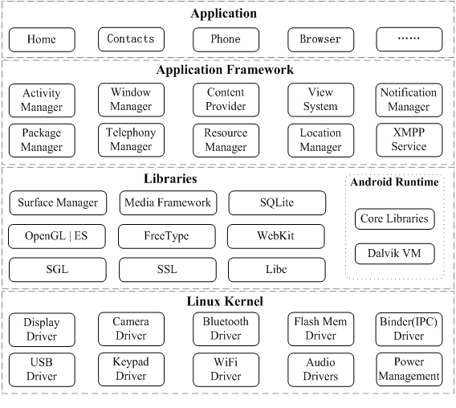

#### 什么是Dalvik

Dalvik是Android中JVM，Android应用程序是运行在Dalvik虚拟机里面的，并且每一个应用程序对应有一个单独的Dalvik虚拟机实例。

Dalvik虚拟机与Java虚拟机的最显著区别是它们分别具有不同的类文件格式以及指令集。Dalvik虚拟机使用的是dex（Dalvik Executable）格式的类文件，而Java虚拟机使用的是class格式的类文件。一个dex文件可以包含若干个类，而一个class文件只包括一个类。由于一个dex文件可以包含若干个类，因此它就可以将各个类中重复的字符串和其它常数只保存一次，从而节省了空间，这样就适合在内存和处理器速度有限的手机系统中使用。一般来说，包含有相同类的未压缩dex文件稍小于一个已经压缩的jar文件。

Dalvik虚拟机使用的指令是基于寄存器的，而Java虚拟机使用的指令集是基于堆栈的。基于堆栈的指令很紧凑，例如，Java虚拟机使用的指令只占一个字节，因而称为字节码。基于寄存器的指令由于需要指定源地址和目标地址，因此需要占用更多的指令空间，例如，Dalvik虚拟机的某些指令需要占用两个字节。基于堆栈和基于寄存器的指令集各有优劣，一般而言，执行同样的功能，前者需要更多的指令（主要是load和store指令），而后者需要更多的指令空间。需要更多指令意味着要多占用CPU时间，而需要更多指令空间意味着数据缓冲（d-cache）更易失效。

### Dalvik位置与Android进程模型     

在Android 运行时中，Dalvik是Android中的java虚拟机，可支持同时运行多个虚拟机实例；每个Android应用程序都在自己的进程中运行，都拥有一个独立的Dalvik虚拟机实例，这样做的后果是：

* 每一个Android应用程序进程都有一个Dalvik虚拟机实例。这样做的好处是Android应用程序进程之间不会相互影响，也就是说，一个Android应用程序进程的意外中止，不会影响到其它的Android应用程序进程的正常运行。

* 每一个Android应用程序进程都是由一种称为Zygote的进程fork出来的。Zygote进程是由init进程启动起来的，也就是在系统启动的时候启动的。Zygote进程在启动的时候，会创建一个虚拟机实例，并且在这个虚拟机实例将所有的Java核心库都加载起来。每当Zygote进程需要创建一个Android应用程序进程的时候，它就通过复制自身来实现，也就是通过fork系统调用来实现。这些被fork出来的Android应用程序进程，一方面是复制了Zygote进程中的虚拟机实例，另一方面是与Zygote进程共享了同一套Java核心库。这样不仅Android应用程序进程的创建过程很快，而且由于所有的Android应用程序进程都共享同一套Java核心库而节省了内存空间。

#### Dalvik启动（虽然看着是动态，但其实Dalvik不过是个类而已）

Zygote进程在启动的过程中，会调用到AndroidRuntime类的成员函数start，接下来我们就这个函数开始分析Dalvik虚拟机启动相关的过程：

	void AndroidRuntime::start(const char* className, const bool startSystemServer)  
	{  
	    ......  
	  
	    /* start the virtual machine */  
	    if (startVm(&mJavaVM, &env) != 0)  
	        goto bail;  
	  
	    /* 
	     * Register android functions. 
	     */  
	    if (startReg(env) < 0) {  
	        LOGE("Unable to register all android natives\n");  
	        goto bail;  
	    }  
	  
	    ......  
	  
	    /* 
	     * Start VM.  This thread becomes the main thread of the VM, and will 
	     * not return until the VM exits. 
	     */  
	    jclass startClass;  
	    jmethodID startMeth;  
	  
	    slashClassName = strdup(className);  
	    for (cp = slashClassName; *cp != '\0'; cp++)  
	        if (*cp == '.')  
	            *cp = '/';  
	  
	    startClass = env->FindClass(slashClassName);  
	    if (startClass == NULL) {  
	        LOGE("JavaVM unable to locate class '%s'\n", slashClassName);  
	        /* keep going */  
	    } else {  
	        startMeth = env->GetStaticMethodID(startClass, "main",  
	            "([Ljava/lang/String;)V");  
	        if (startMeth == NULL) {  
	            LOGE("JavaVM unable to find main() in '%s'\n", className);  
	            /* keep going */  
	        } else {  
	            env->CallStaticVoidMethod(startClass, startMeth, strArray);  
	            ......  
	        }  
	    }  
	  
	    LOGD("Shutting down VM\n");  
	    if (mJavaVM->DetachCurrentThread() != JNI_OK)  
	        LOGW("Warning: unable to detach main thread\n");  
	    if (mJavaVM->DestroyJavaVM() != 0)  
	        LOGW("Warning: VM did not shut down cleanly\n");  
	  
	    ......  
	} 
来看看具体的虚拟机是什么

	/*
	 * Create a new VM instance.
	 *
	 * The current thread becomes the main VM thread.  We return immediately,
	 * which effectively means the caller is executing in a native method.
	 */
	jint JNI_CreateJavaVM(JavaVM** p_vm, JNIEnv** p_env, void* vm_args)
	{
	    const JavaVMInitArgs* args = (JavaVMInitArgs*) vm_args;
	    JNIEnvExt* pEnv = NULL;
	    JavaVMExt* pVM = NULL;
	    const char** argv;
	    int argc = 0;
	    int i, curOpt;
	    int result = JNI_ERR;
	    bool checkJni = false;
	    bool warnError = true;
	    bool forceDataCopy = false;
	
	    if (args->version < JNI_VERSION_1_2)
	        return JNI_EVERSION;
	
	    // TODO: don't allow creation of multiple VMs -- one per customer for now
	
	    /* zero globals; not strictly necessary the first time a VM is started */
	    memset(&gDvm, 0, sizeof(gDvm));
	
	    /*
	     * Set up structures for JNIEnv and VM.
	     */
	    //pEnv = (JNIEnvExt*) malloc(sizeof(JNIEnvExt));
	    pVM = (JavaVMExt*) malloc(sizeof(JavaVMExt));
	
	    //memset(pEnv, 0, sizeof(JNIEnvExt));
	    //pEnv->funcTable = &gNativeInterface;
	    //pEnv->vm = pVM;
	    memset(pVM, 0, sizeof(JavaVMExt));
	    pVM->funcTable = &gInvokeInterface;
	    pVM->envList = pEnv;
	    dvmInitMutex(&pVM->envListLock);
	
	    argv = (const char**) malloc(sizeof(char*) * (args->nOptions));
	    memset(argv, 0, sizeof(char*) * (args->nOptions));
	
	    curOpt = 0;
	
	    /*
	     * Convert JNI args to argv.
	     *
	     * We have to pull out vfprintf/exit/abort, because they use the
	     * "extraInfo" field to pass function pointer "hooks" in.  We also
	     * look for the -Xcheck:jni stuff here.
	     */
	    for (i = 0; i < args->nOptions; i++) {
	        const char* optStr = args->options[i].optionString;
	
	        if (optStr == NULL) {
	            fprintf(stderr, "ERROR: arg %d string was null\n", i);
	            goto bail;
	        } else if (strcmp(optStr, "vfprintf") == 0) {
	            gDvm.vfprintfHook = args->options[i].extraInfo;
	        } else if (strcmp(optStr, "exit") == 0) {
	            gDvm.exitHook = args->options[i].extraInfo;
	        } else if (strcmp(optStr, "abort") == 0) {
	            gDvm.abortHook = args->options[i].extraInfo;
	        } else if (strcmp(optStr, "-Xcheck:jni") == 0) {
	            checkJni = true;
	        } else if (strncmp(optStr, "-Xjniopts:", 10) == 0) {
	            const char* jniOpts = optStr + 9;
	            while (jniOpts != NULL) {
	                jniOpts++;      /* skip past ':' or ',' */
	                if (strncmp(jniOpts, "warnonly", 8) == 0) {
	                    warnError = false;
	                } else if (strncmp(jniOpts, "forcecopy", 9) == 0) {
	                    forceDataCopy = true;
	                } else {
	                    LOGW("unknown jni opt starting at '%s'\n", jniOpts);
	                }
	                jniOpts = strchr(jniOpts, ',');
	            }
	        } else {
	            /* regular option */
	            argv[curOpt++] = optStr;
	        }
	    }
	    argc = curOpt;
	
	    if (checkJni) {
	        dvmUseCheckedJniVm(pVM);
	        pVM->useChecked = true;
	    }
	    pVM->warnError = warnError;
	    pVM->forceDataCopy = forceDataCopy;
	
	    /* set this up before initializing VM, so it can create some JNIEnvs */
	    gDvm.vmList = (JavaVM*) pVM;
	
	    /*
	     * Create an env for main thread.  We need to have something set up
	     * here because some of the class initialization we do when starting
	     * up the VM will call into native code.
	     */
	    pEnv = (JNIEnvExt*) dvmCreateJNIEnv(NULL);
	
	    /* initialize VM */
	    gDvm.initializing = true;
	    if (dvmStartup(argc, argv, args->ignoreUnrecognized, (JNIEnv*)pEnv) != 0) {
	        free(pEnv);
	        free(pVM);
	        goto bail;
	    }
	
	    /*
	     * Success!  Return stuff to caller.
	     */
	    dvmChangeStatus(NULL, THREAD_NATIVE);
	    *p_env = (JNIEnv*) pEnv;
	    *p_vm = (JavaVM*) pVM;
	    result = JNI_OK;
	
	bail:
	    gDvm.initializing = false;
	    if (result == JNI_OK)
	        LOGV("JNI_CreateJavaVM succeeded\n");
	    else
	        LOGW("JNI_CreateJavaVM failed\n");
	    free(argv);
	    return result;
	}        
        
其实就是创建了一个JavaVMExt对象，即Dalvik虚拟机实例：

	typedef struct JavaVMExt {
	    const struct JNIInvokeInterface* funcTable;     /* must be first */
	
	    const struct JNIInvokeInterface* baseFuncTable;
	
	    /* if multiple VMs are desired, add doubly-linked list stuff here */
	
	    /* per-VM feature flags */
	    bool    useChecked;
	    bool    warnError;
	    bool    forceDataCopy;
	
	    /* head of list of JNIEnvs associated with this VM */
	    JNIEnvExt*      envList;
	    pthread_mutex_t envListLock;
	} JavaVMExt; 
	
虚拟机实例，最重要的就是函数列表	，他们决定了这个类所能做的事，其实Dalvik虚拟机不过就是一个翻译器，在一个Dalvik虚拟机里面，可以运行多个线程，也可以说，多个线程共享Dalvik虚拟机，毕竟虚拟机是静态的，如何运行线程呢？所有关联有JNI环境的线程都有一个对应的JNIEnvExt对象，这些JNIEnvExt对象相互连接在一起保存在用来描述其宿主Dalvik虚拟机的一个JavaVMExt对象的成员变量envList中。因此，前面创建的JNIEnvExt对象需要连接到其宿主Dalvik虚拟机的JavaVMExt链表中去。

#### Dalvik虚拟机对于本地直接运行，对于Java代码先翻译，再运行。

函数dvmCallMethodV首先检查参数method描述的函数是否是一个JNI方法。如果是的话，那么它所指向的一个Method对象的成员变量nativeFunc就指向该JNI方法的地址，因此就可以直接对它进行调用。否则的话，就说明参数method描述的是一个Java函数，这时候就需要继续调用函数dvmInterpret来执行它的代码。

#### Dalvik虚拟机的活动场景

Dalvik虚拟机解释器的执行过程就相当于是Dalvik虚拟机的运行过程，也就是说，解释器的执行过程是会不断地重复执行，直至进程退出为止的。以Zygote进程为例，Dalvik虚拟机解释器就是以com.android.internal.os.ZygoteInit类的静态成员函数main为入口点执行，然后在一个Socket上进行循环，用来等待和处理ActivityManagerService服务向它发送创建新应用程序进程的请求，直至系统退出为止。又以Android应用程序进程为例，Dalvik虚拟机解释器就是以android.app.ActivityThread类的静态成员函数main为入口点执行，然后在一消息队列上进行循环，用来等待和处理主线程的消息，直到应用程序退出为止。

#### Dalvik的类加载与执行

就是说，如何加载了这个类，并且，如何执行了它的代码，保证循环之类的。

	
	#define INTERP_FUNC_NAME dvmInterpretStd  	  
	#define FETCH(_offset)     (pc[(_offset)])//程序计数器
	
	bool INTERP_FUNC_NAME(Thread* self, InterpState* interpState)  
	{  
	    ......  
	  
	    DvmDex* methodClassDex;     // curMethod->clazz->pDvmDex  
	    JValue retval;  
	  
	    /* core state */  
	    const Method* curMethod;    // method we're interpreting  
	    const u2* pc;               // program counter  
	    u4* fp;                     // frame pointer  
	    u2 inst;                    // current instruction  
	    ......  
	  
	    /* copy state in */  
	    curMethod = interpState->method;  
	    pc = interpState->pc;  
	    fp = interpState->fp;  
	    retval = interpState->retval;   /* only need for kInterpEntryReturn? */  
	  
	    methodClassDex = curMethod->clazz->pDvmDex;  
	    ......  
	  
	    while (1) {  
	        ......  
	  
	        /* fetch the next 16 bits from the instruction stream */  
	        inst = FETCH(0);  
	  
	        switch (INST_INST(inst)) {  
	......  
	  
	HANDLE_OPCODE(OP_INVOKE_DIRECT /*vB, {vD, vE, vF, vG, vA}, meth@CCCC*/)  
	    GOTO_invoke(invokeDirect, false);  
	OP_END  
  
 所有的所有，最终都会调用最后的本地库来实现，那些已经是编译成机器语言的东西，直接连接执行，最终会到JNI方法，JNI会如何执行呢？.so文件，.so是c/c++代码编译之后生成的可执行文件库，递归到最终的本地代码，比如 dalvik/vm/mterp/out/InterpC-portstd.c中的代码都是已经被翻译成可以直接运行的代码。
 
	#define HANDLE_UNOP(_opcode, _opname, _pfx, _sfx, _type)                    \
	    HANDLE_OPCODE(_opcode /*vA, vB*/)                                       \
	        vdst = INST_A(inst);                                                \
	        vsrc1 = INST_B(inst);                                               \
	        ILOGV("|%s v%d,v%d", (_opname), vdst, vsrc1);                       \
	        SET_REGISTER##_type(vdst, _pfx GET_REGISTER##_type(vsrc1) _sfx);    \
	        FINISH(1);

#### Dalvik解释器的执行方式

注意，我们可以看做，Android中处理动态加载处理的class类，其他都是翻译成了可执行的机器语言，最终所有的Java也都会被翻译成已经.so的可可执行机器代码，所谓的翻译，其实并不存在一个真正的转码，再编译过程，仅仅是通过switch分支，进行***动态的链接***到可以行代码区域，其真正的解释就是 ***动态的链接***，并非自己翻译。

### 参考文章

Dalvik虚拟机简要介绍和学习计划 <http://blog.csdn.net/luoshengyang/article/details/8852432>

 Dalvik虚拟机的启动过程分析 <http://blog.csdn.net/luoshengyang/article/details/8885792>
