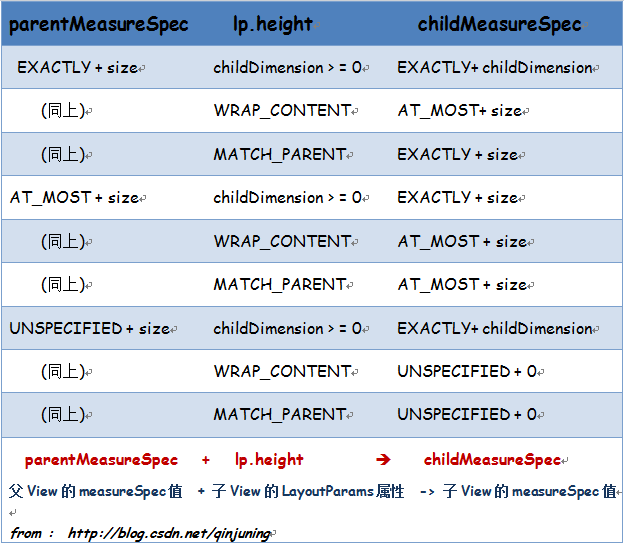

# 自定义控件的几个问题

* MeasureSpec的实现及作用	
* View如何处理自己的尺寸
* ViewGroup如何处理自己的尺寸
* ViewGroup如何处理子View的宽高及布局 
* ViewGroup如何添加Margin	    

# MeasureSpec的实现及作用（父子结合**参考**大小--**仅仅是参考**） 

MeasureSpec参数的意义是：父控件传给Child的参数，仅供子View参考，只是个参考，要多大，还是View自己说了算。如果View自己不定义，采用系统默认实现，那么wrap_content就跟match_parent一个效果。MeasureSpec是父控件创建的，通过getChildMeasureSpec创建的，对于Activity而言，DecorView的MeasureSpec是根据Activity的Theme有WMS来控制，一般是EXACTLY+WINDOWSIZE，这样一来，传递给最顶层View（DecorView）的MeasureSpec就定了，一切有了起源。对于ViewGroup一般会通过measureChild测量子View的尺寸，在这个函数中会调用getChildMeasureSpec为子View创建MeasureSpec，一般不直接调用getChildMeasureSpec，都是通过measureChild或者measureChildren或者measureChildWithMargin间接调用。

	getChildMeasureSpec有三个参数，第一个是ViewGroup传递自身的MeasureSpec，第二个是ViewGroup的padding，第三个一般是子View的LayoutPara中的width或者height

	public static int getChildMeasureSpec(int spec, int padding, int childDimension) {
	        int specMode = MeasureSpec.getMode(spec);
	        int specSize = MeasureSpec.getSize(spec);
	
	        int size = Math.max(0, specSize - padding);
	
	        int resultSize = 0;
	        int resultMode = 0;
	
	        switch (specMode) {
	        // Parent has imposed an exact size on us  我就这么多，你想要多少，如果你要全部，我可以给你最多的
	        case MeasureSpec.EXACTLY:
	            if (childDimension >= 0) {
	                resultSize = childDimension;
	                resultMode = MeasureSpec.EXACTLY;
	            } else if (childDimension == LayoutParams.MATCH_PARENT) {
	                // Child wants to be our size. So be it.
	                resultSize = size;
	                resultMode = MeasureSpec.EXACTLY;
	            } else if (childDimension == LayoutParams.WRAP_CONTENT) {
	                // Child wants to determine its own size. It can't be
	                // bigger than us.
	                resultSize = size;
	                resultMode = MeasureSpec.AT_MOST;
	            }
	            break;
	
	        // Parent has imposed a maximum size on us 最多给多少，你要多少，我就去申请多少，并且全部给你，但是不是一次性的申请最大的给你的，同时也是给自己	        case MeasureSpec.AT_MOST:
	            if (childDimension >= 0) {
	                // Child wants a specific size... so be it
	                resultSize = childDimension;
	                resultMode = MeasureSpec.EXACTLY;
	            } else if (childDimension == LayoutParams.MATCH_PARENT) {
	                // Child wants to be our size, but our size is not fixed.
	                // Constrain child to not be bigger than us.
	                resultSize = size;
	                resultMode = MeasureSpec.AT_MOST;
	            } else if (childDimension == LayoutParams.WRAP_CONTENT) {
	                // Child wants to determine its own size. It can't be
	                // bigger than us.
	                resultSize = size;
	                resultMode = MeasureSpec.AT_MOST;
	            }
	            break;
	
	        // Parent asked to see how big we want to be  要多少给多，反着你爷爷有钱，要多少，你爸爸帮你去要。
	        case MeasureSpec.UNSPECIFIED:
	            if (childDimension >= 0) {
	                // Child wants a specific size... let him have it
	                resultSize = childDimension;
	                resultMode = MeasureSpec.EXACTLY;
	            } else if (childDimension == LayoutParams.MATCH_PARENT) {
	                // Child wants to be our size... find out how big it should
	                // be
	                resultSize = 0;
	                resultMode = MeasureSpec.UNSPECIFIED;
	            } else if (childDimension == LayoutParams.WRAP_CONTENT) {
	                // Child wants to determine its own size.... find out how
	                // big it should be
	                resultSize = 0;
	                resultMode = MeasureSpec.UNSPECIFIED;
	            }
	            break;
	        }
	        return MeasureSpec.makeMeasureSpec(resultSize, resultMode);
	    }

可以看出，只要View自己通过android:layout_withd等参数设定自己的高度，Android默认会给View想要的尺寸，即：EXACTLY+SIZE，如果设置的是wrap_content或者match_parent，那就需要看父布局的MeasureSpec，如果父的specMode是EXACTLY，并且子View的是match_parent，那么子View尺寸其实就确定了，EXACTLY+SIZE(父)，如果是wrap_content，那么就是AT_MOST+SIZE(父)，如果是AT_MOST，那么子View的就全部是AT_MOST+SIZE(父)，如果是UNSPECIFIED，那么子View的就全部是UNSPECIFIED，父子均不限定size。可以参考下面的图：

# View如何处理自己的尺寸

对于自定义View，一般要实现onMeasure

    @Override
    protected void onMeasure(int widthMeasureSpec, int heightMeasureSpec) {   
     1、测量自己的高度realHeight
     2、通过resolveSize(realHeight,heightMeasureSpec)获得推荐的高度，
     3、设置最终尺寸setMeasuredDimension(lineWidth, totolHeight);  
    }
    
其中resolveSize会给出一个推荐尺寸，该函数第一个参数是自己需要的尺寸，第二个是parent限定的参考

	
    public static int resolveSize(int size, int measureSpec) {
        return resolveSizeAndState(size, measureSpec, 0) & MEASURED_SIZE_MASK;
    }

    public static int resolveSizeAndState(int size, int measureSpec, int childMeasuredState) {
        int result = size;
        int specMode = MeasureSpec.getMode(measureSpec);
        int specSize =  MeasureSpec.getSize(measureSpec);
        switch (specMode) {
        case MeasureSpec.UNSPECIFIED:
            result = size;
            break;
        case MeasureSpec.AT_MOST:
            if (specSize < size) {
                result = specSize | MEASURED_STATE_TOO_SMALL;
            } else {
                result = size;
            }
            break;
        case MeasureSpec.EXACTLY:
            result = specSize;
            break;
        }
        return result | (childMeasuredState&MEASURED_STATE_MASK);
    }
 
可以看出，如果父控件没有限制View的高度，View需要的是多少resolveSize就会返回多少当然，如果是AT_MOST,resolveSize会根据View的Size是否会超过父控件限定的Size，两个对比，取最小值，如果父控件传入的是EXACTLY，那最好严格按照这个来，因为其实子View的高度已经是知道的，比如** android:layout_width="30dp" **，当然你也可以无视所有限制，自己设定尺寸。
 
# ViewGroup如何定义自己的尺寸

ViewGroup想要定自己的尺寸，必须首先获取View的高度，并根据自己的属性，计算出自己的高度，最后通过setMeasureDimension设定自己的高度。测量子View的尺寸的时候，可以通过measureChildWithMargins或者measureChild，如果不考虑剩余空间带来的影响，一句 measureChildren(widthMeasureSpec, heightMeasureSpec)，就可以了，之后，就可以通过view.getMeasuredWidth获取View的尺寸。并且根据ViewGroup自身的需求，设定高度，以GrideFlowLayout为例子：

    @Override
    protected void onMeasure(int widthMeasureSpec, int heightMeasureSpec) {

        int widthSize = MeasureSpec.getSize(widthMeasureSpec);
        int heightSize = MeasureSpec.getSize(heightMeasureSpec);
        int paddingLeft = getPaddingLeft();
        int paddingRight = getPaddingRight();
        int paddingbottom = getPaddingBottom();
        int paddingTop = getPaddingTop();
        int count = getChildCount();
        int maxWidth = 0;
        int totolHeight = 0;
        int lineWidth = 0;
        int lineHeight = 0;
        int extralWidth = widthSize - paddingLeft - paddingRight;
     <!--测量所有View-->
        measureChildren(widthMeasureSpec, heightMeasureSpec);
        for (int i = 0; i < count; i++) {
            View view = getChildAt(i);
      <!--根据ViewGroup特性计算Group高度-->
            if (view != null && view.getVisibility() != GONE) {
                if (lineWidth + view.getMeasuredWidth() + mHorizionSpan > extralWidth) {
                    totolHeight += lineHeight + mVerticalSpan;
                    lineWidth = view.getMeasuredWidth();
                    lineHeight = view.getMeasuredHeight();
                    maxWidth = widthSize;
                } else {
                    lineWidth += view.getMeasuredWidth() + mHorizionSpan;
                }
                lineHeight = Math.max(lineHeight, view.getMeasuredHeight());
            }
        }
        totolHeight = Math.max(totolHeight + lineHeight, lineHeight);
        maxWidth = Math.max(lineWidth, maxWidth);
        totolHeight = resolveSize(totolHeight + paddingbottom + paddingTop, heightMeasureSpec);
        lineWidth = resolveSize(maxWidth + paddingLeft + paddingRight, widthMeasureSpec);
 
        setMeasuredDimension(lineWidth, totolHeight);
    }
    	       
## measureChild是自定义ViewGroup的关键

如果不考虑margin参数

    protected void measureChild(View child, int parentWidthMeasureSpec,
            int parentHeightMeasureSpec) {
        final LayoutParams lp = child.getLayoutParams();

        final int childWidthMeasureSpec = getChildMeasureSpec(parentWidthMeasureSpec,
                mPaddingLeft + mPaddingRight, lp.width);
        final int childHeightMeasureSpec = getChildMeasureSpec(parentHeightMeasureSpec,
                mPaddingTop + mPaddingBottom, lp.height);

        child.measure(childWidthMeasureSpec, childHeightMeasureSpec);
    }
    
如果考虑margin参数 measureChildWithMargins，这就是把已经用的空间考虑进去，就好比是padding，至于考虑不考虑看自己实现的布局是做什么用的，如果是LinearLayout，就可以看看是不是用剩余的空间放置本来可能很大的View，如果不是，可以直接采用measureChild，其实measureChild满足大多数情况，

    protected void measureChildWithMargins(View child,
            int parentWidthMeasureSpec, int widthUsed,
            int parentHeightMeasureSpec, int heightUsed) {
        final MarginLayoutParams lp = (MarginLayoutParams) child.getLayoutParams();

        final int childWidthMeasureSpec = getChildMeasureSpec(parentWidthMeasureSpec,
                mPaddingLeft + mPaddingRight + lp.leftMargin + lp.rightMargin
                        + widthUsed, lp.width);
        final int childHeightMeasureSpec = getChildMeasureSpec(parentHeightMeasureSpec,
                mPaddingTop + mPaddingBottom + lp.topMargin + lp.bottomMargin
                        + heightUsed, lp.height);

        child.measure(childWidthMeasureSpec, childHeightMeasureSpec);
       
    }

接下来获取View高度并且加上margin才能算子View占据的高度，
    
              final int childHeight = child.getMeasuredHeight();
              final int totalLength = mTotalLength;

		     //  其实这里已经++，只是为了区分margin带来的影响，看看哪个最大
              mTotalLength = Math.max(totalLength, totalLength + childHeight + lp.topMargin +
                      lp.bottomMargin + getNextLocationOffset(child));

之后加上padding就可以确定根据child获取的View的高度，最后再次根据自己确定一下resolveSizeAndState
 
    int heightSizeAndState = resolveSizeAndState(heightSize, heightMeasureSpec, 0); ---》LinearLayout

	第一个是自己需要的高度，第二个是parent限定的参考，如果按照Android给的推荐，那个就是下面的规格，当然，你也可以无视，自己设定
	
    public static int resolveSizeAndState(int size, int measureSpec, int childMeasuredState) {
        int result = size;
        int specMode = MeasureSpec.getMode(measureSpec);
        int specSize =  MeasureSpec.getSize(measureSpec);
        switch (specMode) {
        case MeasureSpec.UNSPECIFIED:
            result = size;
            break;
        case MeasureSpec.AT_MOST:
            if (specSize < size) {
                result = specSize | MEASURED_STATE_TOO_SMALL;
            } else {
                result = size;
            }
            break;
        case MeasureSpec.EXACTLY:
            result = specSize;
            break;
        }
        return result | (childMeasuredState&MEASURED_STATE_MASK);
    }
    
 最后   
 
	  private void setChildFrame(View child, int left, int top, int width, int height) {
	        child.layout(left, top, left + width, top + height);
	    }

# ViewGroup如何添加添加Margin

	  public static class LayoutParams extends ViewGroup.MarginLayoutParams {
	
	        public LayoutParams(Context c, AttributeSet attrs) {
	            super(c, attrs);
	        }
	
	        public LayoutParams(ViewGroup.LayoutParams source) {
	            super(source);
	        }
	
	        public LayoutParams(MarginLayoutParams source) {
	            super(source);
	        }
	
	        public LayoutParams(int width, int height) {
	            super(width, height);
	        }
	    }
	
	    @Override
	    protected ViewGroup.LayoutParams generateDefaultLayoutParams() {
	        return new LayoutParams(LayoutParams.WRAP_CONTENT,
	                LayoutParams.WRAP_CONTENT);
	    }
	
	    @Override
	    protected ViewGroup.LayoutParams generateLayoutParams(ViewGroup.LayoutParams p) {
	        return new LayoutParams(p);
	    }
	
	    @Override
	    public ViewGroup.LayoutParams generateLayoutParams(AttributeSet attrs) {
	        return new LayoutParams(getContext(), attrs);
	    }
	
	    @Override
	    protected boolean checkLayoutParams(ViewGroup.LayoutParams p) {
	        return p instanceof LayoutParams;
	    }
  
 之后再onMeasure跟onLayout中将Margin考虑进去就可以了。
 
#  参考文档

[从源码角度分析Android View的绘制机制（一）](http://blog.csdn.net/andywuchuanlong/article/details/47751911)   
          