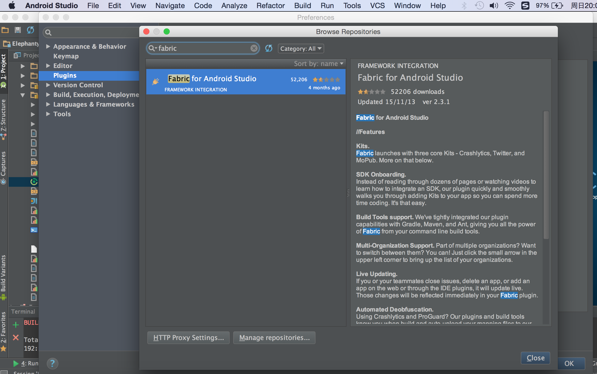
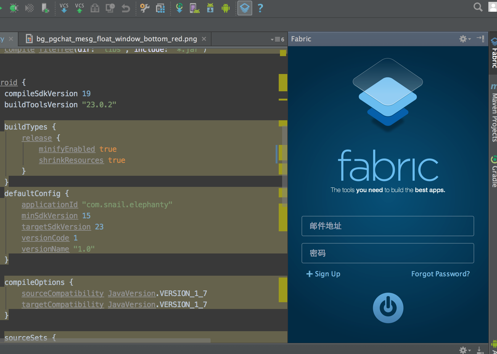
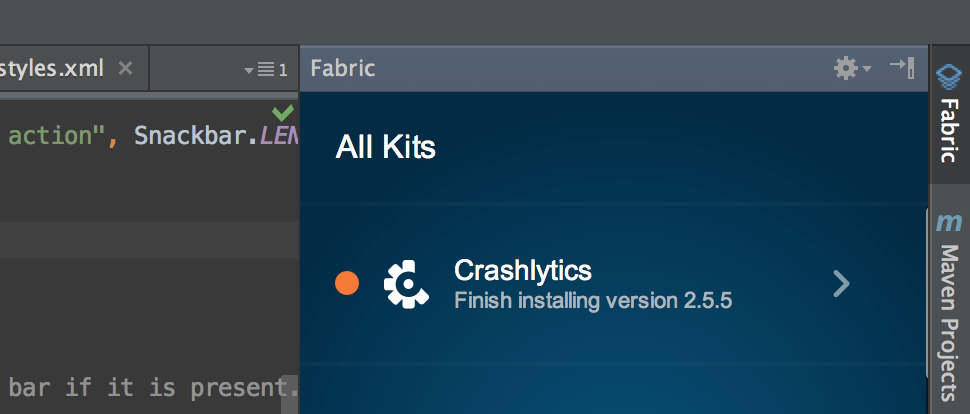
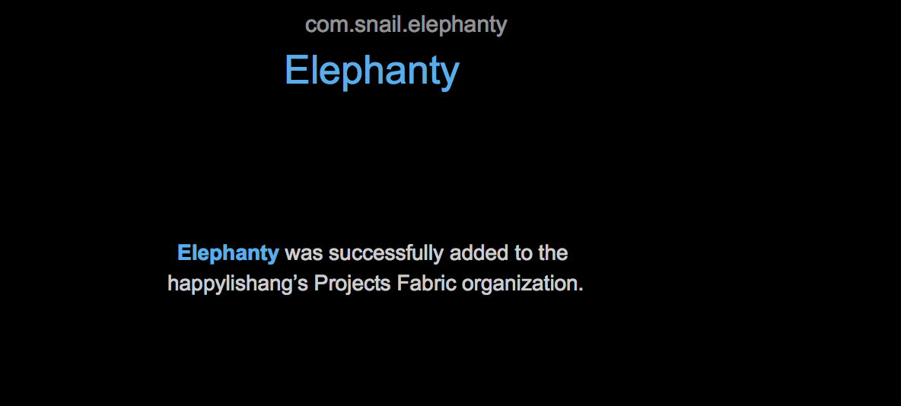

### Fabric集成步骤

* 1 下载插件

* 2 打开插件配置工程

* 3 安装你想要的Kit

* 4 按照提示其实不用配置

* 5 在真机上运行，一定要在真机上运行

* 6 收到Fbric邮件

* 7 日志分析 如果代码混淆，怎么找出原来的代码位置

使用ProGuard混淆代码打包的时候，会生生一个mapping.txt文件。这个文件记录了混淆前后的类、方法等映射关系。通过{sdk-dir}\tools\proguard\bin目录下的retrace.bat工具反混淆，执行命令：

	retract.bat -verbose mapping.txt obfuscated_tract.txt > out_tract.txt。

结果输出如下： 

	java.lang.IndexOutOfBoundsException: Invalid index 0, size is 0 
	at java.util.ArrayList.throwIndexOutOfBoundsException(ArrayList.java:255) 
	at java.util.ArrayList.get(ArrayList.java:308) 
	at com.example.atom.hotel.delegate.HotelListDelegateAdapter.void initSpecialPreferentialTips(boolean)(SourceFile:66) 
	at com.example.atom.hotel.delegate.HotelListDelegateAdapter.<init>(SourceFile:60) 

 [参考文档](http://blog.csdn.net/p106786860/article/details/11974863)

#### 参考文档 

[Step-by-Step: Fabric and Android Studio](http://www.tuicool.com/articles/nqMBJfj)