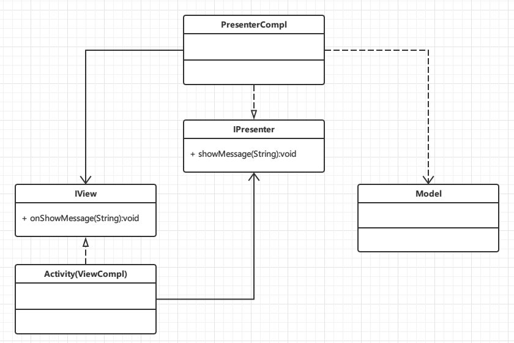

### 为什么使用MVP模式
     
   在Android开发中，Activity并不是一个标准的MVC模式中的Controller，它的首要职责是加载应用的布局和初始化用户界面，并接受并处理来自用户的操作请求，进而作出响应。随着界面及其逻辑的复杂度不断提升，Activity类的职责不断增加，以致变得庞大臃肿。当我们将其中复杂的逻辑处理移至另外的一个类（Presneter）中时，Activity其实就是MVP模式中View，它负责UI元素的初始化，建立UI元素与Presenter的关联（Listener之类），同时自己也会处理一些简单的逻辑（复杂的逻辑交由Presenter处理）.
     另外，回想一下你在开发Android应用时是如何对代码逻辑进行单元测试的？是否每次都要将应用部署到Android模拟器或真机上，然后通过模拟用户操作进行测试？然而由于Android平台的特性，每次部署都耗费了大量的时间，这直接导致开发效率的降低。而在MVP模式中，处理复杂逻辑的Presenter是通过interface与View(Activity)进行交互的，这说明了什么？说明我们可以通过自定义类实现这个interface来模拟Activity的行为对Presenter进行单元测试，省去了大量的部署及测试的时间。
     

一个Activity可以包含一个以上的Presenter，总之，需要什么业务就new什么样的Presenter，是不是很灵活，这也是MVP的核心思想

### MVP与MVC的异同

   MVC模式与MVP模式都作为用来分离UI层与业务层的一种开发模式被应用了很多年。在我们选择一种开发模式时，首先需要了解一下这种模式的利弊：
无论MVC或是MVP模式都不可避免地存在一个弊端：
额外的代码复杂度及学习成本。
 这就导致了这两种开发模式也许并不是很小型应用。
 但比起他们的优点，这点弊端基本可以忽略了：
 
*  (1)降低耦合度
*  (2)模块职责划分明显
*  (3)利于测试驱动开发
*  (4)代码复用
*  (5)隐藏数据
*  (6)代码灵活性

     对于MVP与MVC这两种模式，它们之间也有很大的差异。有一些程序员选择不使用任何一种模式，有一部分原因也许就是不能区分这两种模式差异。以下是这两种模式之间最关键的差异：

*  MVP模式：

View不直接与Model交互，而是通过与Presenter交互来与Model间接交互
Presenter与View的交互是通过接口来进行的，更有利于添加单元测试
通常View与Presenter是一对一的，但复杂的View可能绑定多个Presenter来处理逻辑     

*  MVC模式：

View可以与Model直接交互
Controller是基于行为的，并且可以被多个View共享
可以负责决定显示哪个View

### VP模式

其实只要高清理念，很容易处理V与P的关系，View就是View的显示，P就是V的控制逻辑，
